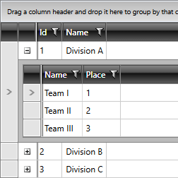
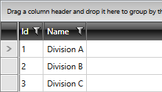
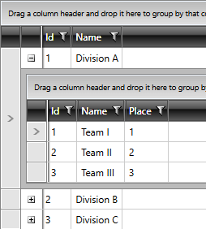

# Building Hierarchical Grid

This tutorial will walk you through the process of displaying hierarchical data in `RadGridView`. It will not cover the creation of a WPF application, adding RadGridView to your `UserControl` or how to define columns. If you need information on any of these topics please read the [Getting Started]() topic. 

The final result should look like the one displayed in the next image.

__Hierarchical RadGridView__



Assuming that you have already created a WPF application and defined the RadGridView control, it is time to prepare the sample data for it.

## Preparing the Data

The sample data is represented by teams divided into divisions. First create the class that will represent a single team.

__The Team class__
```C#
	public class Team
	{
	    public int Id
	    {
	        get;
	        set;
	    }
	    public string Name
	    {
	        get;
	        set;
	    }
	    public int Place
	    {
	        get;
	        set;
	    }
	}
```
```VB.NET
	Public Class Team
	    Private _Id As Integer
	    Public Property Id() As Integer
	        Get
	            Return _Id
	        End Get
	        Set(ByVal value As Integer)
	            _Id = value
	        End Set
	    End Property
	
	    Private _Name As String
	    Public Property Name() As String
	        Get
	            Return _Name
	        End Get
	        Set(ByVal value As String)
	            _Name = value
	        End Set
	    End Property
	
	    Private _Place As Integer
	    Public Property Place() As Integer
	        Get
	            Return _Place
	        End Get
	        Set(ByVal value As Integer)
	            _Place = value
	        End Set
	    End Property
	End Class
```

The class that represents a single division will contain a collection of Team objects.

__The Division class__
```C#
	public class Division
	{
	    public int Id
	    {
	        get;
	        set;
	    }
	    public string Name
	    {
	        get;
	        set;
	    }
	    public List<Team> Teams
	    {
	        get;
	        set;
	    }
	}
```
```VB.NET
	Public Class Division
	    Private _Id As Integer
	    Public Property Id() As Integer
	        Get
	            Return _Id
	        End Get
	        Set(ByVal value As Integer)
	            _Id = value
	        End Set
	    End Property
	
	    Private _Name As String
	    Public Property Name() As String
	        Get
	            Return _Name
	        End Get
	        Set(ByVal value As String)
	            _Name = value
	        End Set
	    End Property
	
	    Private _Teams As List(Of Team)
	    Public Property Teams() As List(Of Team)
	        Get
	            Return _Teams
	        End Get
	        Set(ByVal value As List(Of Team))
	            _Teams = value
	        End Set
	    End Property
	End Class
```

>Note that if you want to support two way binding your classes should implement the `INotifyPropertyChanged` interface and raise the `PropertyChanged` event every time a property value changes.

Create a `DivisionsService` class and implement a static method `GetDivisions`. For the purpose of this tutorial it will return an observable collection containing several hard-coded divisions.

__The DivisionsService class__
```C#
	public class DivisionsService
	{
	    public static ObservableCollection<Division> GetDivisions()
	    {
	        ObservableCollection<Division> divisions = new ObservableCollection<Division>();
	        Division dA = new Division();
	        dA.Name = "Division A";
	        dA.Id = 1;
	        dA.Teams = new List<Team>();
	        Team team1 = new Team();
	        team1.Id = 1;
	        team1.Name = "Team I";
	        team1.Place = 1;
	        dA.Teams.Add(team1);
	        Team team2 = new Team();
	        team2.Id = 2;
	        team2.Name = "Team II";
	        team2.Place = 2;
	        dA.Teams.Add(team2);
	        Team team3 = new Team();
	        team3.Id = 3;
	        team3.Name = "Team III";
	        team3.Place = 3;
	        dA.Teams.Add(team3);
	        divisions.Add(dA);
	        Division dB = new Division();
	        dB.Name = "Division B";
	        dB.Id = 2;
	        dB.Teams = new List<Team>();
	        Team teamRed = new Team();
	        teamRed.Id = 1;
	        teamRed.Name = "Team Red";
	        teamRed.Place = 1;
	        dB.Teams.Add(teamRed);
	        Team teamGreen = new Team();
	        teamGreen.Id = 2;
	        teamGreen.Name = "Team Green";
	        teamGreen.Place = 2;
	        dB.Teams.Add(teamGreen);
	        Team teamBlue = new Team();
	        teamBlue.Id = 3;
	        teamBlue.Name = "Team Blue";
	        teamBlue.Place = 3;
	        dB.Teams.Add(teamBlue);
	        divisions.Add(dB);
	
	        Division dC = new Division();
	        dC.Name = "Division C";
	        dC.Id = 3;
	        dC.Teams = new List<Team>();
	        Team teamAlpha = new Team();
	        teamAlpha.Id = 1;
	        teamAlpha.Name = "Team Alpha";
	        teamAlpha.Place = 1;
	        dC.Teams.Add(teamAlpha);
	        Team teamBeta = new Team();
	        teamBeta.Id = 2;
	        teamBeta.Name = "Team Beta";
	        teamBeta.Place = 2;
	        dC.Teams.Add(teamBeta);
	        Team teamGama = new Team();
	        teamGama.Id = 3;
	        teamGama.Name = "Team Gama";
	        teamGama.Place = 3;
	        dC.Teams.Add(teamGama);
	        divisions.Add(dC);
	        return divisions;
	    }
	}
```
```VB.NET
	Public Class DivisionsService
	    Public Shared Function GetDivisions() As ObservableCollection(Of Division)
	        Dim divisions As New ObservableCollection(Of Division)()
	
	        Dim dA As New Division()
	        dA.Name = "Division A"
	        dA.Id = 1
	        dA.Teams = New List(Of Team)()
	        Dim team1 As New Team()
	        team1.Id = 1
	        team1.Name = "Team I"
	        team1.Place = 1
	        dA.Teams.Add(team1)
	        Dim team2 As New Team()
	        team2.Id = 2
	        team2.Name = "Team II"
	        team2.Place = 2
	        dA.Teams.Add(team2)
	        Dim team3 As New Team()
	        team3.Id = 3
	        team3.Name = "Team III"
	        team3.Place = 3
	        dA.Teams.Add(team3)
	        divisions.Add(dA)
	
	        Dim dB As New Division()
	        dB.Name = "Division B"
	        dB.Id = 2
	        dB.Teams = New List(Of Team)()
	        Dim teamRed As New Team()
	        teamRed.Id = 1
	        teamRed.Name = "Team Red"
	        teamRed.Place = 1
	        dB.Teams.Add(teamRed)
	        Dim teamGreen As New Team()
	        teamGreen.Id = 2
	        teamGreen.Name = "Team Green"
	        teamGreen.Place = 2
	        dB.Teams.Add(teamGreen)
	        Dim teamBlue As New Team()
	        teamBlue.Id = 3
	        teamBlue.Name = "Team Blue"
	        teamBlue.Place = 3
	        dB.Teams.Add(teamBlue)
	        divisions.Add(dB)
	
	        Dim dC As New Division()
	        dC.Name = "Division C"
	        dC.Id = 3
	        dC.Teams = New List(Of Team)()
	        Dim teamAlpha As New Team()
	        teamAlpha.Id = 1
	        teamAlpha.Name = "Team Alpha"
	        teamAlpha.Place = 1
	        dC.Teams.Add(teamAlpha)
	        Dim teamBeta As New Team()
	        teamBeta.Id = 2
	        teamBeta.Name = "Team Beta"
	        teamBeta.Place = 2
	        dC.Teams.Add(teamBeta)
	        Dim teamGama As New Team()
	        teamGama.Id = 3
	        teamGama.Name = "Team Gama"
	        teamGama.Place = 3
	        dC.Teams.Add(teamGama)
	        divisions.Add(dC)
	
	        Return divisions
	    End Function
	End Class
```

Now after the sample data is prepared you are ready to bind it to the RadGridView. To do this set the `ItemsSource` property of the grid to the collection returned by the GetDivisions method. But first define the following columns.

__Defining the RadGridView__
```XAML
	<telerik:RadGridView x:Name="HierarchicalGridView"
	                 AutoGenerateColumns="False">
	    <telerik:RadGridView.Columns>
	        <telerik:GridViewDataColumn DataMemberBinding="{Binding Id}"
	                                Header="Id" />
	        <telerik:GridViewDataColumn DataMemberBinding="{Binding Name}"
	                                Header="Name" />
	    </telerik:RadGridView.Columns>
	</telerik:RadGridView>
```

Set the ItemsSource in the code-behind file of your UserControl.

__Setting the control's ItemsSource__

```C#
	this.HierarchicalGridView.ItemsSource = DivisionsService.GetDivisions();
```
```VB.NET
	Me.HierarchicalGridView.ItemsSource = DivisionsService.GetDivisions()
```

__RadGridView without a hierarchy__



## Defining ChildTableDefinitions

The next step is to make the RadGridView display the collections of teams as children of the respective rows. To do that use the `ChildTableDefinitions` property of the RadGridView and define a new `GridViewTableDefinition` with the following relation.

__Defining ChildTableDefinitions__
```XAML
	<telerik:RadGridView x:Name="HierarchicalGridView" AutoGenerateColumns="False">
	    <telerik:RadGridView.ChildTableDefinitions>

	        <telerik:GridViewTableDefinition>
	            <telerik:GridViewTableDefinition.Relation>
	                <telerik:PropertyRelation ParentPropertyName="Teams" />
	            </telerik:GridViewTableDefinition.Relation>
	        </telerik:GridViewTableDefinition>

	    </telerik:RadGridView.ChildTableDefinitions>
	    <telerik:RadGridView.Columns>
	        <telerik:GridViewDataColumn DataMemberBinding="{Binding Id}"
	                                Header="Id" />
	        <telerik:GridViewDataColumn DataMemberBinding="{Binding Name}"
	                                Header="Name" />
	    </telerik:RadGridView.Columns>
	</telerik:RadGridView>
```

__RadGridView with a hierarchy__



>You can read more about the GridViewTableDefinition [here]().

## HierarchyChildTemplate

If you need to set properties of the child RadGridView instances, you can use the `HierarchyChildTemplate`.

__Setting the control's HierarchyChildTemplate__
```XAML
	<telerik:RadGridView x:Name="HierarchicalGridView" AutoGenerateColumns="False" GroupRenderMode="Flat">
		<telerik:RadGridView.ChildTableDefinitions>
			<telerik:GridViewTableDefinition>
				<telerik:GridViewTableDefinition.Relation>
					<telerik:PropertyRelation ParentPropertyName="Teams" />
				</telerik:GridViewTableDefinition.Relation>
			</telerik:GridViewTableDefinition>
		</telerik:RadGridView.ChildTableDefinitions>
		<telerik:RadGridView.Columns>
			<telerik:GridViewDataColumn DataMemberBinding="{Binding Id}" 
							Header="Id" />
			<telerik:GridViewDataColumn DataMemberBinding="{Binding Name}" 
							Header="Name" />
		</telerik:RadGridView.Columns>
		<telerik:RadGridView.HierarchyChildTemplate>
			<DataTemplate>
				<telerik:RadGridView ShowGroupPanel="False" AutoGenerateColumns="False" ItemsSource="{Binding Teams}" GroupRenderMode="Flat">
					<telerik:RadGridView.Columns>
						<telerik:GridViewDataColumn DataMemberBinding="{Binding Name}" 
							Header="Name" />
						<telerik:GridViewDataColumn DataMemberBinding="{Binding Place}" 
							Header="Place" />
					</telerik:RadGridView.Columns>
				</telerik:RadGridView>
			</DataTemplate>
		</telerik:RadGridView.HierarchyChildTemplate>
	</telerik:RadGridView>
```

__Customized child grids__


>You can also use the `HierarchyChildTemplateSelector` property to specify a DataTemplateSelector and provide different templates for the child elements based on the parent row which is expanded.

To learn more about the Hierarchical Grids you can visit the [Hierarchical GridView]() section.

## See Also

 * [Getting Started]()
 * [Working with Data]()
 * [Set Properties to the Child GridView]()
