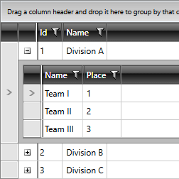
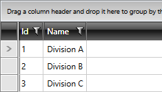
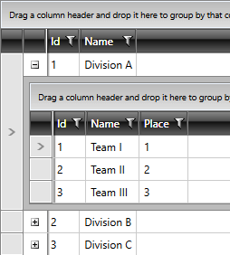

# Building Hierarchical Grid

This tutorial will walk you through the process of displaying hierarchical data in `RadGridView`. It will not cover the creation of a WPF application, adding RadGridView to your `UserControl` or how to define columns. If you need information on any of these topics please read the [Getting Started]() topic. 

The final result should look like the one displayed in the next image.

__Hierarchical RadGridView__

Assuming that you have already created a WPF application and defined the RadGridView control, it is time to prepare the sample data for it.

## Preparing the Data

The sample data is represented by teams divided into divisions. First create the class that will represent a single team.

__The Team class__
<snippet id='radgridview-getting-started-building-hierarchical-grid-view-the_team_class-cs' />

<snippet id='radgridview-getting-started-building-hierarchical-grid-view-the_team_class-vb' />

The class that represents a single division will contain a collection of Team objects.

__The Division class__
<snippet id='radgridview-getting-started-building-hierarchical-grid-view-the_division_class-cs' />

<snippet id='radgridview-getting-started-building-hierarchical-grid-view-the_division_class-vb' />

>Note that if you want to support two way binding your classes should implement the `INotifyPropertyChanged` interface and raise the `PropertyChanged` event every time a property value changes.

Create a `DivisionsService` class and implement a static method `GetDivisions`. For the purpose of this tutorial it will return an observable collection containing several hard-coded divisions.

__The DivisionsService class__
<snippet id='radgridview-getting-started-building-hierarchical-grid-view-the_divisionsservice_class-cs' />

<snippet id='radgridview-getting-started-building-hierarchical-grid-view-the_divisionsservice_class-vb' />

Now after the sample data is prepared you are ready to bind it to the RadGridView. To do this set the `ItemsSource` property of the grid to the collection returned by the GetDivisions method. But first define the following columns.

__Defining the RadGridView__
<snippet id='radgridview-getting-started-building-hierarchical-grid-view-defining_the_radgridview-xaml' />

Set the ItemsSource in the code-behind file of your UserControl.

__Setting the control's ItemsSource__

<snippet id='radgridview-getting-started-building-hierarchical-grid-view-setting_the_control_s_itemssource-cs' />

<snippet id='radgridview-getting-started-building-hierarchical-grid-view-setting_the_control_s_itemssource-vb' />

__RadGridView without a hierarchy__

## Defining ChildTableDefinitions

The next step is to make the RadGridView display the collections of teams as children of the respective rows. To do that use the `ChildTableDefinitions` property of the RadGridView and define a new `GridViewTableDefinition` with the following relation.

__Defining ChildTableDefinitions__
<snippet id='radgridview-getting-started-building-hierarchical-grid-view-defining_childtabledefinitions-xaml' />

__RadGridView with a hierarchy__

>You can read more about the GridViewTableDefinition [here]().

## HierarchyChildTemplate

If you need to set properties of the child RadGridView instances, you can use the `HierarchyChildTemplate`.

__Setting the control's HierarchyChildTemplate__
<snippet id='radgridview-getting-started-building-hierarchical-grid-view-setting_the_control_s_hierarchychildtemplate-xaml' />

__Customized child grids__

>You can also use the `HierarchyChildTemplateSelector` property to specify a DataTemplateSelector and provide different templates for the child elements based on the parent row which is expanded.

To learn more about the Hierarchical Grids you can visit the [Hierarchical GridView]() section.

## See Also

 * [Getting Started]()
 * [Working with Data]()
 * [Set Properties to the Child GridView]()
