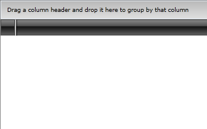
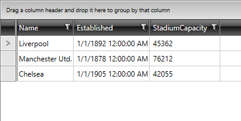
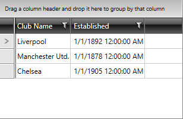
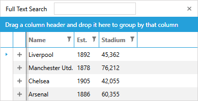

# Getting Started with {{ site.framework_name }} GridView

This tutorial will walk you through the creation of a sample application that contains __RadGridView__. 

* [Adding Telerik Assemblies Using NuGet](#adding-telerik-assemblies-using-nuget)
* [Adding Assembly References Manually](#adding-assembly-references-manually)
* [Adding RadGridView to the Project](#adding-radgridview-to-the-project)
* [Populating with Data](#populating-with-data)
* [Columns](#columns)
* [Sorting, Grouping and Filtering](#sorting-grouping-and-filtering)
* [Setting a Theme](#setting-a-theme)

## Adding Telerik Assemblies Using NuGet

To use __RadGridView__ when working with NuGet packages, install the `Telerik.Windows.Controls.GridView.for.Wpf.Xaml` package. The [package name may vary]() slightly based on the Telerik dlls set - [Xaml or NoXaml]()

Read more about NuGet installation in the [Installing UI for WPF from NuGet Package]() article.

>tip With the 2025 Q1 release, the Telerik UI for WPF has a new licensing mechanism. You can learn more about it [here]().

## Adding Assembly References Manually

If you are not using NuGet packages, you can add a reference to the following assemblies:

* __Telerik.Licensing.Runtime__
* __Telerik.Windows.Controls__
* __Telerik.Windows.Controls.GridView__
* __Telerik.Windows.Controls.Input__
* __Telerik.Windows.Data__

## Adding RadGridView to the Project

Before proceeding with adding __RadGridView__ to your project, make sure the required assembly references are added to the project. 

You can add __RadGridView__ manually by writing the XAML code in __Example 1__. You can also add the control by dragging it from the Visual Studio Toolbox and dropping it over the XAML view.


__Example 1: Adding RadGridView in XAML__

```XAML
	<Window x:Class="WpfApp1.Window1"
			xmlns="http://schemas.microsoft.com/winfx/2006/xaml/presentation"
			xmlns:x="http://schemas.microsoft.com/winfx/2006/xaml"
			xmlns:d="http://schemas.microsoft.com/expression/blend/2008"
			xmlns:mc="http://schemas.openxmlformats.org/markup-compatibility/2006"
			xmlns:telerik="http://schemas.telerik.com/2008/xaml/presentation"
			mc:Ignorable="d"
			Title="Window1" Height="450" Width="800">
		<Grid>
			<telerik:RadGridView/>
		</Grid>
	</Window>
```


>In order to use __RadGridView__ in XAML, you have to add the following namespace declaration:
>__Example 2: Declaring Telerik Namespace__
>```XAML
	xmlns:telerik="http://schemas.telerik.com/2008/xaml/presentation"
```


If you run the application, you will see an empty grid with no columns and rows as demonstrated in __Figure 1__. 

#### __Figure 1: The empty grid generated by the code in Example 1__




## Populating with Data

In order to populate the __RadGridView__ control with data, you should create a collection of business objects. For the purposes of this example, create a new class named __Club__ and add several properties to it, as shown in __Example 3__.
        

__Example 3: Simple business class__

```C#
	public class Club : INotifyPropertyChanged
	{
	    public event PropertyChangedEventHandler PropertyChanged;
	
	    private string name;
	    private DateTime established;
	    private int stadiumCapacity;
	
	    public string Name
	    {
	        get { return this.name; }
	        set
	        {
	            if (value != this.name)
	            {
	                this.name = value;
	                this.OnPropertyChanged("Name");
	            }
	        }
	    }
	
	    public DateTime Established
	    {
	        get { return this.established; }
	        set
	        {
	            if (value != this.established)
	            {
	                this.established = value;
	                this.OnPropertyChanged("Established");
	            }
	        }
	    }
	
	    public int StadiumCapacity
	    {
	        get { return this.stadiumCapacity; }
	        set
	        {
	            if (value != this.stadiumCapacity)
	            {
	                this.stadiumCapacity = value;
	                this.OnPropertyChanged("StadiumCapacity");
	            }
	        }
	    }
	    
	    public Club(string name, DateTime established, int stadiumCapacity)
	    {
	        this.name = name;
	        this.established = established;
	        this.stadiumCapacity = stadiumCapacity;
	    }
	
	    protected virtual void OnPropertyChanged(PropertyChangedEventArgs args)
	    {
	        PropertyChangedEventHandler handler = this.PropertyChanged;
	        if (handler != null)
	        {
	            handler(this, args);
	        }
	    }
	
	    private void OnPropertyChanged(string propertyName)
	    {
	        this.OnPropertyChanged(new PropertyChangedEventArgs(propertyName));
	    }
	}
```
```VB.NET
	Public Class Club
	    Implements INotifyPropertyChanged
	    Public Event PropertyChanged As PropertyChangedEventHandler Implements INotifyPropertyChanged.PropertyChanged
	
	    Private m_name As String
	    Private m_established As DateTime
	    Private m_stadiumCapacity As Integer
	
	    Public Property Name() As String
	        Get
	            Return Me.m_name
	        End Get
	        Set(value As String)
	            If value <> Me.m_name Then
	                Me.m_name = value
	                Me.OnPropertyChanged("Name")
	            End If
	        End Set
	    End Property
	
	    Public Property Established() As DateTime
	        Get
	            Return Me.m_established
	        End Get
	        Set(value As DateTime)
	            If value <> Me.m_established Then
	                Me.m_established = value
	                Me.OnPropertyChanged("Established")
	            End If
	        End Set
	    End Property
	
	    Public Property StadiumCapacity() As Integer
	        Get
	            Return Me.m_stadiumCapacity
	        End Get
	        Set(value As Integer)
	            If value <> Me.m_stadiumCapacity Then
	                Me.m_stadiumCapacity = value
	                Me.OnPropertyChanged("StadiumCapacity")
	            End If
	        End Set
	    End Property
	
	    Public Sub New()
	    End Sub
	
	    Public Sub New(name As String, established As DateTime, stadiumCapacity As Integer)
	        Me.m_name = name
	        Me.m_established = established
	        Me.m_stadiumCapacity = stadiumCapacity
	    End Sub
	
	    Protected Overridable Sub OnPropertyChanged(ByVal args As PropertyChangedEventArgs)
	        Dim handler As PropertyChangedEventHandler = Me.PropertyChangedEvent
	        If handler IsNot Nothing Then
	            handler(Me, args)
	        End If
	    End Sub
	    Private Sub OnPropertyChanged(ByVal propertyName As String)
	        Me.OnPropertyChanged(New PropertyChangedEventArgs(propertyName))
	    End Sub
	End Class
```


>If you want to support two-way binding, your __Club__ class should implement the __INotifyPropertyChanged__ interface and raise the __PropertyChanged__ event every time a property value changes.

Next, you should create the view model containing a collection of Club objects.            
     

__Example 4: View model containing ObservableCollection of sample data__

```C#
	public class MyViewModel : ViewModelBase
	{
	    private ObservableCollection<Club> clubs;
	
	    public ObservableCollection<Club> Clubs
	    {
	        get
	        {
	            if (this.clubs == null)
	            {
	                this.clubs = this.CreateClubs();
	            }
	
	            return this.clubs;
	        }
	    }
	
	    private ObservableCollection<Club> CreateClubs()
	    {
	        ObservableCollection<Club> clubs = new ObservableCollection<Club>();
	        Club club;
	
	        club = new Club("Liverpool", new DateTime(1892, 1, 1), 45362);
	        clubs.Add(club);
	
	        club = new Club("Manchester Utd.", new DateTime(1878, 1, 1), 76212);
	        clubs.Add(club);
	
	        club = new Club("Chelsea", new DateTime(1905, 1, 1), 42055);
	        clubs.Add(club);
	
	        return clubs;
	    }
	}
```
```VB.NET
	Public Class MyViewModel
	    Inherits ViewModelBase
	    Private m_clubs As ObservableCollection(Of Club)
	
	    Public ReadOnly Property Clubs() As ObservableCollection(Of Club)
	        Get
	            If Me.m_clubs Is Nothing Then
	                Me.m_clubs = Me.CreateClubs()
	            End If
	
	            Return Me.m_clubs
	        End Get
	    End Property
	
	    Private Function CreateClubs() As ObservableCollection(Of Club)
	        Dim clubs As New ObservableCollection(Of Club)()
	        Dim club As Club
	
	        club = New Club("Liverpool", New DateTime(1892, 1, 1), 45362)
	        clubs.Add(club)
	
	        club = New Club("Manchester Utd.", New DateTime(1878, 1, 1), 76212)
	        clubs.Add(club)
	
	        club = New Club("Chelsea", New DateTime(1905, 1, 1), 42055)
	        clubs.Add(club)
	
	        Return clubs
	    End Function
	End Class
```


>tip __ViewModelBase__ is an abstract class implementing __INotifyPropertyChanged__. It resides in the Telerik.Windows.Controls namespace.

Now that you have prepared the needed sample data, it is time to bind __RadGridView__ to it. For that purpose, you should set the __RadGridView's ItemsSource__ property to the collection of clubs.


__Example 5__ demonstrates how you can bind the ItemsSource collection in XAML. The _local_ namespace in the example corresponds to the namespace where __MyViewModel__ resides.


__Example 5: Bind RadGridView__

```XAML
	<Window x:Class="WpfApp1.Window1"
			xmlns="http://schemas.microsoft.com/winfx/2006/xaml/presentation"
			xmlns:x="http://schemas.microsoft.com/winfx/2006/xaml"
			xmlns:d="http://schemas.microsoft.com/expression/blend/2008"
			xmlns:mc="http://schemas.openxmlformats.org/markup-compatibility/2006"
			xmlns:telerik="http://schemas.telerik.com/2008/xaml/presentation"
			mc:Ignorable="d"
			xmlns:local="clr-namespace:WpfApp1"
			Title="Window1" Height="450" Width="800">
		<Grid>
			<Grid.Resources>
				<local:MyViewModel x:Key="MyViewModel" />
			</Grid.Resources>
			<telerik:RadGridView x:Name="gridView" DataContext="{StaticResource MyViewModel}" ItemsSource="{Binding Clubs}"/>
		</Grid>
	</Window>
```


Alternatively, you can set the ItemsSource property in code-behind, as demonstrated in __Example 6__.


__Example 6: Set ItemsSource in code__

```C#
	public partial class Window1 : Window
    {
        public Window1()
        {
            InitializeComponent();
            this.gridView.ItemsSource = new MyViewModel().Clubs;
        }
    }
```
```VB.NET
	Public Partial Class Window1
		Inherits Window

		Public Sub New()
			InitializeComponent()
			Me.gridView.ItemsSource = New MyViewModel().Clubs
		End Sub
	End Class
```


Running the application containing the code from Examples 1 - 6 will result in a populated __RadGridView__, like in __Figure 2__.

#### __Figure 2: RadGridView bound to collection of clubs__



You can read more about configuring the data bindings [here]().

## Columns

The __RadGridView__ from the examples above contains three columns, one for each of the properties of the Club class. __RadGridView__ automatically generates these columns. If you want to stop the columns auto generation and define the columns that you want to be visible manually, set the property __AutoGenerateColumns__ to __False__.

__Example 7__ demonstrates how you can manually prevent the automatic generation and define columns. 
        

__Example 7: Manually defined columns__

```XAML
	<telerik:RadGridView x:Name="manualGridView" DataContext="{StaticResource MyViewModel}" 
	                     ItemsSource="{Binding Clubs}" 
	                     AutoGenerateColumns="False" >
	    <telerik:RadGridView.Columns>
	        <telerik:GridViewDataColumn DataMemberBinding="{Binding Name}" Header="Club Name"/>
	        <telerik:GridViewDataColumn DataMemberBinding="{Binding Established}" Header="Established"/>
	    </telerik:RadGridView.Columns>
	</telerik:RadGridView>
```


The code in __Example 7__ is shown in __Figure 3__. The XAML declaration of the __RadGridView__ contains two columns: the first one named "Club Name" is bound to the _Name_ property. The second named "Established" is bound, respectively, to __Established__. As a result, your grid control will have only two columns and no other column will be added because the __AutoGenerateColumns__ property is set to __False__.
        

#### __Figure 3: RadGridView with manually defined columns__



You can read more about __RadGridView__ columns [here]().

## Sorting, Grouping and Filtering 
      
[Sorting](), [Grouping]() and [Filtering]() of __RadGridView__ are enabled by default.

* You can [disable sorting]() for a specific column by setting its __IsSortable__ property to __False__. 
          
* You can [disable filtering]() for a specific column by setting its __IsFilterable__ property to __False__ or by setting the __IsFilteringAllowed__ property of __RadGridView__ to __False__.        

* You can [disable grouping]() for a specific column by setting its __IsGroupable__ property to __False__.

## Setting a Theme

The controls from our suite support different themes. You can see how to apply a theme different than the default one in the [Setting a Theme]() help article.

>important Changing the theme using implicit styles will affect all controls that have styles defined in the merged resource dictionaries. This is applicable only for the controls in the scope in which the resources are merged. 

To change the theme, you can follow the steps below:
* Choose between the themes and add reference to the corresponding theme assembly (ex: **Telerik.Windows.Themes.Windows8.dll**). You can see the different themes applied in the **Theming** examples from our [WPF Controls Examples](https://demos.telerik.com/wpf/)[Silverlight Controls Examples](https://demos.telerik.com/silverlight/#GridView/Theming) application.

* Merge the ResourceDictionaries with the namespace required for the controls that you are using from the theme assembly. For __RadGridView__, you will need to merge the following resources:

	* __Telerik.Windows.Controls__
	* __Telerik.Windows.Controls.Input__
	* __Telerik.Windows.Controls.GridView__

__Example 8__ demonstrates how to merge the ResourceDictionaries so that they are applied globally for the entire application.

__Example 8: Merge the ResourceDictionaries__  
```XAML
		<Application.Resources>
			<ResourceDictionary>
				<ResourceDictionary.MergedDictionaries>
	                <ResourceDictionary Source="/Telerik.Windows.Themes.Windows8;component/Themes/System.Windows.xaml"/>
	                <ResourceDictionary Source="/Telerik.Windows.Themes.Windows8;component/Themes/Telerik.Windows.Controls.xaml"/>
	                <ResourceDictionary Source="/Telerik.Windows.Themes.Windows8;component/Themes/Telerik.Windows.Controls.Input.xaml"/>
	                <ResourceDictionary Source="/Telerik.Windows.Themes.Windows8;component/Themes/Telerik.Windows.Controls.GridView.xaml"/>
				</ResourceDictionary.MergedDictionaries>
			</ResourceDictionary>
		</Application.Resources>
```

__Figure 4__ shows __RadGridView__ with the **Windows8** theme applied.
	
#### __Figure 4: RadGridView with the Windows8 theme__



## Telerik UI for WPF Learning Resources

* [Telerik UI for WPF DataGrid Component](https://www.telerik.com/products/wpf/gridview.aspx)
* [Getting Started with Telerik UI for WPF Components]()
* [Telerik UI for WPF Installation]()
* [Telerik UI for WPF and WinForms Integration]()
* [Telerik UI for WPF Visual Studio Templates]()
* [Setting a Theme with Telerik UI for WPF]()
* [Telerik UI for WPF Virtual Classroom (Training Courses for Registered Users)](https://learn.telerik.com/learn/course/external/view/elearning/16/telerik-ui-for-wpf) 
* [Telerik UI for WPF License Agreement](https://www.telerik.com/purchase/license-agreement/wpf-dlw-s)


## See Also

 * [Key Features]()

 * [Visual Structure]()

 * [Styling and Appearance]()

 * [Configure the Data Bindings]()

 * [Defining Columns]()
