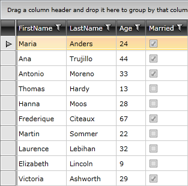
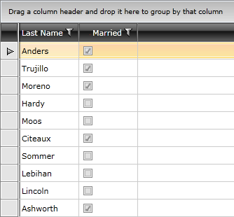

# Getting Started

 <table> <tr><td>RELATED VIDEOS</td></tr><tr><td>In this video, we will look at some of the features and functionality in Telerik RadGridView for Silverlight and how you can start using it in your rich internet applications today.(Runtime: 03:36)
<iframe title="link" width="480" height="390" src="http://tv.telerik.com/silverlight/video/introduction-radgridview-silverlight" frameborder="0" allowfullscreen>< /iframe>
</td></tr></table>


This tutorial will walk you through the creation of a sample application that contains __RadGridView__ control. 

>In order to use the __RadGridView__ control in your projects you have to add references to the following assemblies:			

* __Telerik.Windows.Controls__

* __Telerik.Windows.Controls.GridView__

* __Telerik.Windows.Controls.Input__

* __Telerik.Windows.Data__

For the purpose of this example, you will need to open Visual Studio and then create an empty Application project.

## Adding RadGridView to the Project

* Create a new project.

* You can add __RadGridView__ manually by writing the XAML code in Example 1. You can also add the control by dragging it from the __Toolbox__ and dropping it over the XAML.
            

* Make sure the required assemblies are referenced.

__Example 1:__ Adding a __RadGridView__ manually in XAML.

#### __XAML__

{{region gridview-getting-started2_0}}

	<Grid x:Name="LayoutRoot" Background="White">
		<telerik:RadGridView x:Name="radGridView" />
	</Grid>
{{endregion}}

Two lines code from Example 1 are important here:

* First is the import of __Telerik__ schema. 

#### __XAML__

{{region gridview-getting-started2_2}}

	xmlns:telerik="http://schemas.telerik.com/2008/xaml/presentation"
{{endregion}}

* Second is the declaration of __RadGridView__ control. 

#### __XAML__

{{region gridview-getting-started2_3}}

	<telerik:RadGridView x:Name="radGridView" />
{{endregion}}

* If you run the application (Figure 1) you will see an empty grid with no columns and rows. 

__Figure1__: The empty grid generated by __Example 1__.

## Binding RadGridView

* In order to populate __RadGridView__ control with some sample data for this help article, you should create a new class named "__Employee__" and add several properties to it as shown in __Example 2__.
            

__Example 2:__ A simple Employee class with four properties.
        

#### __C#__

{{region gridview-getting-started2_4}}

	public class Employee
	{
	    public string FirstName
	    {
	        get;
	        set;
	    }
	    public string LastName
	    {
	        get;
	        set;
	    }
	    public int Age
	    {
	        get;
	        set;
	    }
	    public bool IsMarried
	    {
	        get;
	        set;
	    }
	}
{{endregion}}

#### __VB__

{{region gridview-getting-started2_5}}

	Public Class Employee
	Private _FirstName As String
	    Public Property FirstName() As String
	        Get
	            Return _FirstName
	        End Get
	        Set(ByVal value As String)
	            _FirstName = value
	        End Set
	    End Property
	
	Private _LastName As String
	    Public Property LastName() As String
	        Get
	            Return _LastName
	        End Get
	        Set(ByVal value As String)
	            _LastName = value
	        End Set
	    End Property
	
	Private _Age As Integer
	    Public Property Age() As Integer
	        Get
	            Return _Age
	        End Get
	        Set(ByVal value As Integer)
	            _Age = value
	        End Set
	    End Property
	
	        Private _IsMarried As Boolean
	        Public Property IsMarried() As Boolean
	            Get
	                Return _IsMarried
	            End Get
	            Set(ByVal value As Boolean)
	                _IsMarried = value
	            End Set
	        End Property
	    End Class
{{endregion}}

>If you want to support two-way binding, your __Employee__ class should implement the __INotifyPropertyChanged__ interface and raise the __PropertyChanged__ event every time a property value changes.

* Next, you should create the "__EmployeeService__" class and implement a static method __GetEmployees__. For the purpose of this tutorial, it will return an observable collection containing several hard-coded employees. 
            

__Example 3:__ The EmployeeService class with the __GetEmployees__ static method contains hard-coded employee data.
        

#### __C#__

{{region gridview-getting-started2_6}}

	public class EmployeeService
	{
	    public static ObservableCollection<Employee> GetEmployees()
	    {
	        ObservableCollection<Employee> employees = new ObservableCollection<Employee>();
	        Employee employee = new Employee();
	        employee.FirstName = "Maria";
	        employee.LastName = "Anders";
	        employee.IsMarried = true;
	        employee.Age = 24;
	        employees.Add( employee );
	        employee = new Employee();
	        employee.FirstName = "Ana";
	        employee.LastName = "Trujillo";
	        employee.IsMarried = true;
	        employee.Age = 44;
	        employees.Add( employee );
	        employee = new Employee();
	        employee.FirstName = "Antonio";
	        employee.LastName = "Moreno";
	        employee.IsMarried = true;
	        employee.Age = 33;
	        employees.Add( employee );
	        employee = new Employee();
	        employee.FirstName = "Thomas";
	        employee.LastName = "Hardy";
	        employee.IsMarried = false;
	        employee.Age = 13;
	        employees.Add( employee );
	        employee = new Employee();
	        employee.FirstName = "Hanna";
	        employee.LastName = "Moos";
	        employee.IsMarried = false;
	        employee.Age = 28;
	        employees.Add( employee );
	        employee = new Employee();
	        employee.FirstName = "Frederique";
	        employee.LastName = "Citeaux";
	        employee.IsMarried = true;
	        employee.Age = 67;
	        employees.Add( employee );
	        employee = new Employee();
	        employee.FirstName = "Martin";
	        employee.LastName = "Sommer";
	        employee.IsMarried = false;
	        employee.Age = 22;
	        employees.Add( employee );
	        employee = new Employee();
	        employee.FirstName = "Laurence";
	        employee.LastName = "Lebihan";
	        employee.IsMarried = false;
	        employee.Age = 32;
	        employees.Add( employee );
	        employee = new Employee();
	        employee.FirstName = "Elizabeth";
	        employee.LastName = "Lincoln";
	        employee.IsMarried = false;
	        employee.Age = 9;
	        employees.Add( employee );
	        employee = new Employee();
	        employee.FirstName = "Victoria";
	        employee.LastName = "Ashworth";
	        employee.IsMarried = true;
	        employee.Age = 29;
	        employees.Add( employee );
	        return employees;
	    }
	}
{{endregion}}

#### __VB__

{{region gridview-getting-started2_7}}
    Public Class EmployeeService
        Public Shared Function GetEmployees() As ObservableCollection(Of Employee)
            Dim employees As New ObservableCollection(Of Employee)()

            Dim employee As New Employee()

            employee.FirstName = "Maria"
            employee.LastName = "Anders"
            employee.IsMarried = True
            employee.Age = 24
            employees.Add(employee)

            employee = New Employee()
            employee.FirstName = "Ana"
            employee.LastName = "Trujillo"
            employee.IsMarried = True
            employee.Age = 44
            employees.Add(employee)

            employee = New Employee()
            employee.FirstName = "Antonio"
            employee.LastName = "Moreno"
            employee.IsMarried = True
            employee.Age = 33
            employees.Add(employee)

            employee = New Employee()
            employee.FirstName = "Thomas"
            employee.LastName = "Hardy"
            employee.IsMarried = False
            employee.Age = 13
            employees.Add(employee)

            employee = New Employee()
            employee.FirstName = "Hanna"
            employee.LastName = "Moos"
            employee.IsMarried = False
            employee.Age = 28
            employees.Add(employee)

            employee = New Employee()
            employee.FirstName = "Frederique"
            employee.LastName = "Citeaux"
            employee.IsMarried = True
            employee.Age = 67
            employees.Add(employee)

            employee = New Employee()
            employee.FirstName = "Martin"
            employee.LastName = "Sommer"
            employee.IsMarried = False
            employee.Age = 22
            employees.Add(employee)

            employee = New Employee()
            employee.FirstName = "Laurence"
            employee.LastName = "Lebihan"
            employee.IsMarried = False
            employee.Age = 32
            employees.Add(employee)

            employee = New Employee()
            employee.FirstName = "Elizabeth"
            employee.LastName = "Lincoln"
            employee.IsMarried = False
            employee.Age = 9
            employees.Add(employee)

            employee = New Employee()
            employee.FirstName = "Victoria"
            employee.LastName = "Ashworth"
            employee.IsMarried = True
            employee.Age = 29
            employees.Add(employee)

            Return employees
        End Function
    End Class
{{endregion}}

* Now that you have prepared the needed sample data, it is time to bind __RadGridView__ to it. For that purpose, you should set the __RadGridView's ItemSource__ property to the collection of employees returned by the static method __EmployeeService.GetEmployees().__

#### __C#__

{{region gridview-getting-started2_8}}

	this.radGridView.ItemsSource = EmployeeService.GetEmployees();
{{endregion}}

#### __VB__

{{region gridview-getting-started2_9}}

	Me.radGridView.ItemsSource = EmployeeService.GetEmployees()
{{endregion}}

Now run your application and see the result (Figure 2).

__Figure 2: RadGridView__ bound to the collection of employees.

You can read more about data binding [here]().

## Grid Columns

The __RadGridView__ from the example above contains four columns, one for each of the properties of the employee class.__RadGridView__ automatically generates these columns. If you want to stop the columns auto generation, set the __RadGridView__ property __AutoGenerateColumns__ to __False__ as shown in __Example 4__.
        

__Example 4:__ When the AutoGenerateColumns property is False, you will have to manually describe the columns you wish to be shown.
        

#### __XAML__

{{region gridview-getting-started2_10}}

	<telerik:RadGridView x:Name="radGridView" AutoGenerateColumns="False">
	    <telerik:RadGridView.Columns>
	        <telerik:GridViewDataColumn DataMemberBinding="{Binding LastName}" Header="Last Name"/>
	        <telerik:GridViewDataColumn DataMemberBinding="{Binding IsMarried}" Header="Married"/>
	    </telerik:RadGridView.Columns>
	</telerik:RadGridView>
{{endregion}}

The code in Example 4 is shown in Figure 3. The XAML declaration of your __RadGridView__ contains two columns. The first one named "__Last Name__" is bound to the property __LastName__ and "__Is Married__" is bound respectively to __IsMarried__. As a result your grid control will have only two columns and no other column will be added because the property __AutoGenerateColumns__ is set to __False__.
        

__Figure 3: RadGridView__ with manually defined columns.

You can read more about __RadGridView__ columns [here]().

## Sorting, Grouping and Filtering of RadGridView are enabled by default
      
[Sorting](), [Grouping]() and [Filtering]() of __RadGridView__ are enabled by default.

* You can [disable  sorting]() for a specific column by setting its __IsSortable__ property to __False__. 
          
* You can [disable filtering]() for a specific column by setting its __IsFilterable__ property to __False__ or the __IsFilteringAllowed__ property of __RadGridView__ to __False__.        

* You can [disable grouping]() for a specific column by setting its __IsGroupable__ property to __False__.
            
# See Also

 * [Key Features]()

 * [Visual Structure]()

 * [Styling and Appearance]()

 * [Data Binding]()

 * [Defining Columns]()
