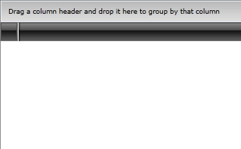
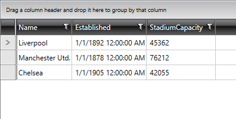
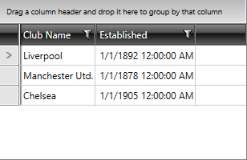
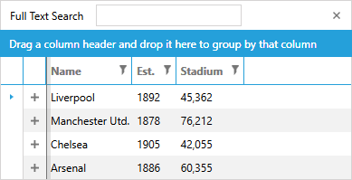

# Getting Started with {{ site.framework_name }} RadGridView

Use this tutorial to create a sample application that contains `RadGridView`. By the end of the article, you will have a working grid that is bound to sample data, displays custom columns, and is ready for sorting, grouping, filtering, and theming.

This article covers the following tasks:

* [Adding Telerik Assemblies Using NuGet](#adding-telerik-assemblies-using-nuget)
* [Adding Assembly References Manually](#adding-assembly-references-manually)
* [Adding RadGridView to the Project](#adding-radgridview-to-the-project)
* [Populating with Data](#populating-with-data)
* [Columns](#columns)
* [Sorting, Grouping and Filtering](#sorting-grouping-and-filtering)
* [Setting a Theme](#setting-a-theme)

## Adding Telerik Assemblies Using NuGet

To use `RadGridView` with NuGet packages, install `Telerik.Windows.Controls.GridView.for.Wpf.Xaml`. The exact package name can vary depending on whether the project uses [Xaml or NoXaml]() packages.

If the project uses NoXaml packages together with implicit styling, install the matching theme package as well.

Read more about the NuGet setup in [Installing UI for WPF from NuGet Packages]().

>tip With the 2025 Q1 release, the Telerik UI for WPF has a new licensing mechanism. You can learn more about it [here]().

## Adding Assembly References Manually

If you are not using NuGet packages, add references to the following assemblies:

* __Telerik.Licensing.Runtime__
* __Telerik.Windows.Controls__
* __Telerik.Windows.Controls.GridView__
* __Telerik.Windows.Controls.Input__
* __Telerik.Windows.Data__

## Adding RadGridView to the Project

After you add the required references, place `RadGridView` in your main window. You can do this in XAML or by dragging the control from the Visual Studio Toolbox.

__Example 1: Add RadGridView in XAML__

```xaml
	<Window x:Class="WpfApp1.Window1"
			xmlns="http://schemas.microsoft.com/winfx/2006/xaml/presentation"
			xmlns:x="http://schemas.microsoft.com/winfx/2006/xaml"
			xmlns:d="http://schemas.microsoft.com/expression/blend/2008"
			xmlns:mc="http://schemas.openxmlformats.org/markup-compatibility/2006"
			xmlns:telerik="http://schemas.telerik.com/2008/xaml/presentation"
			mc:Ignorable="d"
			Title="Window1" Height="450" Width="800">
		<Grid>
			<telerik:RadGridView/>
		</Grid>
	</Window>
```

>note To use `RadGridView` in XAML, declare the Telerik namespace shown in Example 2.

__Example 2: Declare the Telerik namespace__

```xaml
	xmlns:telerik="http://schemas.telerik.com/2008/xaml/presentation"
```

If you run the application at this stage, you will see an empty grid with no rows or columns, as shown in Figure 1.

#### __Figure 1: The empty grid generated by the code in Example 1__



## Populating with Data

To populate `RadGridView`, create a collection of business objects. For this example, create a `Club` class with a few properties, as shown in Example 3.        

__Example 3: Simple business class__

```C#
	public class Club : INotifyPropertyChanged
	{
	    public event PropertyChangedEventHandler PropertyChanged;
	
	    private string name;
	    private DateTime established;
	    private int stadiumCapacity;
	
	    public string Name
	    {
	        get { return this.name; }
	        set
	        {
	            if (value != this.name)
	            {
	                this.name = value;
	                this.OnPropertyChanged("Name");
	            }
	        }
	    }
	
	    public DateTime Established
	    {
	        get { return this.established; }
	        set
	        {
	            if (value != this.established)
	            {
	                this.established = value;
	                this.OnPropertyChanged("Established");
	            }
	        }
	    }
	
	    public int StadiumCapacity
	    {
	        get { return this.stadiumCapacity; }
	        set
	        {
	            if (value != this.stadiumCapacity)
	            {
	                this.stadiumCapacity = value;
	                this.OnPropertyChanged("StadiumCapacity");
	            }
	        }
	    }
	    
	    public Club(string name, DateTime established, int stadiumCapacity)
	    {
	        this.name = name;
	        this.established = established;
	        this.stadiumCapacity = stadiumCapacity;
	    }
	
	    protected virtual void OnPropertyChanged(PropertyChangedEventArgs args)
	    {
	        PropertyChangedEventHandler handler = this.PropertyChanged;
	        if (handler != null)
	        {
	            handler(this, args);
	        }
	    }
	
	    private void OnPropertyChanged(string propertyName)
	    {
	        this.OnPropertyChanged(new PropertyChangedEventArgs(propertyName));
	    }
	}
```
```VB.NET
	Public Class Club
	    Implements INotifyPropertyChanged
	    Public Event PropertyChanged As PropertyChangedEventHandler Implements INotifyPropertyChanged.PropertyChanged
	
	    Private m_name As String
	    Private m_established As DateTime
	    Private m_stadiumCapacity As Integer
	
	    Public Property Name() As String
	        Get
	            Return Me.m_name
	        End Get
	        Set(value As String)
	            If value <> Me.m_name Then
	                Me.m_name = value
	                Me.OnPropertyChanged("Name")
	            End If
	        End Set
	    End Property
	
	    Public Property Established() As DateTime
	        Get
	            Return Me.m_established
	        End Get
	        Set(value As DateTime)
	            If value <> Me.m_established Then
	                Me.m_established = value
	                Me.OnPropertyChanged("Established")
	            End If
	        End Set
	    End Property
	
	    Public Property StadiumCapacity() As Integer
	        Get
	            Return Me.m_stadiumCapacity
	        End Get
	        Set(value As Integer)
	            If value <> Me.m_stadiumCapacity Then
	                Me.m_stadiumCapacity = value
	                Me.OnPropertyChanged("StadiumCapacity")
	            End If
	        End Set
	    End Property
	
	    Public Sub New()
	    End Sub
	
	    Public Sub New(name As String, established As DateTime, stadiumCapacity As Integer)
	        Me.m_name = name
	        Me.m_established = established
	        Me.m_stadiumCapacity = stadiumCapacity
	    End Sub
	
	    Protected Overridable Sub OnPropertyChanged(ByVal args As PropertyChangedEventArgs)
	        Dim handler As PropertyChangedEventHandler = Me.PropertyChangedEvent
	        If handler IsNot Nothing Then
	            handler(Me, args)
	        End If
	    End Sub
	    Private Sub OnPropertyChanged(ByVal propertyName As String)
	        Me.OnPropertyChanged(New PropertyChangedEventArgs(propertyName))
	    End Sub
	End Class
```

>tip If you want to support two-way binding, implement `INotifyPropertyChanged` and raise `PropertyChanged` whenever a bound property value changes.

Next, create a view model that exposes a collection of `Club` objects.

__Example 4: View model containing ObservableCollection of sample data__

```C#
	public class MyViewModel : ViewModelBase
	{
	    private ObservableCollection<Club> clubs;
	
	    public ObservableCollection<Club> Clubs
	    {
	        get
	        {
	            if (this.clubs == null)
	            {
	                this.clubs = this.CreateClubs();
	            }
	
	            return this.clubs;
	        }
	    }
	
	    private ObservableCollection<Club> CreateClubs()
	    {
	        ObservableCollection<Club> clubs = new ObservableCollection<Club>();
	        Club club;
	
	        club = new Club("Liverpool", new DateTime(1892, 1, 1), 45362);
	        clubs.Add(club);
	
	        club = new Club("Manchester Utd.", new DateTime(1878, 1, 1), 76212);
	        clubs.Add(club);
	
	        club = new Club("Chelsea", new DateTime(1905, 1, 1), 42055);
	        clubs.Add(club);
	
	        return clubs;
	    }
	}
```
```VB.NET
	Public Class MyViewModel
	    Inherits ViewModelBase
	    Private m_clubs As ObservableCollection(Of Club)
	
	    Public ReadOnly Property Clubs() As ObservableCollection(Of Club)
	        Get
	            If Me.m_clubs Is Nothing Then
	                Me.m_clubs = Me.CreateClubs()
	            End If
	
	            Return Me.m_clubs
	        End Get
	    End Property
	
	    Private Function CreateClubs() As ObservableCollection(Of Club)
	        Dim clubs As New ObservableCollection(Of Club)()
	        Dim club As Club
	
	        club = New Club("Liverpool", New DateTime(1892, 1, 1), 45362)
	        clubs.Add(club)
	
	        club = New Club("Manchester Utd.", New DateTime(1878, 1, 1), 76212)
	        clubs.Add(club)
	
	        club = New Club("Chelsea", New DateTime(1905, 1, 1), 42055)
	        clubs.Add(club)
	
	        Return clubs
	    End Function
	End Class
```

>tip __ViewModelBase__ is an abstract class implementing __INotifyPropertyChanged__. It resides in the Telerik.Windows.Controls namespace.

Now bind `RadGridView` to the `Clubs` collection through the `ItemsSource` property.

Example 5 shows the XAML binding approach. The `local` namespace corresponds to the namespace where `MyViewModel` is defined.

__Example 5: Bind RadGridView__

```xaml
	<Window x:Class="WpfApp1.Window1"
			xmlns="http://schemas.microsoft.com/winfx/2006/xaml/presentation"
			xmlns:x="http://schemas.microsoft.com/winfx/2006/xaml"
			xmlns:d="http://schemas.microsoft.com/expression/blend/2008"
			xmlns:mc="http://schemas.openxmlformats.org/markup-compatibility/2006"
			xmlns:telerik="http://schemas.telerik.com/2008/xaml/presentation"
			mc:Ignorable="d"
			xmlns:local="clr-namespace:WpfApp1"
			Title="Window1" Height="450" Width="800">
		<Grid>
			<Grid.Resources>
				<local:MyViewModel x:Key="MyViewModel" />
			</Grid.Resources>
			<telerik:RadGridView x:Name="gridView" DataContext="{StaticResource MyViewModel}" ItemsSource="{Binding Clubs}"/>
		</Grid>
	</Window>
```

Alternatively, set `ItemsSource` in code-behind, as shown in Example 6.

__Example 6: Set ItemsSource in code__

```C#
	public partial class Window1 : Window
    {
        public Window1()
        {
            InitializeComponent();
            this.gridView.ItemsSource = new MyViewModel().Clubs;
        }
    }
```
```VB.NET
	Public Partial Class Window1
		Inherits Window

		Public Sub New()
			InitializeComponent()
			Me.gridView.ItemsSource = New MyViewModel().Clubs
		End Sub
	End Class
```

Running the application with the code from Examples 1 through 6 produces a populated `RadGridView`, as shown in Figure 2.

#### __Figure 2: RadGridView bound to collection of clubs__



Use this quick verification checklist before you continue:

1. Build the project.
2. Confirm that the `telerik` namespace resolves in XAML.
3. Run the application.
4. Verify that the grid shows the sample club data.

For more about data setup, see [Configure the Data Bindings]().

## Columns

The `RadGridView` in the previous examples contains three columns, one for each property of `Club`. By default, `RadGridView` auto-generates those columns.

If you want full control over which columns are visible, set `AutoGenerateColumns` to `False` and define the columns manually.

Example 7 demonstrates that approach.

__Example 7: Manually defined columns__

```xaml
	<telerik:RadGridView x:Name="manualGridView" DataContext="{StaticResource MyViewModel}" 
	                     ItemsSource="{Binding Clubs}" 
	                     AutoGenerateColumns="False" >
	    <telerik:RadGridView.Columns>
	        <telerik:GridViewDataColumn DataMemberBinding="{Binding Name}" Header="Club Name"/>
	        <telerik:GridViewDataColumn DataMemberBinding="{Binding Established}" Header="Established"/>
	    </telerik:RadGridView.Columns>
	</telerik:RadGridView>
```

In Figure 3, the grid shows only the two columns defined in XAML because `AutoGenerateColumns` is `False`.

#### __Figure 3: RadGridView with manually defined columns__



To learn more about column configuration, see [Defining Columns]().

## Sorting, Grouping, and Filtering

[Sorting](), [Grouping](), and [Filtering]() are enabled by default.

You can adjust each behavior per column:
          
* To [disable sorting](), set `IsSortable` to `False`.
* To [disable filtering](), set `IsFilterable` to `False`, or set `IsFilteringAllowed` on `RadGridView` to `False`.
* To [disable grouping](), set `IsGroupable` to `False`.

These defaults make it easy to get a functional grid quickly and then refine the behavior later.

## Setting a Theme

The Telerik UI for WPF suite supports multiple themes. To apply a theme other than the default one, see [Setting a Theme]().

>important Changing the theme using implicit styles will affect all controls that have styles defined in the merged resource dictionaries. This is applicable only for the controls in the scope in which the resources are merged. 

To change the theme:

1. Choose a theme and add a reference to the corresponding theme assembly, for example `Telerik.Windows.Themes.Windows8.dll`.
2. Merge the required resource dictionaries from that theme assembly.

You can preview the available themes in the **Theming** examples from the [WPF Controls Examples](https://demos.telerik.com/wpf/)[Silverlight Controls Examples](https://demos.telerik.com/silverlight/#GridView/Theming) application.

For `RadGridView`, merge the following resources:

	* __Telerik.Windows.Controls__
	* __Telerik.Windows.Controls.Input__
	* __Telerik.Windows.Controls.GridView__

__Example 8__ demonstrates how to merge the ResourceDictionaries so that they are applied globally for the entire application.

__Example 8: Merge the ResourceDictionaries__  
```xaml
		<Application.Resources>
			<ResourceDictionary>
				<ResourceDictionary.MergedDictionaries>
	                <ResourceDictionary Source="/Telerik.Windows.Themes.Windows8;component/Themes/System.Windows.xaml"/>
	                <ResourceDictionary Source="/Telerik.Windows.Themes.Windows8;component/Themes/Telerik.Windows.Controls.xaml"/>
	                <ResourceDictionary Source="/Telerik.Windows.Themes.Windows8;component/Themes/Telerik.Windows.Controls.Input.xaml"/>
	                <ResourceDictionary Source="/Telerik.Windows.Themes.Windows8;component/Themes/Telerik.Windows.Controls.GridView.xaml"/>
				</ResourceDictionary.MergedDictionaries>
			</ResourceDictionary>
		</Application.Resources>
```

__Figure 4__ shows __RadGridView__ with the **Windows8** theme applied.
	
#### __Figure 4: RadGridView with the Windows8 theme__



## Telerik UI for WPF Learning Resources

* [Telerik UI for WPF DataGrid Component](https://www.telerik.com/products/wpf/gridview.aspx)
* [Getting Started with Telerik UI for WPF Components]()
* [Telerik UI for WPF Installation]()
* [Telerik UI for WPF and WinForms Integration]()
* [Telerik UI for WPF Visual Studio Templates]()
* [Setting a Theme with Telerik UI for WPF]()
* [Telerik UI for WPF Virtual Classroom (Training Courses for Registered Users)](https://learn.telerik.com/learn/course/external/view/elearning/16/telerik-ui-for-wpf) 
* [Telerik UI for WPF License Agreement](https://www.telerik.com/purchase/license-agreement/wpf-dlw-s)


## See Also

 * [Key Features]()

 * [Visual Structure]()

 * [Styling and Appearance]()

 * [Configure the Data Bindings]()

 * [Defining Columns]()
