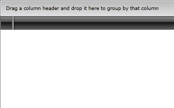
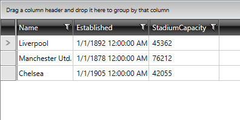
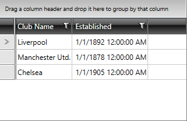
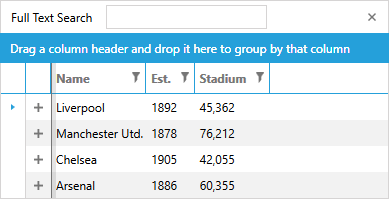

# Getting Started with {{ site.framework_name }} GridView

This tutorial will walk you through the creation of a sample application that contains __RadGridView__. 

* [Adding Telerik Assemblies Using NuGet](#adding-telerik-assemblies-using-nuget)
* [Adding Assembly References Manually](#adding-assembly-references-manually)
* [Adding RadGridView to the Project](#adding-radgridview-to-the-project)
* [Populating with Data](#populating-with-data)
* [Columns](#columns)
* [Sorting, Grouping and Filtering](#sorting-grouping-and-filtering)
* [Setting a Theme](#setting-a-theme)

## Adding Telerik Assemblies Using NuGet

To use __RadGridView__ when working with NuGet packages, install the `Telerik.Windows.Controls.GridView.for.Wpf.Xaml` package. The [package name may vary]() slightly based on the Telerik dlls set - [Xaml or NoXaml]()

Read more about NuGet installation in the [Installing UI for WPF from NuGet Package]() article.

>tip With the 2025 Q1 release, the Telerik UI for WPF has a new licensing mechanism. You can learn more about it [here]().

## Adding Assembly References Manually

If you are not using NuGet packages, you can add a reference to the following assemblies:

* __Telerik.Licensing.Runtime__
* __Telerik.Windows.Controls__
* __Telerik.Windows.Controls.GridView__
* __Telerik.Windows.Controls.Input__
* __Telerik.Windows.Data__

## Adding RadGridView to the Project

Before proceeding with adding __RadGridView__ to your project, make sure the required assembly references are added to the project. 

You can add __RadGridView__ manually by writing the XAML code in __Example 1__. You can also add the control by dragging it from the Visual Studio Toolbox and dropping it over the XAML view.

__Example 1: Adding RadGridView in XAML__

<snippet id='radgridview-getting-started-getting-started2-example_1_adding_radgridview_in_xaml-xaml' />

>In order to use __RadGridView__ in XAML, you have to add the following namespace declaration:
>__Example 2: Declaring Telerik Namespace__

<snippet id='radgridview-getting-started-getting-started2-example_1_adding_radgridview_in_xaml-xaml' />

If you run the application, you will see an empty grid with no columns and rows as demonstrated in __Figure 1__. 

#### __Figure 1: The empty grid generated by the code in Example 1__

## Populating with Data

In order to populate the __RadGridView__ control with data, you should create a collection of business objects. For the purposes of this example, create a new class named __Club__ and add several properties to it, as shown in __Example 3__.
        

__Example 3: Simple business class__

<snippet id='radgridview-getting-started-getting-started2-example_3_simple_business_class-cs' />

<snippet id='radgridview-getting-started-getting-started2-example_3_simple_business_class-vb' />

>If you want to support two-way binding, your __Club__ class should implement the __INotifyPropertyChanged__ interface and raise the __PropertyChanged__ event every time a property value changes.

Next, you should create the view model containing a collection of Club objects.            
     

__Example 4: View model containing ObservableCollection of sample data__

<snippet id='radgridview-getting-started-getting-started2-example_4_view_model_containing_observablecollection_of_sample_data-cs' />

<snippet id='radgridview-getting-started-getting-started2-example_4_view_model_containing_observablecollection_of_sample_data-vb' />

>tip __ViewModelBase__ is an abstract class implementing __INotifyPropertyChanged__. It resides in the Telerik.Windows.Controls namespace.

Now that you have prepared the needed sample data, it is time to bind __RadGridView__ to it. For that purpose, you should set the __RadGridView's ItemsSource__ property to the collection of clubs.

__Example 5__ demonstrates how you can bind the ItemsSource collection in XAML. The _local_ namespace in the example corresponds to the namespace where __MyViewModel__ resides.

__Example 5: Bind RadGridView__

<snippet id='radgridview-getting-started-getting-started2-example_5_bind_radgridview-xaml' />

Alternatively, you can set the ItemsSource property in code-behind, as demonstrated in __Example 6__.

__Example 6: Set ItemsSource in code__

<snippet id='radgridview-getting-started-getting-started2-example_6_set_itemssource_in_code-cs' />

<snippet id='radgridview-getting-started-getting-started2-example_6_set_itemssource_in_code-vb' />

Running the application containing the code from Examples 1 - 6 will result in a populated __RadGridView__, like in __Figure 2__.

#### __Figure 2: RadGridView bound to collection of clubs__

You can read more about configuring the data bindings [here]().

## Columns

The __RadGridView__ from the examples above contains three columns, one for each of the properties of the Club class. __RadGridView__ automatically generates these columns. If you want to stop the columns auto generation and define the columns that you want to be visible manually, set the property __AutoGenerateColumns__ to __False__.

__Example 7__ demonstrates how you can manually prevent the automatic generation and define columns. 
        

__Example 7: Manually defined columns__

<snippet id='radgridview-getting-started-getting-started2-example_7_manually_defined_columns-xaml' />

The code in __Example 7__ is shown in __Figure 3__. The XAML declaration of the __RadGridView__ contains two columns: the first one named "Club Name" is bound to the _Name_ property. The second named "Established" is bound, respectively, to __Established__. As a result, your grid control will have only two columns and no other column will be added because the __AutoGenerateColumns__ property is set to __False__.
        

#### __Figure 3: RadGridView with manually defined columns__

You can read more about __RadGridView__ columns [here]().

## Sorting, Grouping and Filtering 
      
[Sorting](), [Grouping]() and [Filtering]() of __RadGridView__ are enabled by default.

* You can [disable sorting]() for a specific column by setting its __IsSortable__ property to __False__. 
          
* You can [disable filtering]() for a specific column by setting its __IsFilterable__ property to __False__ or by setting the __IsFilteringAllowed__ property of __RadGridView__ to __False__.        

* You can [disable grouping]() for a specific column by setting its __IsGroupable__ property to __False__.

## Setting a Theme

The controls from our suite support different themes. You can see how to apply a theme different than the default one in the [Setting a Theme]() help article.

>important Changing the theme using implicit styles will affect all controls that have styles defined in the merged resource dictionaries. This is applicable only for the controls in the scope in which the resources are merged. 

To change the theme, you can follow the steps below:
* Choose between the themes and add reference to the corresponding theme assembly (ex: **Telerik.Windows.Themes.Windows8.dll**). You can see the different themes applied in the **Theming** examples from our [WPF Controls Examples](https://demos.telerik.com/wpf/)[Silverlight Controls Examples](https://demos.telerik.com/silverlight/#GridView/Theming) application.

* Merge the ResourceDictionaries with the namespace required for the controls that you are using from the theme assembly. For __RadGridView__, you will need to merge the following resources:

	* __Telerik.Windows.Controls__
	* __Telerik.Windows.Controls.Input__
	* __Telerik.Windows.Controls.GridView__

__Example 8__ demonstrates how to merge the ResourceDictionaries so that they are applied globally for the entire application.

__Example 8: Merge the ResourceDictionaries__  
<snippet id='radgridview-getting-started-getting-started2-example_8_merge_the_resourcedictionaries-xaml' />

__Figure 4__ shows __RadGridView__ with the **Windows8** theme applied.
	
#### __Figure 4: RadGridView with the Windows8 theme__


## Telerik UI for WPF Learning Resources

* [Telerik UI for WPF DataGrid Component](https://www.telerik.com/products/wpf/gridview.aspx)
* [Getting Started with Telerik UI for WPF Components]()
* [Telerik UI for WPF Installation]()
* [Telerik UI for WPF and WinForms Integration]()
* [Telerik UI for WPF Visual Studio Templates]()
* [Setting a Theme with Telerik UI for WPF]()
* [Telerik UI for WPF Virtual Classroom (Training Courses for Registered Users)](https://learn.telerik.com/learn/course/external/view/elearning/16/telerik-ui-for-wpf) 
* [Telerik UI for WPF License Agreement](https://www.telerik.com/purchase/license-agreement/wpf-dlw-s)


## See Also

 * [Key Features]()

 * [Visual Structure]()

 * [Styling and Appearance]()

 * [Configure the Data Bindings]()

 * [Defining Columns]()
