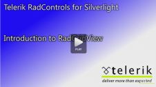

# Overview

## 

<table> <tr><td>RELATED VIDEOS</td></tr><tr><td>In this video, we will look at some of the features and functionality in Telerik RadGridView for Silverlight and how you can start using it in your rich internet applications today.(Runtime: 03:36)

[Link...](http://tv.telerik.com/silverlight/video/introduction-radgridview-silverlight)</td></tr></table>



Thank you for choosing Telerik __RadGridView__!

__RadGridView__ for SilverlightWPF is the ultimate grid control that provides outstanding performance and a remarkably flexible hierarchy model. __RadGridView__ enables you to create fully customizable and highly interactive interfaces for display and management of large data. 
        

__RadGridView__ key features list:

* __WPF/Silverlight code compatibility__

* __Powerful data binding to objects, collections, XML and WCF services__

* __Grouping__

* __Sorting__

* __Filtering__

* __Totals row with aggregate functions__

* __Frozen columns__

* __Row details and details presenter for better user experience__

* __In-place data editing with validation__

* __Enable\disable grid elements__

* __Completely stylable control with a variety of themes and properties__

* __Templates for advanced customizations of the look and feel__

* __Custom layout__

* __Flexible hierarchy model, support of self-referencing and custom hierarchy models__

* __Selecting and navigating__

* __Localization support__

* __Flexible API__

* __Enhanced Routed Events Framework will help your code become even more elegant and concise__

* __All Telerik controls for__

You can find a list with all key features and additional explanation of the features [here]()

Check out the online demo 
          [here.](http://demos.telerik.com/silverlight/#GridView/FirstLook)

Check out the WPF demos [here.](http://demos.telerik.com/wpf/)

>tipYou can find more examples of how to implement various scenarios available for download from our online SDK repository
            [here. ](https://github.com/telerik/xaml-sdk/)Look for examples listed under __GridView__.
            For a better and easier reviewing of our examples you can download the 
            [SDK Samples Browser.](http://demos.telerik.com/xaml-sdkbrowser//)

# See Also

 * [Getting Started]()

 * [Key Features]()

 * [Visual Structure]()[UI for WPF Demos](http://demos.telerik.com/wpf/)[SDK Samples Browser](http://demos.telerik.com/xaml-sdkbrowser//)
