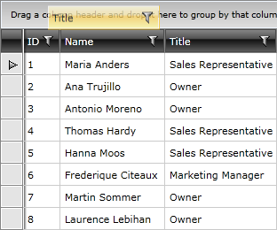
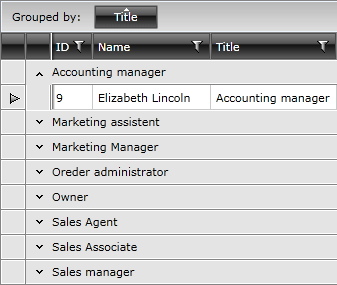
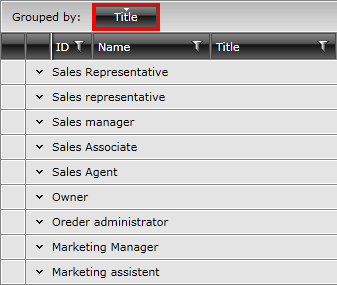
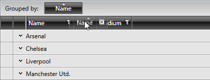
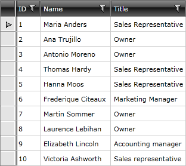
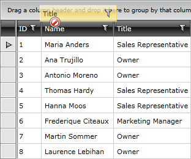

# Basic Grouping

__RadGridView__ provides a built-in grouping functionality, which allows the user to easily group the data by one or more columns.

>The groups of RadGridView can be programmatically expanded and collapsed. This is demonstrated in the [Programmatic Grouping]() topic.

In order to group data the user has to just drag the desired column to __GridViewGroupPanel__ located at the top of __RadGridView__. If __RadGridView__ is not grouped, a hint is shown in __GridViewGroupPanel__.

#### __Figure 1: Dragging a column to the GridViewGroupPanel__



After dropping the selected header in the grouping area, the text message will be replaced with a rectangle that represents the selected header and the data will be properly grouped.

#### __Figure 2: RadGridView after grouping__



To remove the grouping just click the close button of the rectangle or drag it out of the grouping area.

#### __Figure 3: Removing the grouping__


>tipThe data can be grouped by more than one column. To do that just drag another column into the grouping area and the data will be grouped against these two criteria. To learn more about the multi-column grouping take a look at the [Multi-Column Grouping]() topic.
        
>tipGridViewColumn exposes a property __ShowColumnWhenGrouped__. It indicates whether the column should be visible or not when RadGridView is grouped by this same column. By default its value is True and the column will remain visible.

>tip As of __Q3 2012__ we have introduced a new rendering mode of RadGridView - Flat. The default GroupRenderMode is Nested, and the new one is __Flat__. When you set the Flat mode, the GridView will render rows one below the other. This leads to a very good perfromance when the grid is grouped on several levels and has a lot of data. You can also refer to the [Grouping Modes]() article.

__RadGridView__ also provides the user with a way to sort the groups of data. To do that the user just has to click on the rectangle that represents the grouping column. By default, when the data is grouped, the groups are sorted __Ascending__. When the sort direction of the rectangle is None the groups are sorted depending on the data they contain. 

#### __Figure 4: Sorting RadGridView when grouping is applied__



### Sort Group by Aggregate
        
You can download a __runnable project__ on how to sort a group by defined aggregate functions from our online SDK repository: [SortGroupByAggregate](https://github.com/telerik/xaml-sdk/tree/master/GridView/SortGroupByAggregate).

### Sort Group by Different Property

>tipYou can download a __runnable project__ on how to sort a group by a different property from our online SDK repository: [SortGroupByDifferentProperty](https://github.com/telerik/xaml-sdk/tree/master/GridView/SortGroupByDifferentProperty).

>You can also check the [SDK Samples Browser]() that provides a more convenient approach in exploring and executing the examples in the Telerik XAML SDK repository. 

## GroupMemberPath

Each GridViewColumn has a property called GroupMemberPath. This property can be used to specify the column to group on a property different from the bound one. 

For example, you can configure the column to be grouped on the Name property although the bound property is Title:

__Example 1 : Set GroupMemberPath for a certain column__

```XAML
	<telerik:GridViewDataColumn DataMemberBinding="{Binding Title}"
	                GroupMemberPath="Name" />
```

## Grouping Modes

As of __Q3 2012__ we have introduced a new __GroupRenderMode__ of RadGridView . It has two options:
        
__Nested Mode__: It is the default one and it will nest GridViewGroupRows into one another when you have grouping on many levels. This may lead to a poor performance when the grid is grouped on several levels and has a lot of data. The visual element representing the grouped row is GridViewGroupRow.
        
__Flat Mode__: This mode simply renders rows one below the other. This leads to a very good perfromance when the grid is grouped on several levels and has a lot of data. The visual element representing the grouped row is GroupHeaderRow.
        
>Please note that when you use the __Flat Mode__, you should work with __GroupHeaderRow, not GridViewGroupRow__.
   
## Reorder Columns when Ungrouping

The **ShouldReorderColumnsOnUngrouping** property controls whether the columns' **DisplayIndex** will be changed when the user drags a group cell onto a header cell. The default value is **False** - when the user ungroups, the display indexes of the columns prior to the grouping will not be changed. When set to **True**, if the user drops the group cell onto one of RadGridView's header cells, the columns will be **reordered** based on the drop position.

#### __Figure 5: Dragging the group cell over a header cell__



#### __Figure 6: The reordered columns when ShouldReorderColumnsOnUngrouping is True__


       
## Disabling Grouping

> As of __R2 2018__ the grouping operation can be disabled for all columns of the control. This can be done through the __CanUserGroupColumns__ property of __RadGridView__. If the property is set to __False__ at runtime and there is a grouping applied prior it, the user will not be able to neither, ungroup the control nor to reorder the __GroupPanelCells__ in the __GroupPanel__.

There are two ways to disable the built-in grouping of __RadGridView__. The first one is at __RadGridView__ level via the __ShowGroupPanel__ property. By setting it to __False__ the grouping area gets hidden and the column headers have nowhere to be dropped. The default value is __True__.

__Example 2: Disable Grouping__

```XAML
	<telerik:RadGridView x:Name="radGridView" ShowGroupPanel="False"/>
```

#### __Figure 7: RadGridView with disabled grouping__



The second way is to disable it on column level via __IsGroupable__ property. When set to __False__ the column is not allowed to be dropped in the grouping area.

__Example 3: Disable grouping for specific column__

```XAML
	<telerik:GridViewDataColumn DataMemberBinding="{Binding Title}"
	                Header="Title"
	                UniqueName="Title"
	                IsGroupable="False" />
```

__Example 3: Disable grouping for a specific column__

```C#
	this.radGridView.Columns["Title"].IsGroupable = false;
```
```VB.NET
	Me.radGridView.Columns("Title").IsGroupable = False
```

#### __Figure 8: RadGridView with disabled grouping for a specific column__



>important If an **IValueConverter** is applied to the **DataMemberBinding** of a certain column, Grouping will respect it and create Group names according to the converted values. Thus, the appearance of duplicated groups will be avoided. In the case of filtering the **RadGridView** control, on the other hand, the converted values would not be respected.  

## Events

There are two events that are raised, when the data in __RadGridView__ is grouped. The first one is __Grouping__ event and it is raised before the data is grouped. The second one is __Grouped__ event and it is raised when the data has been already grouped. You can find more information about them [here]().

## Styling and Appearance

__RadGridView__ provides you with several ways to style the default look and appearance of the built-in grouping functionality. You can manipulate the grouping area at the top of __RadGridView.__ To learn how to do this take a look at the [Modifying the Grouping Panel]() topic.

You can easily change the appearance of the group row by just setting __GroupRowStyle__ property. To learn how to use it take a look at the [Styling the Group Row]() topic.

You can also manipulate the visual appearance of the group footers. Just set the __GroupFooterCellStyle__ property of the __GridViewColumn__ to an appropriate style. 

You can also manipulate the visual appearance of the group footers. Just configure __GroupFooterCellStyle__ property of __GridViewColumn__ to an appropriate style. 

To learn more about the group footers take a look at the [Group Footers]() topic. 

To learn how to style them take a look at the [Styling the Group Footers]() topic.

## See Also

 * [Grouping Modes]()

 * [Grouping events]()

 * [Programmatic Grouping]()

 * [Multiple-column Grouping]()

 * [Group Aggregates]()

 * [Group Footers]()

 * [Modifying the Group Panel]()

 * [Reevaluation of data operations]()
