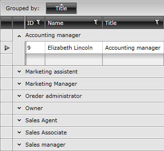
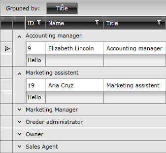
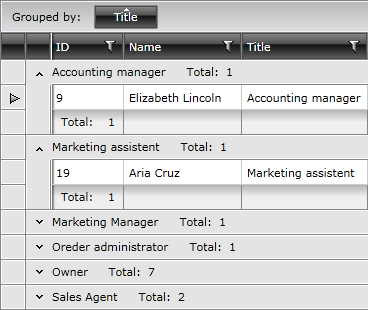

# Group Footers

__RadGridView__ exposes __group footers__ features which provide the option to render a footer under each group in the grid. Group footers display group summaries and contain footer cells that correspond to data columns.

This tutorial will walk you through the common tasks of:

* [Enabling the group footers functionality](#enable-group-footers-functionality)

* [Setting the group footers content](#set-the-group-footers-content)

* [Styling the group footers](#styling-group-footers)

* [Re-defining Group Aggregates](#re-defining-group-aggregates)

>Before continuing with this topic make sure that you are familiar with the [Visual Structure]() of __RadGridView__.

For the purpose of this tutorial the following declaration will be used:

<snippet id='radgridview-grouping-group-footers-block_1-xaml' />

## Enable Group Footers Functionality

In order to enable the group footers functionality, merely set __ShowGroupFooters__ property of __RadGridView__ to __True__.

<snippet id='radgridview-grouping-group-footers-block_2-xaml' />

>The default value of __ShowGroupFooters__ property is __False__.

The same operation can be done in the code-behind.

<snippet id='radgridview-grouping-group-footers-block_3-cs' />

<snippet id='radgridview-grouping-group-footers-block_3-vb' />

## Set the Group Footers Content

* Using __GroupFootersTemplate__.

If you want your group footers to have a static content, simply configure __GroupFootersTemplate__ property.

<snippet id='radgridview-grouping-group-footers-block_4-xaml' />

* Using [Aggregate Functions]().

The group footers are most commonly used to visualize calculations from aggregate functions within the scope of the current group. Consider the following example:

<snippet id='radgridview-grouping-group-footers-block_5-xaml' />

The result can be seen on the next image.

>__RadGridView__ will calculate aggregates over the entire data source and will respect the filter expression applied (if present).

## Styling Group Footers

If you want to learn how to style group footers take a look at the [Styling Group Footers]() topic.

Check out the following topics which explain in great details __RadGridView__'s grouping functionality.

* Learn the [basic]() of the grouping behavior.

* Using group [aggregates]().

* [Implement]() programmatic grouping.

## Re-defining Group Aggregates

You can modify the default template of displaying group aggregates by applying a new __GroupFooterTemplate__ configured it per specific requirements.

<snippet id='radgridview-grouping-group-footers-block_6-xaml' />

> The GroupFooter's DataContext is __AggregateResultsList__.

## See Also
 * [Aggregate Functions]()
 * [Basic Filtering]()
 * [Programmatic Filtering]()
