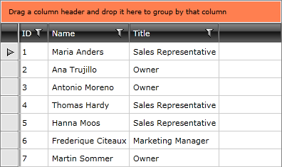
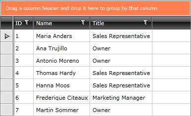

# Modifying Group Panel

__RadGridView__ exposes two properties - __GroupPanelBackground__ and __GroupPanelForeground__ which allow you to make basic modifications of the __Group Panel__ (area).

>tipThe __GridView__ also exposes two style properties - __GroupPanelStyle__ and __GroupPanelItemStyle__. To learn how to use them in order to style the __Group Panel__ read [here]().

>[Here]() you can read more information about the visual structure of the __RadGridView__.

## Setting the GroupPanelBackground

In the following example the group panel background is set to YellowGreen.


```XAML
	<telerik:RadGridView GroupPanelBackground="Coral" />
```



## Setting the GroupPanelForeground

Similarly to group panel's background you may also change the group panel's foreground. Consider the following example.


```XAML
	<telerik:RadGridView GroupPanelBackground="Coral" GroupPanelForeground="AntiqueWhite" />
```

And the result is:



Check out the following topics which explain in great details the __RadGridView__'s grouping functionality.

* Learn the [basic]() of the grouping behavior.

* Using group [aggregates]().

* [Implement]() programmatic grouping.

* Use [group footers]() for displaying summaries.

## See Also

 * [Style Group Panel]()

 * [Basic Filtering]()

 * [Programmatic Filtering]()

 * [Multiple Selection]()
