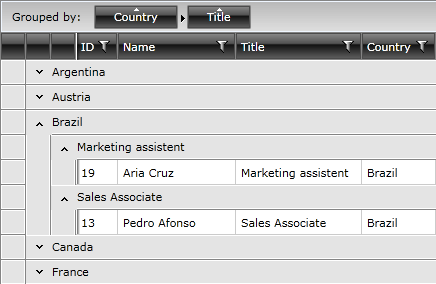
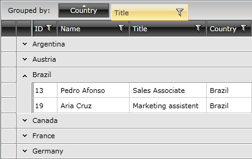
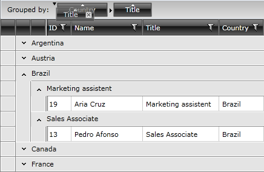

# Multiple-Column Grouping

On the snapshot you can see how the data in the __RadGridView__ is grouped by two columns - the __Country__ and the __Title__. The data is first grouped by the __Country__ column and then the data in the separate groups is grouped again by the __Title__ column.

The user can do it via the built-in grouping mechanism by dragging and dropping more than one column headers into the grouping area.

>The data in the __RadGridView__ will be grouped depending on the order the user drops the headers in the grouping area.

After adding several headers you are allowed to reorder them by dragging the rectangle representing the grouping criteria and dropping it at the desired position.

It is also possible to group the data by multiple columns programmatically by using the __GroupDescriptors__ collection of __RadGridView__. To learn more about it take a look at the [Programmatic Grouping]() topic.

If you want to implement multi-column grouping you just have to define __GroupDescriptor__ or __ColumnGroupDescriptor__ objects for the desired grouping criteria and add them to the __GroupDescriptors__ collection. It can be done at design time:

<snippet id='radgridview-grouping-multiple-column-grouping-block_1-xaml' />

This can be done at run time via managed code too:

<snippet id='radgridview-grouping-multiple-column-grouping-block_2-cs' />

<snippet id='radgridview-grouping-multiple-column-grouping-block_2-vb' />

The result is the same as if the user has dragged and dropped the desired columns into the grouping area:

## See Also

 * [Basic Grouping]()

 * [Programmatic Grouping]()

 * [Group Aggregates]()

 * [Group Footers]()

 * [Modifying the Group Panel]()
