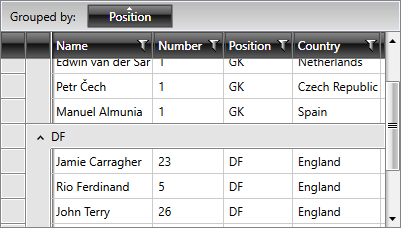
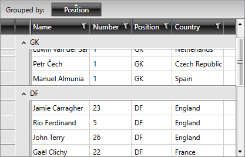

# Sticky Group Headers

By default, RadGridView's group headers will go out of view once you scroll past them as illustrated in **Figure 1**.

#### __Figure 1: RadGridView with Disabled Sticky Group Headers__



You can stick the headers of the group to the top until its items are scrolled out of view by setting the **EnableStickyGroupHeaders** property to *true*.

>important The EnableStickyGroupHeaders functionality is only supported when [GroupRenderMode]() is **Flat**. If the **Nested** grouping mode is set, a **NotSupportedException** will be thrown.

__Example 1: Enable Sticky Group Headers__

```XAML
	<telerik:RadGridView EnableStickyGroupHeaders="True" />
```

#### __Figure 2: RadGridView with Enabled Sticky Group Headers__



## See Also

 * [Group Footers]()
 * [Modifying Group Panel]()
 * [Grouping Modes]()
