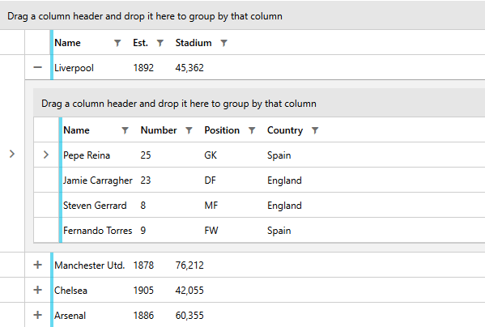
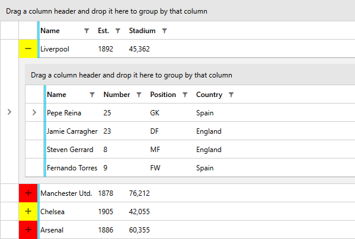

# Basic Hierarchies



__RadGridView__ allows you to display hierarchical data in the form of nested grid views. To do so you have to define a table definition for each subset of data you want to display. Such a definition can be done by creating a __GridViewTableDefinition__ object and adding it to the __ChildTableDefinitions__ collection of the __RadGridView__.

## Defining the GridViewTableDefinition

Specific for the __GridViewTableDefinition__ is that it needs to have its __Relation__ property to the name of the property containing the subset of data. In this way you define the data source for the nested tables. You set the property to an object of type __PropertyRelation__.

The __ParentPropertyName__ of the __PropertyRelation__ object represents the name of the property that will be used as a source for the nested table.

__Example 1: Defining the GridViewTableDefinition__

```XAML
	<telerik:GridViewTableDefinition>
	    <telerik:GridViewTableDefinition.Relation>
	        <telerik:PropertyRelation ParentPropertyName="Orders" />
	    </telerik:GridViewTableDefinition.Relation>
	</telerik:GridViewTableDefinition>
```

__Example 2: Defining the GridViewTableDefinition programmatically__
```C#
	GridViewTableDefinition td = new GridViewTableDefinition();
	td.Relation = new PropertyRelation("Orders");
```
```VB.NET
	Dim td As New GridViewTableDefinition()
	td.Relation = New Telerik.Windows.Data.PropertyRelation("Orders")
```

Now you can add the definition to the __ChildTableDefinitions__ collection.

__Example 3: Adding the GridViewTableDefinition to the ChildTableDefinitions__

```XAML
	<telerik:RadGridView x:Name="radGridView"
	                 AutoGenerateColumns="False">
	    <telerik:RadGridView.ChildTableDefinitions>
	        <telerik:GridViewTableDefinition>
	            <telerik:GridViewTableDefinition.Relation>
	                <telerik:PropertyRelation ParentPropertyName="Orders" />
	            </telerik:GridViewTableDefinition.Relation>
	        </telerik:GridViewTableDefinition>
	    </telerik:RadGridView.ChildTableDefinitions>
	</telerik:RadGridView>
```

__Example 4: Adding the GridViewTableDefinition to the ChildTableDefinitions programmatically__

```C#
	this.radGridView.ChildTableDefinitions.Add(td);
```
```VB.NET
	Me.radGridView.ChildTableDefinitions.Add(d)
```

>tip The __GridViewTableDefinition__ object also exposes a __ChildTableDefinitions__ property, which means that you can nest grids on more than one level.

## Check If a Hierarchy Item Is Expanded

>The __IsExpanded__ method can also be used to check whether a group is expanded. More information can be found in the [Programmatic Grouping]() topic.

In case when checking whether a given hierarchical item is expanded the __IsExpanded__ method of __RadGridView__ comes in handy. When an item is passed as a parameter to it, it will return a boolean value determining whether its hierarchy is expanded or not.

__Example 5: Call the IsExpanded method of RadGridView__

```C#
	bool isExpanded = this.clubsGrid.IsExpanded(this.clubsGrid.Items[0]);
```
```VB.NET
	Dim isExpanded As Boolean = Me.clubsGrid.IsExpanded(Me.clubsGrid.Items(0))
```

## Style the Hierarchy Expand Button

RadGridView exposes the **HierarchyExpandButtonStyle** and **HierarchyExpandButtonStyleSelector** properties which allow you to (conditionally) style the toggle button displayed for expanding the hierarchy rows. The style provided for the properties needs to target the **GridViewToggleButton** type.

**Examples 6,7 and 8** demonstrate how to set up and use the HierarchyExpandButtonStyleSelector property. Alternatively, you can define a style similar to the ones displayed in **Example 7** and set it as the HierarchyExpandButtonStyle of the control.

__Example 6: Defining the StyleSelector for the expand button__

```C#
    public class MyHierarchyExpandButtonStyleSelector : System.Windows.Controls.StyleSelector
	{
		public Style BigStadiumStyle { get; set; }
		public Style SmallStadiumStyle { get; set; }

		public override Style SelectStyle(object item, DependencyObject container)
		{
			if (item is Club)
			{
				Club club = item as Club;
				if (club.StadiumCapacity > 50000)
				{
					return BigStadiumStyle;
				}
				else
				{
					return SmallStadiumStyle;
				}
			}
			return null;
		}
	}
```
```VB.NET
	Public Class MyHierarchyExpandButtonStyleSelector
		Inherits System.Windows.Controls.StyleSelector

		Public Property BigStadiumStyle() As Style
		Public Property SmallStadiumStyle() As Style

		Public Overrides Function SelectStyle(ByVal item As Object, ByVal container As DependencyObject) As Style
			If TypeOf item Is Club Then
				Dim club As Club = TryCast(item, Club)
				If club.StadiumCapacity > 50000 Then
					Return BigStadiumStyle
				Else
					Return SmallStadiumStyle
				End If
			End If
			Return Nothing
		End Function
	End Class
```

__Example 7: Adding the style selector as a resource__

```XAML
		<Application.Resources>
			<local:MyHierarchyExpandButtonStyleSelector x:Key="StadiumCapacityStyleSelector">
				<local:MyHierarchyExpandButtonStyleSelector.BigStadiumStyle>
                    <!-- If you're using the NoXaml binaries you need to add the following attribute to the style:
                    BasedOn="{StaticResource GridViewToggleButtonStyle}" -->
                    <Style TargetType="telerik:GridViewToggleButton">
						<Setter Property="Background" Value="Red"/>
					</Style>
				</local:MyHierarchyExpandButtonStyleSelector.BigStadiumStyle>
				<local:MyHierarchyExpandButtonStyleSelector.SmallStadiumStyle>
                    <!-- If you're using the NoXaml binaries you need to add the following attribute to the style:
                    BasedOn="{StaticResource GridViewToggleButtonStyle}" -->
					<Style TargetType="telerik:GridViewToggleButton">
						<Setter Property="Background" Value="Yellow" />
					</Style>
				</local:MyHierarchyExpandButtonStyleSelector.SmallStadiumStyle>
			</local:MyHierarchyExpandButtonStyleSelector>
		</Grid.Resources>
```

__Example 8: Setting the HierarchyExpandButtonStyleSelector property__

```XAML
	<telerik:RadGridView HierarchyExpandButtonStyleSelector="{StaticResource StadiumCapacityStyleSelector}">
	<!-- ... -->
```

#### Figure 1: RadGridView with the custom HierarchyExpandButtonStyleSelector applied



## See Also

 * [Custom Hierarchies]()
 * [Self-Referencing GridView]()
 * [How-to Set Properties of the Child RadGridView]()