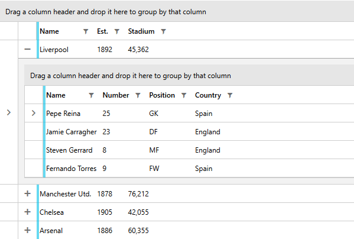
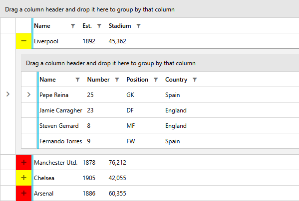

# Basic Hierarchies

__RadGridView__ allows you to display hierarchical data in the form of nested grid views. To do so you have to define a table definition for each subset of data you want to display. Such a definition can be done by creating a __GridViewTableDefinition__ object and adding it to the __ChildTableDefinitions__ collection of the __RadGridView__.

## Defining the GridViewTableDefinition

Specific for the __GridViewTableDefinition__ is that it needs to have its __Relation__ property to the name of the property containing the subset of data. In this way you define the data source for the nested tables. You set the property to an object of type __PropertyRelation__.

The __ParentPropertyName__ of the __PropertyRelation__ object represents the name of the property that will be used as a source for the nested table.

__Example 1: Defining the GridViewTableDefinition__

<snippet id='radgridview-hierarchical-gridview-basic-hierarchies-example_1_defining_the_gridviewtabledefinition-xaml' />

__Example 2: Defining the GridViewTableDefinition programmatically__
<snippet id='radgridview-hierarchical-gridview-basic-hierarchies-example_2_defining_the_gridviewtabledefinition_programmatically-cs' />

<snippet id='radgridview-hierarchical-gridview-basic-hierarchies-example_2_defining_the_gridviewtabledefinition_programmatically-vb' />

Now you can add the definition to the __ChildTableDefinitions__ collection.

__Example 3: Adding the GridViewTableDefinition to the ChildTableDefinitions__

<snippet id='radgridview-hierarchical-gridview-basic-hierarchies-example_3_adding_the_gridviewtabledefinition_to_the_childtabledefinitions-xaml' />

__Example 4: Adding the GridViewTableDefinition to the ChildTableDefinitions programmatically__

<snippet id='radgridview-hierarchical-gridview-basic-hierarchies-example_4_adding_the_gridviewtabledefinition_to_the_childtabledefinitions_programmatically-cs' />

<snippet id='radgridview-hierarchical-gridview-basic-hierarchies-example_4_adding_the_gridviewtabledefinition_to_the_childtabledefinitions_programmatically-vb' />

>tip The __GridViewTableDefinition__ object also exposes a __ChildTableDefinitions__ property, which means that you can nest grids on more than one level.

## Check If a Hierarchy Item Is Expanded

>The __IsExpanded__ method can also be used to check whether a group is expanded. More information can be found in the [Programmatic Grouping]() topic.

In case when checking whether a given hierarchical item is expanded the __IsExpanded__ method of __RadGridView__ comes in handy. When an item is passed as a parameter to it, it will return a boolean value determining whether its hierarchy is expanded or not.

__Example 5: Call the IsExpanded method of RadGridView__

<snippet id='radgridview-hierarchical-gridview-basic-hierarchies-example_5_call_the_isexpanded_method_of_radgridview-cs' />

<snippet id='radgridview-hierarchical-gridview-basic-hierarchies-example_5_call_the_isexpanded_method_of_radgridview-vb' />

## Style the Hierarchy Expand Button

RadGridView exposes the **HierarchyExpandButtonStyle** and **HierarchyExpandButtonStyleSelector** properties which allow you to (conditionally) style the toggle button displayed for expanding the hierarchy rows. The style provided for the properties needs to target the **GridViewToggleButton** type.

**Examples 6,7 and 8** demonstrate how to set up and use the HierarchyExpandButtonStyleSelector property. Alternatively, you can define a style similar to the ones displayed in **Example 7** and set it as the HierarchyExpandButtonStyle of the control.

__Example 6: Defining the StyleSelector for the expand button__

<snippet id='radgridview-hierarchical-gridview-basic-hierarchies-example_6_defining_the_styleselector_for_the_expand_button-cs' />

<snippet id='radgridview-hierarchical-gridview-basic-hierarchies-example_6_defining_the_styleselector_for_the_expand_button-vb' />

__Example 7: Adding the style selector as a resource__

<snippet id='radgridview-hierarchical-gridview-basic-hierarchies-example_7_adding_the_style_selector_as_a_resource-xaml' />

__Example 8: Setting the HierarchyExpandButtonStyleSelector property__

<snippet id='radgridview-hierarchical-gridview-basic-hierarchies-example_8_setting_the_hierarchyexpandbuttonstyleselector_property-xaml' />

#### Figure 1: RadGridView with the custom HierarchyExpandButtonStyleSelector applied

## See Also

 * [Custom Hierarchies]()
 * [Self-Referencing GridView]()
 * [How-to Set Properties of the Child RadGridView]()