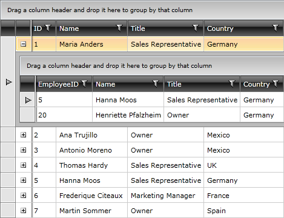

# Self-Referencing GridView

## 

Except displaying hierarchical data and applying some custom criteria about when the subset of data to be displayed, the __RadGridView__ allows you to define a relation that points back to the same table. In the cases when the hierarchical data is build from one type of items you can use a self referencing __RadGridView__ to display the data.

This tutorial illustrates building a self-referencing hierarchy.

Here is an ordinary __RadGridView__ declaration, populated with some data:

#### __XAML__

{{region gridview-self-referencing-grid_0}}
	<telerik:RadGridView Margin="8" x:Name="radGridView" AutoGenerateColumns="False">
	    <telerik:RadGridView.Columns>
	        <telerik:GridViewDataColumn DataMemberBinding="{Binding EmployeeID}"
	                                        Header="ID" />
	        <telerik:GridViewDataColumn DataMemberBinding="{Binding Name}"
	                                        Header="Name" />
	        <telerik:GridViewDataColumn DataMemberBinding="{Binding Title}"
	                                        Header="Title"
	                                        UniqueName="Title" />
	    </telerik:RadGridView.Columns>
	</telerik:RadGridView>
	{{endregion}}

#### __C#__

{{region gridview-self-referencing-grid_1}}
	this.radGridView.ItemsSource = RadGridViewSampleData.GetEmployees();
	{{endregion}}

#### __VB.NET__

{{region gridview-self-referencing-grid_2}}
	Me.radGridView.ItemsSource = RadGridViewSampleData.GetEmployees()
	{{endregion}}

         
      

This features allows you to display objects which are related to objects of the same type, thus modelling a tree structure. For example, consider an __Employee__ object with a property __RelatedTo__ of type int, which holds the __EmployeeID__ of the related object.

You can build a self-refencing hierarchy by performing the following steps:

* Define a ChildeTableDefinition for your RadGridView:

#### __XAML__

{{region gridview-self-referencing-grid_3}}
	<telerik:RadGridView x:Name="radGridView"
	                         AutoGenerateColumns="False">
	    <telerik:RadGridView.ChildTableDefinitions>
	        <telerik:GridViewTableDefinition>
	        </telerik:GridViewTableDefinition>
	    </telerik:RadGridView.ChildTableDefinitions>
	    ...
	</telerik:RadGridView>
	{{endregion}}

* Set the __Relation__property of the __GridViewTableDefinition__ to an instance of the __TableRelation__ class and set its __IsSelfReference__ property to __True__.

#### __XAML__

{{region gridview-self-referencing-grid_4}}
	<telerik:RadGridView x:Name="radGridView"
	                         AutoGenerateColumns="False">
	    <telerik:RadGridView.ChildTableDefinitions>
	        <telerik:GridViewTableDefinition>
	            <telerik:GridViewTableDefinition.Relation>
							<telerik:TableRelation IsSelfReference="True">
							</telerik:TableRelation>
	            </telerik:GridViewTableDefinition.Relation>
	        </telerik:GridViewTableDefinition>
	    </telerik:RadGridView.ChildTableDefinitions>
	    ...
	</telerik:RadGridView>
	{{endregion}}

* Set the __FieldNames__ property of the __TableRelation__. It is a collection of __FieldDescriptorNamePairs__.

#### __XAML__

{{region gridview-self-referencing-grid_5}}
	<telerik:RadGridView x:Name="radGridView"
	                         AutoGenerateColumns="False">
	    <telerik:RadGridView.ChildTableDefinitions>
	        <telerik:GridViewTableDefinition>
	            <telerik:GridViewTableDefinition.Relation>
							<telerik:TableRelation IsSelfReference="True">
								<telerik:TableRelation.FieldNames>
									<telerik:FieldDescriptorNamePair
	                            ParentFieldDescriptorName="EmployeeID"
	                            ChildFieldDescriptorName="RelatedTo" />
								</telerik:TableRelation.FieldNames>
							</telerik:TableRelation>
	            </telerik:GridViewTableDefinition.Relation>
	        </telerik:GridViewTableDefinition>
	    </telerik:RadGridView.ChildTableDefinitions>
	    ...
	</telerik:RadGridView>
	{{endregion}}

The __FiledDescriptorNamePair__ allows to specify the relations between the objects in the __RadGridView's__ source. It has two important properties:

__ParentFieldDescriptorName__ - specifies the name of the property of the object in the parent RadGridView, that is on the one side of the relation.

__ChildFieldDescriptorName__ - specifies the name of the property of the object in the child RadGridView, that is on the other side of the relation.

In the child __RadGridView__ these entries of the __RadGridView's__ source are displayed, which values of the property, specified as the __ChildFieldDescriptorName__, are equal to the value of the property, specified as the __ParentFieldDescriptorName__.

Here is a snapshot of the result:

         
      

You can specify more than one __FiledDescriptorNamePair__. For example, define a relation that specifies that the child objects should have the same country as the parent object.

#### __XAML__

{{region gridview-self-referencing-grid_6}}
	<telerik:RadGridView x:Name="radGridView"
	                         AutoGenerateColumns="False">
	    <telerik:RadGridView.ChildTableDefinitions>
	        <telerik:GridViewTableDefinition>
	            <telerik:GridViewTableDefinition.Relation>
							<telerik:TableRelation IsSelfReference="True">
								<telerik:TableRelation.FieldNames>
									<telerik:FieldDescriptorNamePair
	                             ParentFieldDescriptorName="EmployeeID"
	                             ChildFieldDescriptorName="RelatedTo" />
	
									<telerik:FieldDescriptorNamePair
	                            ParentFieldDescriptorName="Country"
	                            ChildFieldDescriptorName="Country" />
								</telerik:TableRelation.FieldNames>
							</telerik:TableRelation>
	            </telerik:GridViewTableDefinition.Relation>
	        </telerik:GridViewTableDefinition>
	    </telerik:RadGridView.ChildTableDefinitions>
	    ...
	</telerik:RadGridView>
	{{endregion}}

In the snapshot below you can see that for the object with __EmployeeID__ equal to 1 only the employee with __RelatedTo__ property equal to 1 and __Country__ equal to __Germany__ is displayed.

         
      

# See Also

 * [Basic Hierarchies]()

 * [Custom Hierarchies]()
