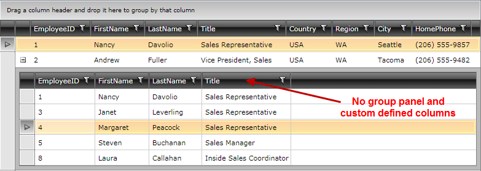

# How-to: Set properties to the child gridview


Usually, you create the gridview hierarchy by using the __TableDefinition__ and adding it to the __ChildTableDefinitions__ collection of __RadGridView__. 

This article will show how to access and set different properties, in code behind, of the child gridview. Follow the steps below in order to achieve a child gridview which does not have a group panel and does not have auto-generated columns:




1. Subscribe to the __DataLoading__ event of the parent gridview 

#### __XAML__

```XAML
	<telerik:RadGridView Name="employeeRadGridView" 
	             ItemsSource="{Binding Employees}" 
	             DataLoading="employeeRadGridView_DataLoading">
	    <!-- ... -->
	</telerik:RadGridView>
```

2. In the event handler of the DataLoading event check the __ParentRow__ property of the sender object:

#### __C#__

```C#
	private void employeeRadGridView_DataLoading(object sender, GridViewDataLoadingEventArgs e)
	{
	    GridViewDataControl dataControl = (GridViewDataControl)sender;
	    if (dataControl.ParentRow != null)
	    {
	        //dataControl is the child gridview
	        dataControl.ShowGroupPanel = false;
	        GridViewDataColumn column = new GridViewDataColumn();
	        column.DataMemberBinding = new Binding("EmployeeID");
	        dataControl.Columns.Add(column);
	        column = new GridViewDataColumn();
	        column.DataMemberBinding = new Binding("FirstName");
	        dataControl.Columns.Add(column);
	        column = new GridViewDataColumn();
	        column.DataMemberBinding = new Binding("LastName");
	        dataControl.Columns.Add(column);
	        column = new GridViewDataColumn();
	        column.DataMemberBinding = new Binding("Title");
	        dataControl.Columns.Add(column);
	    }
	}
```

#### __VB.NET__

```VB.NET
	Private Sub employeeRadGridView_DataLoading(sender As Object, e As GridViewDataLoadingEventArgs)
	    Dim dataControl As GridViewDataControl = DirectCast(sender, GridViewDataControl)
	    If dataControl.ParentRow IsNot Nothing Then
	        'dataControl is the child gridview
	        dataControl.ShowGroupPanel = False
	        Dim column As New GridViewDataColumn()
	        column.DataMemberBinding = New Binding("EmployeeID")
	        dataControl.Columns.Add(column)
	        column = New GridViewDataColumn()
	        column.DataMemberBinding = New Binding("FirstName")
	        dataControl.Columns.Add(column)
	        column = New GridViewDataColumn()
	        column.DataMemberBinding = New Binding("LastName")
	        dataControl.Columns.Add(column)
	        column = New GridViewDataColumn()
	        column.DataMemberBinding = New Binding("Title")
	        dataControl.Columns.Add(column)
	    End If
	End Sub
```

As an alternative, you can use the __HierarchyChildTemplate__ and put RadGridView in its DataTemplate - this way you can set the properties directly to the gridview:

#### __XAML__

```XAML
	<telerik:RadGridView Name="gridView" ItemsSource="{Binding Person}">
	    <telerik:RadGridView.ChildTableDefinitions>
	        <telerik:GridViewTableDefinition />
	    </telerik:RadGridView.ChildTableDefinitions>
	    <telerik:RadGridView.HierarchyChildTemplate>
	        <DataTemplate>
	            <telerik:RadGridView ItemsSource="{Binding Children}" Name="childGrid" ShowGroupPanel="False" />
	        </DataTemplate>
	    </telerik:RadGridView.HierarchyChildTemplate>
	</telerik:RadGridView>
```

## See Also

 * [Custom Hierarchies]()
