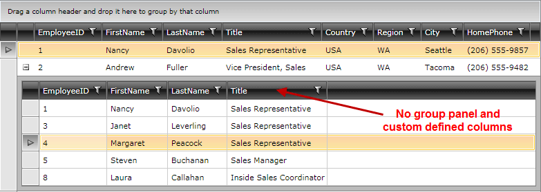

# How-to: Set properties to the child gridview

Usually, you create the gridview hierarchy by using the __TableDefinition__ and adding it to the __ChildTableDefinitions__ collection of __RadGridView__. 

This article will show how to access and set different properties, in code behind, of the child gridview. Follow the steps below in order to achieve a child gridview which does not have a group panel and does not have auto-generated columns:

1. Subscribe to the __DataLoading__ event of the parent gridview 

<snippet id='radgridview-hierarchical-gridview-how-to-access-child-gridview-block_1-xaml' />

2. In the event handler of the DataLoading event check the __ParentRow__ property of the sender object:

<snippet id='radgridview-hierarchical-gridview-how-to-access-child-gridview-block_2-cs' />

<snippet id='radgridview-hierarchical-gridview-how-to-access-child-gridview-block_2-vb' />

As an alternative, you can use the __HierarchyChildTemplate__ and put RadGridView in its DataTemplate - this way you can set the properties directly to the gridview:

<snippet id='radgridview-hierarchical-gridview-how-to-access-child-gridview-block_3-xaml' />

## See Also

 * [Custom Hierarchies]()
