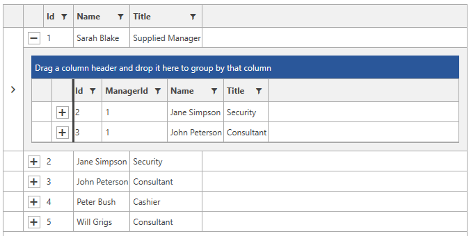
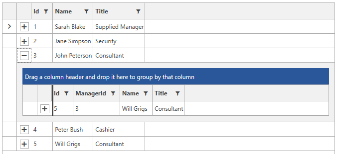

# Self-Referencing GridView

Except displaying hierarchical data and applying some custom criteria about when the subset of data is to be displayed, __RadGridView__ allows you to define a relation that points back to the same collection. In the cases when the hierarchical data is build from one type of items, you can use a self referencing __RadGridView__ to display the data.

This tutorial demonstrates how you can build a self-referencing hierarchy.

**Example 1** demonstrates an ordinary __RadGridView__ declaration, populated with some data:

__Example 1: RadGridView declaration__

```XAML
	<Window.Resources>
        <my:MyViewModel x:Key="MyViewModel"/>
    </Window.Resources>
	<telerik:RadGridView DataContext="{StaticResource MyViewModel}"
						 ItemsSource="{Binding Employees}"
						 AutoGenerateColumns="False">
		<telerik:RadGridView.Columns>
			<telerik:GridViewDataColumn DataMemberBinding="{Binding Id}"
								Header="Id" />
			<telerik:GridViewDataColumn DataMemberBinding="{Binding Name}"
								Header="Name" />
			<telerik:GridViewDataColumn DataMemberBinding="{Binding Title}"
								Header="Title" />
		</telerik:RadGridView.Columns>
	</telerik:RadGridView>
```

__Example 2: Creating the ViewModel__

```C#
	public class MyViewModel
    {
    	private ObservableCollection<Employee> employees;
        public ObservableCollection<Employee> Employees
        {
            get
            {
                if (this.employees == null)
                {
                    this.employees = EmployeeService.GetEmployees();
                }

                return this.employees;
            }
        }
    }

	public class EmployeeService
    {
        public static ObservableCollection<Employee> GetEmployees()
        {
            ObservableCollection<Employee> employees = new ObservableCollection<Employee>();

            employees.Add(new Employee()
            {
                Name = "Sarah Blake",
                Title = "Supplied Manager",
                Id = 1,
                ManagerId = null
            });
            employees.Add(new Employee()
            {
                Id = 2,
                ManagerId = 1,
                Name = "Jane Simpson",
                Title = "Security",
            });
            employees.Add(new Employee()
            {
                Id = 3,
                ManagerId = 1,
                Name = "John Peterson",
                Title = "Consultant"
            });
            employees.Add(new Employee()
            {
                Id = 4,
                ManagerId = 3,
                Name = "Peter Bush",
                Title = "Cashier"
            });
            employees.Add(new Employee()
            {
                Id = 5,
                ManagerId = 3,
                Name = "Will Grigs",
                Title = "Consultant"
            });

            return employees;
        }
    }

	public class Employee : INotifyPropertyChanged
    {
        public event PropertyChangedEventHandler PropertyChanged;

        private int id;
        private int? managerId;
        private string name;
        private string title;

        public int Id
        {
            get { return this.id; }
            set
            {
                if (value != this.id)
                {
                    this.id = value;
                    this.OnPropertyChanged("Id");
                }
            }
        }

        public int? ManagerId
        {
            get { return this.managerId; }
            set
            {
                if (value != this.managerId)
                {
                    this.managerId = value;
                    this.OnPropertyChanged("ManagerId");
                }
            }
        }


        public string Name
        {
            get { return this.name; }
            set
            {
                if (value != this.name)
                {
                    this.name = value;
                    this.OnPropertyChanged("Name");
                }
            }
        }

        public string Title
        {
            get { return this.title; }
            set
            {
                if (value != this.title)
                {
                    this.title = value;
                    this.OnPropertyChanged("Title");
                }
            }
        }

        public Employee()
        {

        }

        public Employee(int id, int managerId, string name, string title)
        {
            this.name = name;
            this.id = id;
            this.managerId = managerId;
            this.title = title;
        }

        protected virtual void OnPropertyChanged(PropertyChangedEventArgs args)
        {
            PropertyChangedEventHandler handler = this.PropertyChanged;
            if (handler != null)
            {
                handler(this, args);
            }
        }

        private void OnPropertyChanged(string propertyName)
        {
            this.OnPropertyChanged(new PropertyChangedEventArgs(propertyName));
        }
    }
```
```VB.NET
	Public Class MyViewModel
		Public ReadOnly Property Employees() As ObservableCollection(Of Employee)
			Get
				If Me.employees Is Nothing Then
					Me.employees = EmployeeService.GetEmployees()
				End If

				Return Me.employees
			End Get
		End Property
	End Class

	Public Class EmployeeService
		Public Shared Function GetEmployees() As ObservableCollection(Of Employee)
			Dim employees As New ObservableCollection(Of Employee)()

			employees.Add(New Employee() With {
				.Name = "Sarah Blake",
				.Title = "Supplied Manager",
				.Id = 1,
				.ManagerId = Nothing
			})
			employees.Add(New Employee() With {
				.Id = 2,
				.ManagerId = 1,
				.Name = "Jane Simpson",
				.Title = "Security"
			})
			employees.Add(New Employee() With {
				.Id = 3,
				.ManagerId = 1,
				.Name = "John Peterson",
				.Title = "Consultant"
			})
			employees.Add(New Employee() With {
				.Id = 4,
				.ManagerId = 3,
				.Name = "Peter Bush",
				.Title = "Cashier"
			})
			employees.Add(New Employee() With {
				.Id = 5,
				.ManagerId = 3,
				.Name = "Will Grigs",
				.Title = "Consultant"
			})

			Return employees
		End Function
	End Class

	Public Class Employee
	Implements INotifyPropertyChanged

		Public Event PropertyChanged As PropertyChangedEventHandler Implements INotifyPropertyChanged.PropertyChanged

		Private _id As Integer
		Private _managerId As Integer
		Private _name As String
		Private _title As String

		Public Property Id() As Integer
			Get
				Return Me._id
			End Get
			Set(ByVal value As Integer)
				If value <> Me._id Then
					Me._id = value
					Me.OnPropertyChanged("Id")
				End If
			End Set
		End Property

		Public Property ManagerId() As Integer?
			Get
				Return Me._managerId
			End Get
			Set(ByVal value? As Integer)
				If Not Me._managerId.Equals(value) Then
					Me._managerId = value
					Me.OnPropertyChanged("ManagerId")
				End If
			End Set
		End Property


		Public Property Name() As String
			Get
				Return Me._name
			End Get
			Set(ByVal value As String)
				If value <> Me._name Then
					Me._name = value
					Me.OnPropertyChanged("Name")
				End If
			End Set
		End Property

		Public Property Title() As String
			Get
				Return Me._title
			End Get
			Set(ByVal value As String)
				If value <> Me._title Then
					Me._title = value
					Me.OnPropertyChanged("Title")
				End If
			End Set
		End Property

		Public Sub New()

		End Sub

		Public Sub New(ByVal id As Integer, ByVal managerId As Integer, ByVal name As String, ByVal title As String)
			Me._name = name
			Me._id = id
			Me._managerId = managerId
			Me._title = title
		End Sub

		Protected Overridable Sub OnPropertyChanged(ByVal args As PropertyChangedEventArgs)
			Dim handler As PropertyChangedEventHandler = Me.PropertyChangedEvent
			If handler IsNot Nothing Then
				handler(Me, args)
			End If
		End Sub

		Private Sub OnPropertyChanged(ByVal propertyName As String)
			Me.OnPropertyChanged(New PropertyChangedEventArgs(propertyName))
		End Sub
End Class
```

The ChildTableDefinitions property of the RadGridView allows you to display objects which are related to objects of the same type, thus modelling a tree structure. **Example 3** demonstrates how this can be achieved with the Employee class defined in **Example 2**.

__Example 3: Setting the ChildTableDefinitions__

```XAML
	<telerik:RadGridView DataContext="{StaticResource MyViewModel}"
						 ItemsSource="{Binding Employees}"
						 AutoGenerateColumns="False">
	    <telerik:GridViewTableDefinition.Relation>
			<telerik:TableRelation IsSelfReference="True">
				<telerik:TableRelation.FieldNames>
					<telerik:FieldDescriptorNamePair
						ParentFieldDescriptorName="Id"
						ChildFieldDescriptorName="ManagerId" />
				</telerik:TableRelation.FieldNames>
			</telerik:TableRelation>
		</telerik:GridViewTableDefinition.Relation>
		<!--...-->
	</telerik:RadGridView>
```

The __FieldDescriptorNamePair__ allows for specifying the relations between the objects in the __RadGridView's__ source. It has two important properties:

__ParentFieldDescriptorName__ - specifies the name of the property of the object in the parent RadGridView, that is on one side of the relation.

__ChildFieldDescriptorName__ - specifies the name of the property of the object in the child RadGridView, that is on the other side of the relation.

In the child __RadGridView__ the entries of the __RadGridView's__ source are displayed, which values of the property, specified as the __ChildFieldDescriptorName__, are equal to the value of the property, specified as the __ParentFieldDescriptorName__.

**Figure 1** demonstrates the result from **Example 3**:

#### __Figure 1: Self-referencing RadGridView__


You can specify more than one __FiledDescriptorNamePair__. For example, define a relation that specifies that the child objects should have the same title as the parent object.

__Example 4: Specifying two FiledDescriptorNamePair__

```XAML
	<telerik:RadGridView DataContext="{StaticResource MyViewModel}"
						 ItemsSource="{Binding Employees}"
						 AutoGenerateColumns="False">
	    <telerik:RadGridView.ChildTableDefinitions>
	        <telerik:GridViewTableDefinition>
	            <telerik:GridViewTableDefinition.Relation>
					<telerik:TableRelation IsSelfReference="True">
						<telerik:TableRelation.FieldNames>
							<telerik:FieldDescriptorNamePair
								ParentFieldDescriptorName="Id"
								ChildFieldDescriptorName="ManagerId" />
						</telerik:TableRelation.FieldNames>
					</telerik:TableRelation>
				</telerik:GridViewTableDefinition.Relation>
	        </telerik:GridViewTableDefinition>
	    </telerik:RadGridView.ChildTableDefinitions>
	    <!--...-->
	</telerik:RadGridView>
```

In **Figure 2** you can see that for the object with __Id__ equal to 3 only the employee with __ManagerId__ property equal to 3 and __Title__ equal to __Consultant__ is displayed.

#### __Figure 2: Custom relation__


> In order to hide the GridViewToggleButton that expands the hierarchy for items that do not have subitems, you can introduce a boolean property in the Employee class and use the [IsExpandableBinding](#isexpandablebinding) property of the RadGridView.

<!-- -->

> In order to learn how to modify the child RadGridViews, check out the [How-to: Set properties to the child gridview]() article.

## See Also

 * [Basic Hierarchies]()

 * [Custom Hierarchies]()
