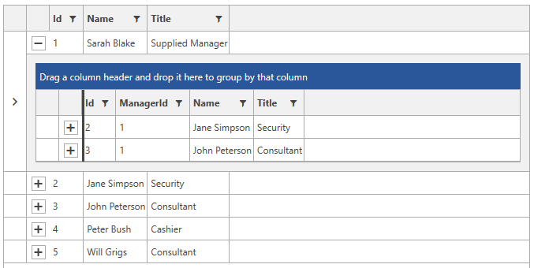
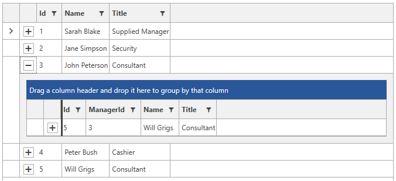

# Self-Referencing GridView

Except displaying hierarchical data and applying some custom criteria about when the subset of data is to be displayed, __RadGridView__ allows you to define a relation that points back to the same collection. In the cases when the hierarchical data is build from one type of items, you can use a self referencing __RadGridView__ to display the data.

This tutorial demonstrates how you can build a self-referencing hierarchy.

**Example 1** demonstrates an ordinary __RadGridView__ declaration, populated with some data:

__Example 1: RadGridView declaration__

<snippet id='radgridview-hierarchical-gridview-self-referencing-grid-example_1_radgridview_declaration-xaml' />

__Example 2: Creating the ViewModel__

<snippet id='radgridview-hierarchical-gridview-self-referencing-grid-example_2_creating_the_viewmodel-cs' />

<snippet id='radgridview-hierarchical-gridview-self-referencing-grid-example_2_creating_the_viewmodel-vb' />

The ChildTableDefinitions property of the RadGridView allows you to display objects which are related to objects of the same type, thus modelling a tree structure. **Example 3** demonstrates how this can be achieved with the Employee class defined in **Example 2**.

__Example 3: Setting the ChildTableDefinitions__

<snippet id='radgridview-hierarchical-gridview-self-referencing-grid-example_3_setting_the_childtabledefinitions-xaml' />

The __FieldDescriptorNamePair__ allows for specifying the relations between the objects in the __RadGridView's__ source. It has two important properties:

__ParentFieldDescriptorName__ - specifies the name of the property of the object in the parent RadGridView, that is on one side of the relation.

__ChildFieldDescriptorName__ - specifies the name of the property of the object in the child RadGridView, that is on the other side of the relation.

In the child __RadGridView__ the entries of the __RadGridView's__ source are displayed, which values of the property, specified as the __ChildFieldDescriptorName__, are equal to the value of the property, specified as the __ParentFieldDescriptorName__.

**Figure 1** demonstrates the result from **Example 3**:

#### __Figure 1: Self-referencing RadGridView__

You can specify more than one __FiledDescriptorNamePair__. For example, define a relation that specifies that the child objects should have the same title as the parent object.

__Example 4: Specifying two FiledDescriptorNamePair__

<snippet id='radgridview-hierarchical-gridview-self-referencing-grid-example_4_specifying_two_fileddescriptornamepair-xaml' />

In **Figure 2** you can see that for the object with __Id__ equal to 3 only the employee with __ManagerId__ property equal to 3 and __Title__ equal to __Consultant__ is displayed.

#### __Figure 2: Custom relation__

> In order to hide the GridViewToggleButton that expands the hierarchy for items that do not have subitems, you can introduce a boolean property in the Employee class and use the [IsExpandableBinding](#isexpandablebinding) property of the RadGridView.

<!-- -->

> In order to learn how to modify the child RadGridViews, check out the [How-to: Set properties to the child gridview]() article.

## See Also

 * [Basic Hierarchies]()

 * [Custom Hierarchies]()
