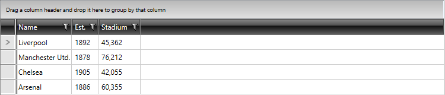
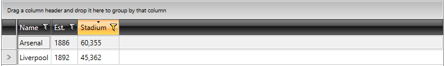

# How to Access Sorted and Filtered Items Within RadGridView

The RadGridView exposes an __Items__ property which represents a collection of the items after filtering, sorting and grouping operations have been applied upon the RadGridView`s __ItemsSource__.  

Lets assume we have a RadGridView with an ItemsSource that is an ObservableCollection of Club objects. The collection consists of 4 objects and the control has the following appearance:

#### __Figure 1: The original appearance of the RadGridView__ 

Eventually, we would like to filter and sort the RadGridView:

#### __Figure 2: The appearance of the RadGridView after applying the data operations__

You can access the items that remain after the data operations are applied through the __Items__ property, as the __ItemsSource__ will remain unchanged. 

>tip The __Items__ collection will be sorted according to the applied changes. Grouping the __RadGridView__ might also result in reordering the collection.  

## See Also

* [RadGridView - Configure the Data Bindings]()

* [RadGridView - Sorting]()

* [RadGridView - Filtering]()
