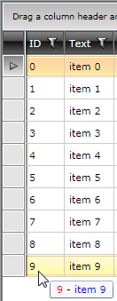
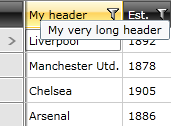

# Add ToolTip for Columns and Headers

This article demonstrates how to set the tooltip of the gridview's rows, columns and column headers.

>If you are using the [implicit styles]() approach for theming the controls with the [NoXaml binaries](), you need to base your styles on the default styles for the controls.

First you should add a GridView to the user control and bind it to some data.

__Example 1: Bind RadGridView in XAML__
```XAML
	<telerik:RadGridView x:Name="gridView" ItemsSource="{Binding}" />
```

## ToolTip for Column's Cells

You can check the source code below on how to set a ToolTip for a specific column. The ToolTip will use a __DataTemplate__ with TextBlocks and will show information from the currently hovered row. The final result should look like this:



To achive that you can define a __DataTemplate__ for the __ToolTipTemplate__ property for the column.

__Example 2: Setting ToolTipTemplate property__  
```XAML
	<telerik:GridViewDataColumn DataMemberBinding="{Binding ID}" >
	    <telerik:GridViewColumn.ToolTipTemplate>
	        <DataTemplate>
	            <StackPanel Orientation="Horizontal">
	                <TextBlock Text="{Binding ID}" Foreground="Red" />
	                <TextBlock Text=" - " />
	                <TextBlock Text="{Binding Text}" Foreground="Blue" />
	            </StackPanel>
	        </DataTemplate>
	    </telerik:GridViewColumn.ToolTipTemplate>
	</telerik:GridViewDataColumn>
```

Here you can add any arbitrary control.

>tip You can define the DataTemplate as a StaticResource and then directly assign the ToolTipTemplate property of the GridViewColumn.

The duration of the tooltip enabled with the ToolTipTemplate, set the __ToolTipShowDuration__ property of the associated GridViewColumn element.

__Example 3: Setting ToolTipShowDuration property__  
```XAML
	<telerik:GridViewDataColumn DataMemberBinding="{Binding ID}" 
				    ToolTipTemplate="{StaticResource MyColumnToolTipDataTemplate}"
				    ToolTipShowDuration="8000" />
```

## ToolTip for a Column's Header Cell 

To add a __ToolTip__ to the header cells you can set a custom style to the __HeaderCellStyle__ property. Or you can use the __Header__ property of the column. 

>If you're using the NoXAML binaries, you need to base your style on the __GridViewHeaderCellStyle__.

* Predefine the HeaderCellStyle for the column. 

__Example 4: Setting custom style to the HeaderCellStyle property__

```XAML
	<telerik:GridViewDataColumn DataMemberBinding="{Binding Name}">
	    <telerik:GridViewDataColumn.HeaderCellStyle>
	        <Style TargetType="telerik:GridViewHeaderCell">
	            <Setter Property="ToolTipService.ToolTip" Value="My very long header"/>
	        </Style>
	    </telerik:GridViewDataColumn.HeaderCellStyle>
	</telerik:GridViewDataColumn>
```


>tip You can define the DataTemplate as a StaticResource and then directly assign the HeaderCellStyle property of the GridViewColumn.

* Predefine the Header for the column.

__Example 5: Predefining the Header of the column__

```XAML
	<telerik:GridViewDataColumn DataMemberBinding="{Binding Name}">
	    <telerik:GridViewDataColumn.Header>
	        <TextBlock Text="Name" ToolTipService.ToolTip="My very long header"/>
	    </telerik:GridViewDataColumn.Header>
	</telerik:GridViewDataColumn>
```

The final result should look like this:



## ToolTip for a GridViewRow

To add a ToolTip to the grid view row, you can create an implicit style that targets GridViewRow and set the __ToolTipService.ToolTip__ attached property.

>If you're using the NoXAML binaries, you need to base your style on the __GridViewRowStyle__.

__Example 6: Adding ToolTip to the GridViewRow__

```XAML
	<Style TargetType="telerik:GridViewRow">
	    <Setter Property="ToolTipService.ToolTip" Value="MyToolTipText"/>
	</Style>
```

## See Also

* [UI Virtualization]()
