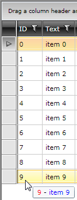
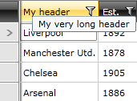

# Add ToolTip for Columns and Headers

This article demonstrates how to set the tooltip of the gridview's rows, columns and column headers.

>If you are using the [implicit styles]() approach for theming the controls with the [NoXaml binaries](), you need to base your styles on the default styles for the controls.

First you should add a GridView to the user control and bind it to some data.

__Example 1: Bind RadGridView in XAML__
<snippet id='radgridview-how-to-create-tooltip-example_1_bind_radgridview_in_xaml-xaml' />

## ToolTip for Column's Cells

You can check the source code below on how to set a ToolTip for a specific column. The ToolTip will use a __DataTemplate__ with TextBlocks and will show information from the currently hovered row. The final result should look like this:

To achive that you can define a __DataTemplate__ for the __ToolTipTemplate__ property for the column.

__Example 2: Setting ToolTipTemplate property__  
<snippet id='radgridview-how-to-create-tooltip-example_2_setting_tooltiptemplate_property-xaml' />

Here you can add any arbitrary control.

>tip You can define the DataTemplate as a StaticResource and then directly assign the ToolTipTemplate property of the GridViewColumn.

The duration of the tooltip enabled with the ToolTipTemplate, set the __ToolTipShowDuration__ property of the associated GridViewColumn element.

__Example 3: Setting ToolTipShowDuration property__  
<snippet id='radgridview-how-to-create-tooltip-example_3_setting_tooltipshowduration_property-xaml' />

## ToolTip for a Column's Header Cell 

To add a __ToolTip__ to the header cells you can set a custom style to the __HeaderCellStyle__ property. Or you can use the __Header__ property of the column. 

>If you're using the NoXAML binaries, you need to base your style on the __GridViewHeaderCellStyle__.

* Predefine the HeaderCellStyle for the column. 

__Example 4: Setting custom style to the HeaderCellStyle property__

<snippet id='radgridview-how-to-create-tooltip-example_4_setting_custom_style_to_the_headercellstyle_property-xaml' />

>tip You can define the DataTemplate as a StaticResource and then directly assign the HeaderCellStyle property of the GridViewColumn.

* Predefine the Header for the column.

__Example 5: Predefining the Header of the column__

<snippet id='radgridview-how-to-create-tooltip-example_5_predefining_the_header_of_the_column-xaml' />

The final result should look like this:

## ToolTip for a GridViewRow

To add a ToolTip to the grid view row, you can create an implicit style that targets GridViewRow and set the __ToolTipService.ToolTip__ attached property.

>If you're using the NoXAML binaries, you need to base your style on the __GridViewRowStyle__.

__Example 6: Adding ToolTip to the GridViewRow__

<snippet id='radgridview-how-to-create-tooltip-example_6_adding_tooltip_to_the_gridviewrow-xaml' />

## See Also

* [UI Virtualization]()
