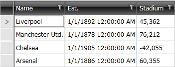
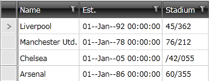

# How to Respect Application's CurrentCulture in Custom Format Strings

Currently the culture used for formattng the data in RadGridView is the one specified as a __Language__ for it (or for the containing Window/UserControl). We have changed this behaviour with version __Q2 2012 SP2__, so now it is compatible with the behaviour of the MS DataGrid. 

Still, there is a way to set the CurrentCulture and apply the format you would like to. With __Q1 2013__ we have introduced a new property of RadGridView - __IsLocalizationLanguageRespected__. You can use it to control whether CurrentCulture or Language is respected. Please note that by default the Language will be respected, so you will need to set it to **False** so that your custom format can take effect.
        
**Example 1** demonstrates how you can define custom formatting with the help of the CurrentCulture.

__Example 1: Defining custom formatting__

```C#
	System.Globalization.CultureInfo cultureInfo = new System.Globalization.CultureInfo("en-US");
	System.Globalization.DateTimeFormatInfo dateTimeInfo =
	new System.Globalization.DateTimeFormatInfo();
	dateTimeInfo.LongDatePattern = "dd--MMM--yyyy";
	dateTimeInfo.ShortDatePattern = "dd--MMM--yy";
	cultureInfo.DateTimeFormat = dateTimeInfo;
	cultureInfo.NumberFormat.NumberGroupSeparator = "/";
	cultureInfo.NumberFormat.NegativeSign = "/";
	
	Thread.CurrentThread.CurrentCulture = cultureInfo;
	Thread.CurrentThread.CurrentUICulture = cultureInfo;
```
```VB.NET
	Dim cultureInfo As New System.Globalization.CultureInfo("en-US")
	Dim dateTimeInfo As New System.Globalization.DateTimeFormatInfo()
	dateTimeInfo.LongDatePattern = "dd--MMM--yyyy"
	dateTimeInfo.ShortDatePattern = "dd--MMM--yy"
	cultureInfo.DateTimeFormat = dateTimeInfo
	cultureInfo.NumberFormat.NumberGroupSeparator = "/"
	cultureInfo.NumberFormat.NegativeSign = "/"
	
	Thread.CurrentThread.CurrentCulture = cultureInfo
	Thread.CurrentThread.CurrentUICulture = cultureInfo
```

__Figure 1__: RadGridView displaying data with IsLocalizationLanguageRespected set to True
        


__Figure 2__: RadGridView displaying data with IsLocalizationLanguageRespected set to False



## See Also

 * [Data Formatting]()
