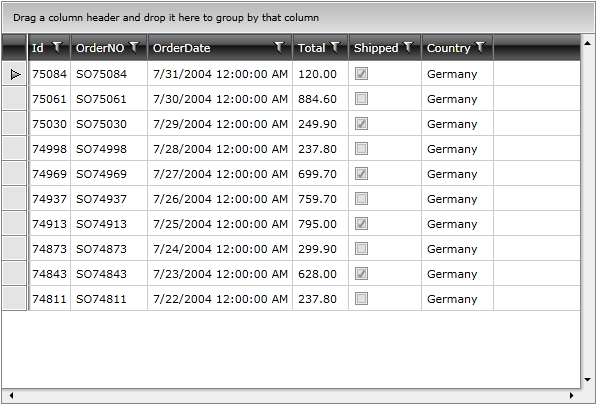

# Enable Horizontal and Vertical Scrollbar 

## 

In order to enable horizontal and/or vertical scrollbars you need to set the __ScrollViewer__'s attached properties __HorizontalScrollBarVisibility__ and/or __VerticalScrollBarVisibility__.

#### __XAML__

{{region radgridview-how-to-enable-horiz-vertic-scrollbar_0}}
	<telerik:RadGridView ScrollViewer.HorizontalScrollBarVisibility="Visible" ScrollViewer.VerticalScrollBarVisibility="Visible"/>
	{{endregion}}

The same operation can be done in the code-behind:

#### __C#__

{{region radgridview-how-to-enable-horiz-vertic-scrollbar_1}}
	private void EnableScrollBars()
	{
	    ScrollViewer.SetHorizontalScrollBarVisibility( this.radGridView, ScrollBarVisibility.Visible );
	    ScrollViewer.SetVerticalScrollBarVisibility( this.radGridView, ScrollBarVisibility.Visible );
	}
	{{endregion}}

#### __VB.NET__

{{region radgridview-how-to-enable-horiz-vertic-scrollbar_2}}
	Private Sub EnableScrollBars()
	    ScrollViewer.SetHorizontalScrollBarVisibility(Me.radGridView, ScrollBarVisibility.Visible)
	    ScrollViewer.SetVerticalScrollBarVisibility(Me.radGridView, ScrollBarVisibility.Visible)
	End Sub
	{{endregion}}

The result can be seen on the next image.

         
      

# See Also

 * [Selection via CheckBox]()
