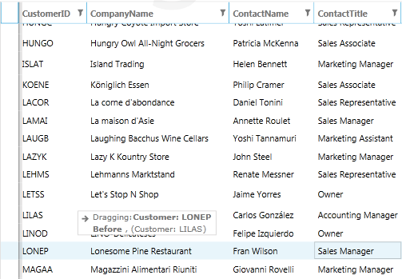

# Enable Row Reordering within two RadGridView-s

RadGridView does provide you with a great amount of built-in features that enable you to extend its functionality so that it suits your needs best. However, in some cases you may require to empower the control more and implement some additional functionality. An example for this would be the integration of __row reordering__ feature for your RadGridView(s). 

This can be achieved with the help of __attached behavior__. The main idea here would be to use the DragDropManager, set the required properties for the corresponding grids and perform the logic for row reordering.
        

The full source code of the behavior is available on this
[demo](https://demos.telerik.com/wpf/#GridView/RowReorder)
[demo](https://demos.telerik.com/silverlight/#GridView/RowReorder)
