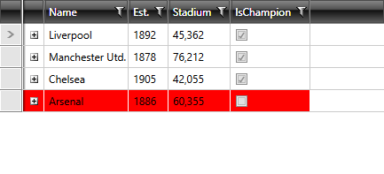
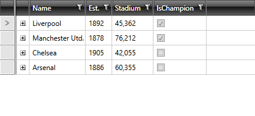

# Change Background for Disabled Grid Elements

The goal of this tutorial is to show you how to customize the look of disabled **GridViewCell** elements.

In order to do so, you need to [edit the control template of the GridViewCell](). You can then modify the **Disabled visual state** as well as the **Background_Disabled** Border element to your liking.

In **Example 1** we've changed the control template so that all disabled cells have a fully opaque red background as illustrated in **Figure 1**.

#### __[XAML] Example 1: Modifying the Disabled visual state and Background_Disabled element__

{{region gridview-how-to-set-background-disabled-cell_0}}
	<ControlTemplate x:Key="GridViewCellTemplate" TargetType="telerik:GridViewCell">
		<Grid>
			<VisualStateManager.VisualStateGroups>
				<VisualStateGroup x:Name="SelectionStates">
					<VisualState x:Name="Unselected"/>
					<VisualState x:Name="Selected">
						<Storyboard>
							<ObjectAnimationUsingKeyFrames Storyboard.TargetName="Background_Selected" Storyboard.TargetProperty="Visibility">
								<DiscreteObjectKeyFrame KeyTime="0">
									<DiscreteObjectKeyFrame.Value>
										<Visibility>Visible</Visibility>
									</DiscreteObjectKeyFrame.Value>
								</DiscreteObjectKeyFrame>
							</ObjectAnimationUsingKeyFrames>
						</Storyboard>
					</VisualState>
				</VisualStateGroup>
				<VisualStateGroup x:Name="CommonStates">
					<VisualState x:Name="Normal"/>
					<VisualState x:Name="Current">
						<Storyboard>
							<ObjectAnimationUsingKeyFrames Storyboard.TargetName="Background_Current" Storyboard.TargetProperty="Visibility">
								<DiscreteObjectKeyFrame KeyTime="0">
									<DiscreteObjectKeyFrame.Value>
										<Visibility>Visible</Visibility>
									</DiscreteObjectKeyFrame.Value>
								</DiscreteObjectKeyFrame>
							</ObjectAnimationUsingKeyFrames>
						</Storyboard>
					</VisualState>
					<VisualState x:Name="MouseOver">
						<Storyboard>
							<ObjectAnimationUsingKeyFrames Storyboard.TargetName="Background_Over" Storyboard.TargetProperty="Visibility">
								<DiscreteObjectKeyFrame KeyTime="0">
									<DiscreteObjectKeyFrame.Value>
										<Visibility>Visible</Visibility>
									</DiscreteObjectKeyFrame.Value>
								</DiscreteObjectKeyFrame>
							</ObjectAnimationUsingKeyFrames>
						</Storyboard>
					</VisualState>
				</VisualStateGroup>
				<VisualStateGroup x:Name="EditingStates">
					<VisualState x:Name="Edited">
						<Storyboard>
							<ObjectAnimationUsingKeyFrames Storyboard.TargetName="PART_ContentPresenter" Storyboard.TargetProperty="Margin">
								<DiscreteObjectKeyFrame KeyTime="0">
									<DiscreteObjectKeyFrame.Value>
										<Thickness>0</Thickness>
									</DiscreteObjectKeyFrame.Value>
								</DiscreteObjectKeyFrame>
							</ObjectAnimationUsingKeyFrames>
							<ObjectAnimationUsingKeyFrames Storyboard.TargetName="PART_ContentPresenter" Storyboard.TargetProperty="VerticalAlignment">
								<DiscreteObjectKeyFrame KeyTime="0">
									<DiscreteObjectKeyFrame.Value>
										<VerticalAlignment>Stretch</VerticalAlignment>
									</DiscreteObjectKeyFrame.Value>
								</DiscreteObjectKeyFrame>
							</ObjectAnimationUsingKeyFrames>
							<ObjectAnimationUsingKeyFrames Storyboard.TargetName="PART_CellBorder" Storyboard.TargetProperty="Background">
								<DiscreteObjectKeyFrame KeyTime="0:0:0" Value="{StaticResource GridView_CellBackground_Edited}"/>
							</ObjectAnimationUsingKeyFrames>
						</Storyboard>
					</VisualState>
					<VisualState x:Name="Display"/>
				</VisualStateGroup>
				<VisualStateGroup x:Name="DisabledStates">
					<VisualState x:Name="Enabled"/>
					<VisualState x:Name="Disabled">
						<Storyboard>
							<DoubleAnimationUsingKeyFrames Storyboard.TargetName="PART_CellBorder" Storyboard.TargetProperty="Opacity">
								<DiscreteDoubleKeyFrame KeyTime="0:0:0" Value="0"/>
							</DoubleAnimationUsingKeyFrames>
							<DoubleAnimationUsingKeyFrames Storyboard.TargetName="PART_ContentPresenter" Storyboard.TargetProperty="Opacity">
								<DiscreteDoubleKeyFrame KeyTime="0:0:0" Value="1"/>
							</DoubleAnimationUsingKeyFrames>
							<ObjectAnimationUsingKeyFrames Storyboard.TargetName="Background_Disabled" Storyboard.TargetProperty="Visibility">
								<DiscreteObjectKeyFrame KeyTime="0">
									<DiscreteObjectKeyFrame.Value>
										<Visibility>Visible</Visibility>
									</DiscreteObjectKeyFrame.Value>
								</DiscreteObjectKeyFrame>
							</ObjectAnimationUsingKeyFrames>
						</Storyboard>
					</VisualState>
				</VisualStateGroup>
				<VisualStateGroup x:Name="ValueStates">
					<VisualState x:Name="CellValid"/>
					<VisualState x:Name="CellInvalid">
						<Storyboard>
							<ObjectAnimationUsingKeyFrames Storyboard.TargetName="Background_Invalid" Storyboard.TargetProperty="Visibility">
								<DiscreteObjectKeyFrame KeyTime="0">
									<DiscreteObjectKeyFrame.Value>
										<Visibility>Visible</Visibility>
									</DiscreteObjectKeyFrame.Value>
								</DiscreteObjectKeyFrame>
							</ObjectAnimationUsingKeyFrames>
						</Storyboard>
					</VisualState>
					<VisualState x:Name="CellInvalidUnfocused">
						<Storyboard>
							<ObjectAnimationUsingKeyFrames Storyboard.TargetName="Background_Invalid_Unfocused" Storyboard.TargetProperty="Visibility">
								<DiscreteObjectKeyFrame KeyTime="0">
									<DiscreteObjectKeyFrame.Value>
										<Visibility>Visible</Visibility>
									</DiscreteObjectKeyFrame.Value>
								</DiscreteObjectKeyFrame>
							</ObjectAnimationUsingKeyFrames>
						</Storyboard>
					</VisualState>
				</VisualStateGroup>
				<VisualStateGroup x:Name="HighlightStates">
					<VisualState x:Name="NotHighlighted"/>
					<VisualState x:Name="Highlighted">
						<Storyboard>
							<ObjectAnimationUsingKeyFrames Duration="0" Storyboard.TargetName="PART_CellBorder" Storyboard.TargetProperty="Background">
								<DiscreteObjectKeyFrame KeyTime="0" Value="{StaticResource GridViewCell_HightlightedBrush}"/>
							</ObjectAnimationUsingKeyFrames>
						</Storyboard>
					</VisualState>
				</VisualStateGroup>
			</VisualStateManager.VisualStateGroups>
			<Border x:Name="PART_CellBorder"
		    Background="{Binding Background, RelativeSource={RelativeSource TemplatedParent}}"
		    BorderBrush="{TemplateBinding VerticalGridLinesBrush}"
		    BorderThickness="{Binding VerticalGridLinesWidth, RelativeSource={RelativeSource TemplatedParent}, Converter={StaticResource GridLineWidthToThicknessConverter}, ConverterParameter=Right}"/>
			<Border x:Name="Background_Over"
		    Margin="1 1 2 2"
		    BorderThickness="1"
		    CornerRadius="1"
		    BorderBrush="{StaticResource ItemOuterBorder_Over}"
		    Grid.Column="2"
		    Grid.ColumnSpan="2"
		    Visibility="Collapsed">
				<Border BorderThickness="1" BorderBrush="{StaticResource ItemInnerBorder_Over}" Background="{StaticResource ItemBackground_Over}"/>
			</Border>
			<Border x:Name="Background_Selected"
		    Margin="1 1 2 2"
		    BorderThickness="1"
		    CornerRadius="1"
		    BorderBrush="{StaticResource ItemOuterBorder_Selected}"
		    Grid.Column="2"
		    Grid.ColumnSpan="2"
		    Visibility="Collapsed">
				<Border BorderThickness="1" BorderBrush="{StaticResource ItemInnerBorder_Selected}" Background="{StaticResource ItemBackground_Selected}"/>
			</Border>
			<Border x:Name="Background_Current"
		    Margin="1 1 2 2"
		    BorderThickness="1"
		    CornerRadius="1"
		    BorderBrush="{StaticResource ControlOuterBorder}"
		    Grid.Column="2"
		    Grid.ColumnSpan="2"
		    Visibility="Collapsed"/>
			<Border x:Name="Background_Invalid"
		    Background="{StaticResource ItemBackground}"
		    Margin="1 1 2 2"
		    BorderThickness="1"
		    CornerRadius="1"
		    BorderBrush="{StaticResource ControlOuterBorder_Invalid}"
		    Grid.Column="2"
		    Grid.ColumnSpan="2"
		    Visibility="Collapsed">
				<ToolTipService.ToolTip>
					<ToolTip x:Name="validationTooltip" Placement="Right" Content="{TemplateBinding Errors}" Template="{StaticResource GridViewCell_ValidationToolTipTemplate}"/>
				</ToolTipService.ToolTip>
				<Grid Height="12" HorizontalAlignment="Right" Margin="1 -4 -4 0" VerticalAlignment="Top" Width="12" Background="Transparent">
					<Path Fill="{StaticResource ControlOuterBorder_Invalid}" Margin="1 3 0 0" Data="M 1,0 L6,0 A 2,2 90 0 1 8,2 L8,7 z"/>
					<Path Fill="{StaticResource ControlInnerBorder_Invalid}" Margin="1 3 0 0" Data="M 0,0 L2,0 L 8,6 L8,8"/>
				</Grid>
			</Border>
			<Border x:Name="Background_Invalid_Unfocused"
		    Margin="1 1 1 2"
		    BorderThickness="1"
		    CornerRadius="1"
		    Visibility="Collapsed"
		    BorderBrush="{StaticResource ItemOuterBorder_Invalid}"
		    Grid.Column="2"
		    Grid.ColumnSpan="2"
		    Opacity="1">
				<Border BorderThickness="1" BorderBrush="{StaticResource ItemInnerBorder_Invalid}" Background="{StaticResource ItemBackground_Invalid}"/>
			</Border>
			<Border x:Name="Background_Disabled"
		    BorderThickness="1"
		    Margin="0 0 1 1"
		    Background="Red"
		    BorderBrush="Red"
		    Grid.Column="2"
		    Grid.ColumnSpan="2"
		    Visibility="Collapsed"/>
			<ContentPresenter x:Name="PART_ContentPresenter"
		    Margin="{TemplateBinding Padding}"
		    Content="{TemplateBinding Content}"
		    ContentTemplate="{TemplateBinding ContentTemplate}"
		    VerticalAlignment="{TemplateBinding VerticalContentAlignment}"
		    HorizontalAlignment="{TemplateBinding HorizontalContentAlignment}"/>
		</Grid>
	</ControlTemplate>
	
{{endregion}}

#### __Figure 1: Disabled GridViewCells with fully opaque background__

Similarly, you can define the visual state in **Example 2** so that there's no visual difference between enabled and disabled cells.

#### [XAML] __Example 2: No visual difference between enabled and disabled cells__

{{region xaml-gridview-how-to-set-background-disabled-cell_1}}
	<VisualState x:Name="Disabled">
		<Storyboard>
			<DoubleAnimationUsingKeyFrames Storyboard.TargetName="PART_CellBorder" Storyboard.TargetProperty="Opacity">
				<DiscreteDoubleKeyFrame KeyTime="0:0:0" Value="1"/>
			</DoubleAnimationUsingKeyFrames>
			<DoubleAnimationUsingKeyFrames Storyboard.TargetName="PART_ContentPresenter" Storyboard.TargetProperty="Opacity">
				<DiscreteDoubleKeyFrame KeyTime="0:0:0" Value="1"/>
			</DoubleAnimationUsingKeyFrames>
		</Storyboard>
	</VisualState>
{{endregion}}

#### __Figure 2: Disabled GridViewCells with transparent background__

## See Also

 * [Styling a Cell]()
