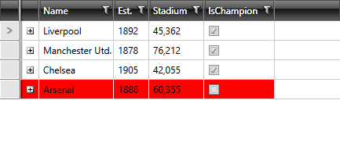
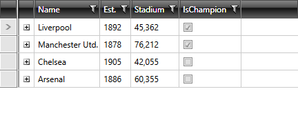

# Change Background for Disabled Grid Elements

The goal of this tutorial is to show you how to customize the look of disabled __GridViewCell__ elements. The approaches for doing so differ depending on whether you are using the older themes (which use visual states) or the newer ones (which use triggers).

## Changing the Background for Disabled GridViewCells in Newer Themes

In the newer themes, you can create a style targeting GridViewCell and add a trigger, which sets its __Background__ when the cell is disabled. A sample style is demonstrated in __Example 1__.

__Example 1: Styling Disabled GridViewCells__

<snippet id='radgridview-how-to-set-background-disabled-cell-example_1_styling_disabled_gridviewcells-xaml' />

## Changing the Background for Disabled GridViewCells in Older Themes

In older themes, you need to [extract the ControlTemplate of the GridViewCell](). You can then modify the __Disabled VisualState__ as well as the __Background_Disabled__ Border element to your liking.

In __Example 2__ we've changed the ControlTemplate so that all disabled cells have a fully opaque red background as illustrated in __Figure 1__. 

> You should make sure to extract the ControlTemplate for the theme that you are using.

__Example 2: Modifying the Disabled visual state and Background_Disabled element__

<snippet id='radgridview-how-to-set-background-disabled-cell-example_2_modifying_the_disabled_visual_state_and_background_disabled_element-xaml' />

#### __Figure 1: Disabled GridViewCells with fully opaque background__

Similarly, you can define the visual state in __Example 3__ so that there's no visual difference between enabled and disabled cells.

__Example 3: No visual difference between enabled and disabled cells__

<snippet id='radgridview-how-to-set-background-disabled-cell-example_3_no_visual_difference_between_enabled_and_disabled_cells-xaml' />

#### __Figure 2: Disabled GridViewCells with transparent background__

## See Also

 * [Styling a Cell]()