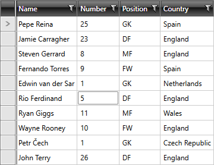

# Set the Current Cell

You can set the current cell of the RadGridView control by using the __CurrentCellInfo__ class.

**Example 1** demonstrates how to so in the **Loaded** event handler by specifying an item from the control's **Items** collection and a column from the **Columns** collection.

__Example 1: Setting the current cell via an item and a column__

```C#
	private void gridView_Loaded(object sender, EventArgs e)
	{
        gridView.CurrentCellInfo = new GridViewCellInfo(gridView.Items[5], gridView.Columns["Number"]);
        gridView.Focus();
	}
```
```VB.NET
	Private Sub gridView_Loaded(ByVal sender As Object, ByVal e As EventArgs)
		gridView.CurrentCellInfo = New GridViewCellInfo(gridView.Items(5), gridView.Columns("Number"))
		gridView.Focus()
	End Sub
```

>important Please note that for this to work, the control must be loaded.

**Figure 1** demonstrates that the current cell is set and at this point if you hit **F2** that cell will go in edit mode.

__RadGridView with changed current cell__



## See Also

* [Change Background for Disabled Grid Elements]()
* [Cancel Edit On LostFocus]()
