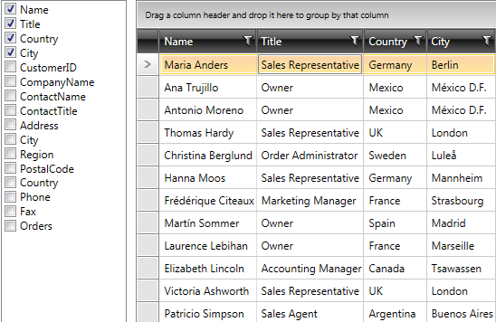

# Show/Hide Columns outside of RadGridView

This topic will show you how to choose which columns to be visible from outside of __RadGridView__. 

There are several options available:
* using [ListBox outside RadGridView](#listbox-outside-radgridview)

* through [ControlPanel]()

* defining [Header Context Menu](https://demos.telerik.com/silverlight/#GridView/HeaderContextMenu)[Header Context Menu](https://demos.telerik.com/wpf) 

## ListBox Outside RadGridView

The example will represent a __ListBox and RadGridView__. The ListBox will list the available columns for RadGridView and each of the items in this list will have a check box for determining the visibility of the column.

Here are the definitions of the controls.

#### __XAML__
```XAML
	<Grid Background="White">
	    <Grid.ColumnDefinitions>
	        <ColumnDefinition Width="150"/>
	        <ColumnDefinition Width="*"/>
	    </Grid.ColumnDefinitions>
	    <ListBox />
	    <telerik:RadGridView Grid.Column="1"
	                 Margin="10,0,0,0" />
	</Grid>
```

Next bind the __ListBox.ItemsSource__ to __RadGridView.Columns__ collection via Element Binding.

#### __XAML__
```XAML
	<Grid Background="White">
	    <Grid.ColumnDefinitions>
	        <ColumnDefinition Width="150"/>
	        <ColumnDefinition Width="*"/>
	    </Grid.ColumnDefinitions>
	    <ListBox ItemsSource="{Binding Columns, ElementName=radGridView}" />
	    <telerik:RadGridView x:Name="radGridView"
	                 Grid.Column="1" 
	                 Margin="10,0,0,0" />
	</Grid>
```

After that define __DataTemplate__ for __ItemTemplate__ property of the ListBox. It should include a __CheckBox__ and you can bind its __IsChecked__ property to __column.IsVisible__ property using __TwoWay__ Data Binding.

#### __XAML__

```XAML
	<Grid Background="White">
	    <Grid.ColumnDefinitions>
	        <ColumnDefinition Width="150"/>
	        <ColumnDefinition Width="*"/>
	    </Grid.ColumnDefinitions>
	    <ListBox ItemsSource="{Binding Columns, ElementName=radGridView2}">
	        <ListBox.ItemTemplate>
	            <DataTemplate>
	                <CheckBox Content="{Binding Header}"
	                  IsChecked="{Binding IsVisible, Mode=TwoWay}" />
	            </DataTemplate>
	        </ListBox.ItemTemplate>
	    </ListBox>
	    <telerik:RadGridView x:Name="radGridView2"
	                 Grid.Column="1" 
	                 Margin="10,0,0,0" />
	</Grid>
```

Provide RadGridView with an appropriate data source and run your application. The result should be similar to this snapshot:


>tipYou can download a runnable project of the previous example from our online SDK repository: [ColumnChooser](https://github.com/telerik/xaml-sdk/tree/master/GridView/ColumnChooser).
          
