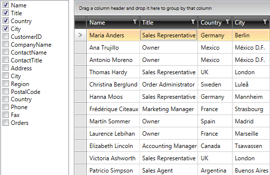

# Show/Hide Columns outside of RadGridView

This topic will show you how to choose which columns to be visible from outside of __RadGridView__. 

There are several options available:
* using [ListBox outside RadGridView](#listbox-outside-radgridview)

* through [ControlPanel]()

* defining [Header Context Menu](https://demos.telerik.com/silverlight/#GridView/HeaderContextMenu)[Header Context Menu](https://demos.telerik.com/wpf) 

## ListBox Outside RadGridView

The example will represent a __ListBox and RadGridView__. The ListBox will list the available columns for RadGridView and each of the items in this list will have a check box for determining the visibility of the column.

Here are the definitions of the controls.

<snippet id='radgridview-how-to-show-hide-columns-outside-of-the-radgridview-block_1-xaml' />

Next bind the __ListBox.ItemsSource__ to __RadGridView.Columns__ collection via Element Binding.

<snippet id='radgridview-how-to-show-hide-columns-outside-of-the-radgridview-block_2-xaml' />

After that define __DataTemplate__ for __ItemTemplate__ property of the ListBox. It should include a __CheckBox__ and you can bind its __IsChecked__ property to __column.IsVisible__ property using __TwoWay__ Data Binding.

<snippet id='radgridview-how-to-show-hide-columns-outside-of-the-radgridview-block_3-xaml' />

Provide RadGridView with an appropriate data source and run your application. The result should be similar to this snapshot:

>tip You can download a runnable project of the previous example from our online SDK repository: [ColumnChooser](https://github.com/telerik/xaml-sdk/tree/master/GridView/ColumnChooser).
          
