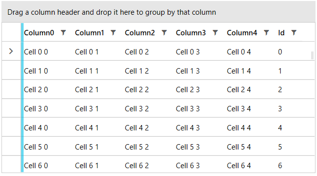

# Data Bind to Dynamic Object with CLR and Dynamic Properties

This article describes how to implement DynamicObject with dynamic (DLR) and static (CLR) fields, and data bind it to RadGridView.

The following model shows a class that derives from [DynamicObject](https://docs.microsoft.com/en-us/dotnet/api/system.dynamic.dynamicobject?view=netframework-4.8) and containing one CLR property called `Id`. When the RadGridView auto-generates its columns, the [TryGetMember](https://docs.microsoft.com/en-us/dotnet/api/system.dynamic.dynamicobject.trygetmember?view=netframework-4.8) method of the DynamicObject class will be used to fetch the values for each column. This said, you will need to implement some logic in the method in order to allow RadGridView to work with the data - both CLR (Common Language Runtime) and DLR (Dynamic Language Runtime).

__Example 1: DynamicObject implementation__
```C#
	public class RowInfo : DynamicObject, INotifyPropertyChanged
	{     
		private int id;	
		private readonly IDictionary<string, object> data = new Dictionary<string, object>();
		
		public event PropertyChangedEventHandler PropertyChanged;

		// CLR property
		public int Id
        {
            get { return id; }
            set { id = value; OnPropertyChanged("Id"); }
        }

		public override IEnumerable<string> GetDynamicMemberNames()
		{
			return data.Keys;
		}

		public override bool TryGetMember(GetMemberBinder binder, out object result)
		{
			if (binder.Name == nameof(this.Id))
			{
				result = this.Id;
			}
			else
			{
				result = this[binder.Name];
			}
			
			return true;
		}

		public override bool TrySetMember(SetMemberBinder binder, object value)
		{
			this[binder.Name] = value;
			return true;
		}

		public object this[string columnName]
		{
			get
			{
				if (data.ContainsKey(columnName))
				{
					return data[columnName];
				}
				return null;
			}
			set
			{
				if (!data.ContainsKey(columnName))
				{
					data.Add(columnName, value);
					OnPropertyChanged(columnName);
				}
				else
				{
					if (data[columnName] != value)
					{
						data[columnName] = value;
						OnPropertyChanged(columnName);
					}
				}
			}
		}
		
		private void OnPropertyChanged(string propertyName)
		{
			if (PropertyChanged != null)
			{
				PropertyChanged(this, new PropertyChangedEventArgs(propertyName));
			}
		}
	}
```
```VB.NET
	Public Class RowInfo
		Inherits DynamicObject
		Implements INotifyPropertyChanged

		Private id As Integer
		Private ReadOnly data As IDictionary(Of String, Object) = New Dictionary(Of String, Object)()
		Public Event PropertyChanged As PropertyChangedEventHandler
				
		Public Property Id As Integer
			Get
				Return id
			End Get
			Set(ByVal value As Integer)
				id = value
				OnPropertyChanged("Id")
			End Set
		End Property

		Public Overrides Function GetDynamicMemberNames() As IEnumerable(Of String)
			Return data.Keys
		End Function

		Public Overrides Function TryGetMember(ByVal binder As GetMemberBinder, <Out> ByRef result As Object) As Boolean
			If binder.Name = NameOf(Me.Id) Then
				result = Me.Id
			Else
				result = Me(binder.Name)
			End If

			Return True
		End Function

		Public Overrides Function TrySetMember(ByVal binder As SetMemberBinder, ByVal value As Object) As Boolean
			Me(binder.Name) = value
			Return True
		End Function

		Default Public Property Item(ByVal columnName As String) As Object
			Get

				If data.ContainsKey(columnName) Then
					Return data(columnName)
				End If

				Return Nothing
			End Get
			Set(ByVal value As Object)

				If Not data.ContainsKey(columnName) Then
					data.Add(columnName, value)
					OnPropertyChanged(columnName)
				Else

					If data(columnName) <> value Then
						data(columnName) = value
						OnPropertyChanged(columnName)
					End If
				End If
			End Set
		End Property

		Private Sub OnPropertyChanged(ByVal propertyName As String)
			RaiseEvent PropertyChanged(Me, New PropertyChangedEventArgs(propertyName))
		End Sub
	End Class
```

__Example 2: Populating with data__
```C#
	public MyUserControl()
	{
		InitializeComponent();

		var data = new ObservableCollection<RowInfo>();
		for (int i = 0; i < 100; i++)
		{
			var row = new RowInfo() { Id = i };                
			for (int j = 0; j < 5; j++)
			{
				row[string.Format("Column{0}", j)] = string.Format("Cell {0} {1}", i, j);
			}

			data.Add(row);
		}

		this.DataContext = data;
	}
```
```VB.NET
	Public Sub New()
		InitializeComponent()
		Dim data = New ObservableCollection(Of RowInfo)()

		For i As Integer = 0 To 100 - 1
			Dim row = New RowInfo() With {
				.Id = i
			}

			For j As Integer = 0 To 5 - 1
				row(String.Format("Column{0}", j)) = String.Format("Cell {0} {1}", i, j)
			Next

			data.Add(row)
		Next

		Me.DataContext = data
	End Sub
```

__Example 3: RadGridView definition__
```XAML
	<telerik:RadGridView ItemsSource="{Binding}" />
```



>tip Another code example with dynamic data can be found in the [Various Data Sources](https://demos.telerik.com/silverlight/#GridView/DataSources)[Various Data Sources](https://demos.telerik.com/wpf) demo.
