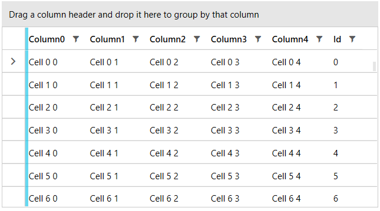

# Data Bind to Dynamic Object with CLR and Dynamic Properties

This article describes how to implement DynamicObject with dynamic (DLR) and static (CLR) fields, and data bind it to RadGridView.

The following model shows a class that derives from [DynamicObject](https://docs.microsoft.com/en-us/dotnet/api/system.dynamic.dynamicobject?view=netframework-4.8) and containing one CLR property called `Id`. When the RadGridView auto-generates its columns, the [TryGetMember](https://docs.microsoft.com/en-us/dotnet/api/system.dynamic.dynamicobject.trygetmember?view=netframework-4.8) method of the DynamicObject class will be used to fetch the values for each column. This said, you will need to implement some logic in the method in order to allow RadGridView to work with the data - both CLR (Common Language Runtime) and DLR (Dynamic Language Runtime).

__Example 1: DynamicObject implementation__
<snippet id='radgridview-how-to-use-mixed-clr-dlr-properties-example_1_dynamicobject_implementation-cs' />

<snippet id='radgridview-how-to-use-mixed-clr-dlr-properties-example_1_dynamicobject_implementation-vb' />

__Example 2: Populating with data__
<snippet id='radgridview-how-to-use-mixed-clr-dlr-properties-example_2_populating_with_data-cs' />

<snippet id='radgridview-how-to-use-mixed-clr-dlr-properties-example_2_populating_with_data-vb' />

__Example 3: RadGridView definition__
<snippet id='radgridview-how-to-use-mixed-clr-dlr-properties-example_3_radgridview_definition-xaml' />

>tip Another code example with dynamic data can be found in the [Various Data Sources](https://demos.telerik.com/silverlight/#GridView/DataSources)[Various Data Sources](https://demos.telerik.com/wpf) demo.
