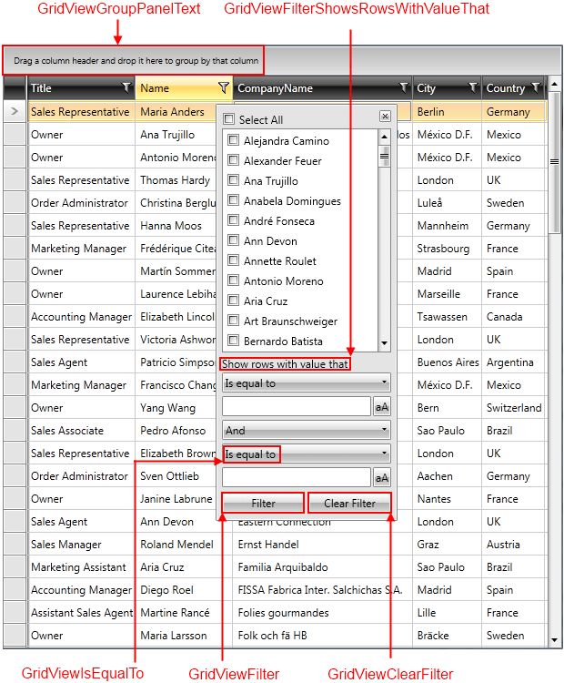

# Localization

The built-in localization mechanism in the platform allows you to localize __RadGridView__ control. 

Here is a list of the supported languages:

* English            
* German          
* Spanish           
* French
* Italian              
* Dutch             
* Turkish

>tip To learn more about the ways to localize the RadControls please read the common topic on [Localization]().

>__In order to dynamically localize the GridView at runtime, you should recreate it.__

## Resource Keys

__RadGridView__ is a complex user interface control and its strings for localization are numerous. In order to be able to distinguish these resources, an unique identifier, called __resource key__, is assigned to each localizable string.

On the picture below you can see some of the resource keys and the strings they are associated with.

Here is a list of all of the __Resources__ available and their default values:

Key	|	Value
---	|	---	
FilterColumn | Filter Column
GridViewAlwaysVisibleNewRow | Click here to add new item
GridViewClearFilter | Clear Filter
GridViewFilter | Filter
GridViewFilterAnd | And
GridViewFilterContains | Contains
GridViewFilterDoesNotContain | Does not contain
GridViewFilterEndsWith | Ends with
GridViewFilterIsContainedIn | Is contained in
GridViewFilterIsEqualTo | Is equal to
GridViewFilterIsGreaterThan | Is greater than
GridViewFilterIsGreaterThanOrEqualTo | Is greater than or equal to
GridViewFilterIsNotContainedIn | Is not contained in
GridViewFilterIsLessThan | Is less than
GridViewFilterIsLessThanOrEqualTo | Is less than or equal to
GridViewFilterIsNotEqualTo | Is not equal to
GridViewFilterMatchCase | Match case 
GridViewFilterOr | Or
GridViewFilterSelectAll | Select All
GridViewFilterShowRowsWithValueThat | Show rows with value that
GridViewFilterStartsWith | Starts with
GridViewFilterIsNull | Is null
GridViewFilterIsNotNull | Is not null
GridViewFilterIsEmpty | Is empty
GridViewFilterIsNotEmpty | Is not empty
GridViewFilterDistinctValueNull | [null]
GridViewFilterDistinctValueStringEmpty | [empty]
GridViewGroupPanelText | Drag a column header and drop it here to group by that column
GridViewGroupPanelTopText | Group Header
GridViewGroupPanelTopTextGrouped | Grouped by:
GridViewSearchPanelTopText | Full Text Search
GridViewColumnsSelectionButtonTooltip | Select Columns
GroupColumn | Group Column
SortAdditionalColumn | Sort Additional Column
SortColumn | Sort Column

## See Also

 * [CurrentCulture Format Settings are not respected]()

 * [Enable\Disable Grid Elements]()

 * [Grid Export]()

 * [Tips and Tricks]()
