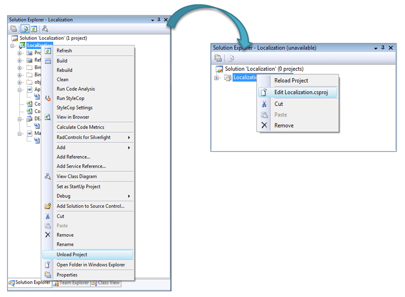
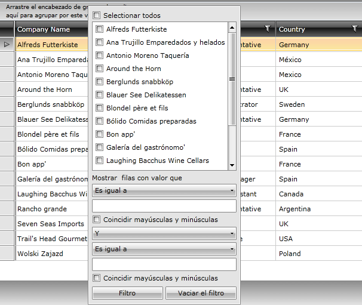

# Setting default startup language

The built-in localization mechanism in WPFSilverlight provides the possibility to set your RadControls in whichever language you need. Up for now the supported languages are English, German, Spanish and French.
If you want to translate your RadControl in another language, you should use the CustomLocalization Manager, as it is described in the common [Localization](B0F77598-F54B-4ACA-B3EE-A38FF9B41BB8)  .

However, in case you aim at loading the right resources automatically by means of culture settings, a couple of things need to be done. Firstly, your project file should be opened in text – mode. So, go to Visual Studio, right – click on the project and unload it.

Here, under the section of <Property Group> is the element <Supported Cultures>. This is the place, where every language you want your application to support is defined. In case the desired default language is Spanish, for example, the code will be:

#### __XAML__

{{region gridview-localization-setting-default-startup-language3_0}}

	<SupportedCultures>es</SupportedCultures>
{{endregion}}

Thus the framework is notified about the supported cultures and will include the satellite resource assemblies for all RadControls.
                  

The next step for defining the language settings of the application is change the current culture of the application. Locate the application initialization logic and add some code in the method for Startup in App.xaml.cs:
                  
#### __C#__

{{region gridview-localization-setting-default-startup-language3_1}}

	private void Application_Startup(object sender, StartupEventArgs e)
	{
	    Thread.CurrentThread.CurrentCulture = new CultureInfo("es");
	    Thread.CurrentThread.CurrentUICulture = new CultureInfo("es");
	
	    this.RootVisual = new MainPage();
	}
{{endregion}}

#### __VB.NET__

{{region gridview-localization-setting-default-startup-language3_2}}

	Private Sub Application_Startup(ByVal sender As Object, ByVal e As StartupEventArgs)
	     Thread.CurrentThread.CurrentCulture = New CultureInfo("es")
	     Thread.CurrentThread.CurrentUICulture = New CultureInfo("es")
	
	     Me.RootVisual = New MainPage()
	End Sub
{{endregion}}



The thing that you must do for defining the language settings of the application, is to change the current culture of the application. Locate the application initialization logic and add some code in the method for Startup in App.xaml.cs:

#### __C#__

{{region gridview-localization-setting-default-startup-language3_3}}

	public App()
	{
	  Thread.CurrentThread.CurrentCulture = new CultureInfo("es");
	  Thread.CurrentThread.CurrentUICulture = new CultureInfo("es");
	}
{{endregion}}

#### __VB.NET__

{{region gridview-localization-setting-default-startup-language3_4}}

	Public Sub New()
	    Thread.CurrentThread.CurrentCulture = New CultureInfo("es")
	    Thread.CurrentThread.CurrentUICulture = New CultureInfo("es")
	End Sub
{{endregion}}



Note that, the resource folders are supposed to be placed along with the binaries you have referenced.

Thus, after setting the startup language, RadControls’ elements will be translated automatically and the application will initialize in the specified language.

# See Also

 * [Localization]()
