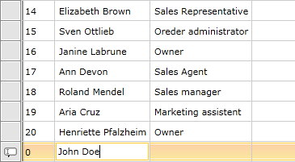
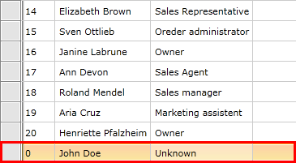

# Adding New Entries

RadGridView comes with out-of-the-box insert functionality.

There are three ways to insert a new row in RadGridView:

* By pressing the __Insert__ key
* By clicking on the row which is shown in the control when the `NewRowPosition` property is set to either __Top__ or __Bottom__. To learn more about this approach, check this [article]().
* By calling the `BeginInsert` method

__Adding new rows with BeginInsert()__
```C#
	this.radGridView.BeginInsert();
```
```VB.NET
		Me.radGridView.BeginInsert()
	```

When a user adds a new item, an empty row is created in which the user can input data.

__The newly created row__



>important If the `IsReadOnly` property of RadGridView is set to __True__ or the `CanUserInsertRows` property is set to __False__, no row is added. Additionally, the underlying object should expose a default constructor for an empty row to be added.

## Modifying New Entries

The next step in implementing the adding functionality is to attach event handlers to the `AddingNewDataItem` and the `RowEditEnded` events.

__Add handlers for the AddingNewDataItem and RowEditEnded events__
```XAML
	<telerik:RadGridView AddingNewDataItem="radGridView_AddingNewDataItem"
	                 RowEditEnded="radGridView_RowEditEnded" />
```

The AddingNewDataItem event is raised before a new row is added to RadGridView. A typical use case would be when you have to set initial values for an initialized object. You can do this by passing an object to the `GridViewAddingNewEventArgs`'s `NewObject` property.

__The AddingNewDataItem event handler__
```C#
	private void radGridView_AddingNewDataItem(object sender, GridViewAddingNewEventArgs e)
	{
	    var employee = new Employee();
	    employee.FirstName = "John";
	    employee.LastName = "Doe";
	    e.NewObject = employee;
	}
```
```VB.NET
	Private Sub radGridView_AddingNewDataItem(ByVal sender As Object, ByVal e As GridViewAddingNewEventArgs)
	    Dim employee = New Employee()
	    employee.FirstName = "John"
	    employee.LastName = "Doe"
	    e.NewObject = employee
	End Sub
```

If the ItemsSource is a `DataTable.DefaultView`, you can initialize the newly inserted item as shown below:

__Adding a new item to a DataTable__
```C#
	private void radGridView_AddingNewDataItem2(object sender, GridViewAddingNewEventArgs e)
	{
	    e.Cancel = true;
	    var newRow = this.dataSource.DefaultView.AddNew();
	    newRow["FirstName"] = "John";
	    newRow["LastName"] = "Doe";
	    e.NewObject = newRow;
	}
```
```VB.NET
		Private Sub radGridView_AddingNewDataItem2(sender As Object, e As GridViewAddingNewEventArgs)
		    e.Cancel = True
		    Dim newRow = Me.dataSource.DefaultView.AddNew()
		    newRow("FirstName") = "John"
		    newRow("LastName") = "Doe"
		    e.NewObject = newRow
		End Sub
```

>tip Via the `OwnerGridViewItemsControl` property of the `GridViewAddingNewEventArgs` class you can access the `GridViewItemsControl` for the `RadGridView` that raised the event.

## Committing New Entries

The `RowEditEnded` event is raised when new data is added to RadGridView. This can be done in any of the following ways: 

* When the user presses the __Enter__ key.
* When the `CommitEdit` method is called.
* When another row is selected.
* When the insert operation is cancelled by pressing the __Escape__ key or calling the `CancelEdit` method.

You can access the `EditAction` (__Commit__ or __Cancel__) and the `GridViewEditOperationType` (__Insert__ or __Edit__) using `GridViewRowEditEndedEventArgs` of the RowEditEnded event. It also allows you to access the new data via the `NewData` property.

__Handling the RowEditEnded event__
```C#
	private void radGridView_RowEditEnded(object sender, GridViewRowEditEndedEventArgs e)
	{
	    if (e.EditAction == GridViewEditAction.Cancel)
	    {
	        return;
	    }
	    if (e.EditOperationType == GridViewEditOperationType.Insert)
	    {
	        //Add the new entry to the data base.
	    }
	}
```
```VB.NET
	Private Sub radGridView_RowEditEnded(ByVal sender As Object, ByVal e As GridViewRowEditEndedEventArgs)
	    If e.EditAction = GridViewEditAction.Cancel Then
	        Exit Sub
	    End If
	
	    If e.EditOperationType = GridViewEditOperationType.Insert Then
	        'Add the new entry to the data base.
	    End If
	End Sub
```

When the new item is committed, it is added to RadGridView's `Items` collection.

__The new row__



## See Also

 * [Updating an Entry]()

 * [Deleting an Entry]()

 * [Validating]()

 * [Adding Rows]()
