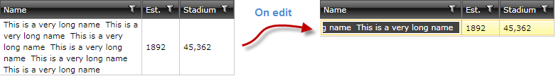
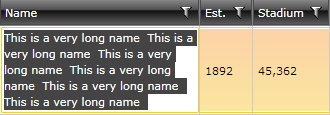

# Access the default editing element

This article will show how to access the default editing element of RadGridView's cells and set its properties. In addition, it will show how to alter the default behavior of selecting the whole text upon editing. 

First, let's start with a real world scenario - you have a cell which shows a long text. You wrap the text by setting the __TextWrapping="Wrap"__ property of the column. The text looks good in view mode, but when you enter edit mode - the full text is shown on one line:



To make the editing textbox wraps the text as well you need to subscribe to the PreparingCellForEdit event, find the editing element and set its property:

#### __C#__

```C#
	private void clubsGrid_PreparingCellForEdit(object sender, GridViewPreparingCellForEditEventArgs e)
	{
	    if ((string)e.Column.Header == "Name")
	    {
	        var tb = e.EditingElement as TextBox;
	        tb.TextWrapping = TextWrapping.Wrap;
	    }
	}
```

#### __VB.NET__

```VB.NET
	Private Sub clubsGrid_PreparingCellForEdit(sender As Object, e As GridViewPreparingCellForEditEventArgs)
	    If DirectCast(e.Column.Header, String) = "Name" Then
	        Dim tb = TryCast(e.EditingElement, TextBox)
	        tb.TextWrapping = TextWrapping.Wrap
	    End If
	End Sub
```

Now it is better:



Ok, what if I do not want have this text selected, but want to have the cursor positioned at the end of it? Here comes the other useful event - PreparedCellForEdit which fires when the cell is already prepared for editing:

#### __C#__

```C#
	private void clubsGrid_PreparedCellForEdit(object sender, GridViewPreparingCellForEditEventArgs e)
	{
	    if ((string)e.Column.Header == "Name")
	    {
	        var tb = e.EditingElement as TextBox;
	        tb.SelectionLength = 0;
	        tb.SelectionStart = tb.Text.Length;
	    }
	}
```

#### __VB.NET__

```VB.NET
	Private Sub clubsGrid_PreparedCellForEdit(sender As Object, e As GridViewPreparingCellForEditEventArgs)
	    If DirectCast(e.Column.Header, String) = "Name" Then
	        Dim tb = TryCast(e.EditingElement, TextBox)
	        tb.SelectionLength = 0
	        tb.SelectionStart = tb.Text.Length
	    End If
	End Sub
```


