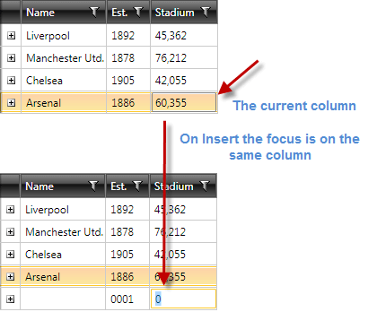

# Always focus the first cell on insert 

When you insert a new item (via the Insert key or the insert row) RadGridView will check which is your current column and focus that column in the newly added and probably blank row. This picture explains it better:



This article shows how to make always the first column be focused when a new item is about to be inserted. You need to subscribe to the __AddingNewDataItem__ event of the RadGridView and set the current column in its event handler:


```C#
	private void clubsGrid_AddingNewDataItem(object sender, Telerik.Windows.Controls.GridView.GridViewAddingNewEventArgs e)
	{
	    var grid = e.OwnerGridViewItemsControl;
	    grid.CurrentColumn = grid.Columns[0];
	}
```
```VB.NET
	Private Sub clubsGrid_AddingNewDataItem(sender As Object, e As Telerik.Windows.Controls.GridView.GridViewAddingNewEventArgs)
	    Dim grid = e.OwnerGridViewItemsControl
	    grid.CurrentColumn = grid.Columns(0)
	End Sub
```

Now, no matter which is the current column, when you insert a new item - the first cell will always get the focus. 


