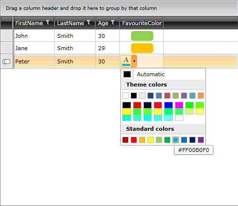

# Create Custom Editor with RadGridView

The purpose of this tutorial is to show you how to create a custom editor with __RadGridView__. If you need a custom editor to edit specific data, you can use one of the following approaches:

* Use the __CellEditTemplate__ property of __GridViewColumn__.

* Create a custom column by inheriting from __GridViewBoundColumnBase__.

Both approaches have some advantages and disadvantages. Although it is quite easy to implement the first option, you cannot easily apply this to all __RadGridView__ instances in your application, and more importantly - this bypasses RadGridView's validation and editing engine.

This tutorial will demonstrate you the second approach by creating a column with an embedded color picker control as an editor.

* The first step is to create a class that inherits from __GridViewBoundColumnBase__ (this is the base class used to create a column with editing capabilities). Name the class __RadColorPickerColumn__.
          

__Example 1: Creating the RadColorPickerColumn class__

```C#
	public class RadColorPickerColumn : GridViewBoundColumnBase
	{
	}
```
```VB.NET
	Public Class RadColorPickerColumn
	    Inherits GridViewBoundColumnBase
	
	    Public Overrides Function CreateCellElement(ByVal cell As GridViewCell, ByVal dataItem As Object) As FrameworkElement
	        Dim cellElement As New Border()
	        Dim valueBinding = New System.Windows.Data.Binding(Me.DataMemberBinding.Path.Path) With {
	            .Mode = BindingMode.OneTime,
	            .Converter = New ColorToBrushConverter()
	        }
	        cellElement.SetBinding(Border.BackgroundProperty, valueBinding)
	        cellElement.Width = 45
	        cellElement.Height = 20
	        cellElement.CornerRadius = New CornerRadius(5)
	        Return cellElement
	    End Function
	    Public Overrides Function CreateCellEditElement(ByVal cell As GridViewCell, ByVal dataItem As Object) As FrameworkElement
	        Dim cellEditElement = New RadColorPicker()
	        Me.BindingTarget = RadColorPicker.SelectedColorProperty
	        cellEditElement.MainPalette = Me.MainPalette
	        Dim valueBinding As System.Windows.Data.Binding = Me.CreateValueBinding()
	        cellEditElement.SetBinding(RadColorPicker.SelectedColorProperty, valueBinding)
	        Return TryCast(cellEditElement, FrameworkElement)
	    End Function
	    Private Function CreateValueBinding() As System.Windows.Data.Binding
	        Dim valueBinding As New System.Windows.Data.Binding()
	        valueBinding.Mode = BindingMode.TwoWay
	        valueBinding.NotifyOnValidationError = True
	        valueBinding.ValidatesOnExceptions = True
	        valueBinding.UpdateSourceTrigger = UpdateSourceTrigger.Explicit
	        valueBinding.Path = New PropertyPath(Me.DataMemberBinding.Path.Path)
	        Return valueBinding
	    End Function
	    Public Overrides Sub CopyPropertiesFrom(ByVal source As Telerik.Windows.Controls.GridViewColumn)
	        MyBase.CopyPropertiesFrom(source)
	        Dim _radColorPickerColumn = TryCast(source, RadColorPickerColumn)
	        If _radColorPickerColumn IsNot Nothing Then
	            Me.MainPalette = _radColorPickerColumn.MainPalette
	        End If
	    End Sub
	    Public Property MainPalette() As ColorPreset
	        Get
	            Return CType(GetValue(MainPaletteProperty), ColorPreset)
	        End Get
	        Set(ByVal value As ColorPreset)
	            SetValue(MainPaletteProperty, value)
	        End Set
	    End Property
	    Public Shared ReadOnly MainPaletteProperty As DependencyProperty = DependencyProperty.Register("MainPalette", GetType(ColorPreset), GetType(RadColorPickerColumn), New PropertyMetadata(Nothing))
	End Class
```

There are several methods you should override:

* __CreateCellElement()__ – override this method if you want to customize how cells that belongs to this column will look like. This method is called when __GridViewCell__ is prepared and returned element will be used as a __ContentPresenter__. If you do not override this method a __TextBlock__ control will be used as a default presenter.
          

__Example 2: Overriding the CreateCellElement method__

```C#
	public class RadColorPickerColumn : GridViewBoundColumnBase
	{
	    public override FrameworkElement CreateCellElement(GridViewCell cell, object dataItem)
	    {
	        Border cellElement = cell.Content as Border;
		if (cellElement == null) 
        	{ 
			cellElement = new Border();			
		}	
		var valueBinding = new System.Windows.Data.Binding(this.DataMemberBinding.Path.Path)
			{
			    Mode = BindingMode.OneTime,
			    Converter = new ColorToBrushConverter()
			};
		cellElement.SetBinding(Border.BackgroundProperty, valueBinding);
		cellElement.Width = 45;
		cellElement.Height = 20;
		cellElement.CornerRadius = new CornerRadius(5);
	        return cellElement;
	    }
	}
```
```VB.NET
	Public Class RadColorPickerColumn
	    Inherits GridViewBoundColumnBase

	    Public Overrides Function CreateCellElement(ByVal cell As GridViewCell, ByVal dataItem As Object) As FrameworkElement
		Dim cellElement As Border = TryCast(cell.Content, Border)

		If cellElement Is Nothing Then
		    cellElement = New Border()		   
		End If
		Dim valueBinding = New System.Windows.Data.Binding(Me.DataMemberBinding.Path.Path) With {
			.Mode = BindingMode.OneTime,
			.Converter = New ColorToBrushConverter()
		    }
	    	cellElement.SetBinding(Border.BackgroundProperty, valueBinding)
	   	cellElement.Width = 45
	   	cellElement.Height = 20
	   	cellElement.CornerRadius = New CornerRadius(5)
		Return cellElement
	    End Function
	End Class
```

You should note two things here: first, a border with bound background to the color from data item is created and second, a custom converter is used. The next code snippet shows you the code for the __ColorToBrushConverter__.

__Example 3: The ColorToBrushConverter class__

```C#
	public class ColorToBrushConverter : IValueConverter
	{
	    public object Convert(object value, Type targetType, object parameter, System.Globalization.CultureInfo culture)
	    {
	        var color = (Color)value;
	        if (color != null)
	        {
	            return new SolidColorBrush(color);
	        }
	        return value;
	    }
	    public object ConvertBack(object value, Type targetType, object parameter, System.Globalization.CultureInfo culture)
	    {
	        return value;
	    }
	}
```
```VB.NET
	Public Class ColorToBrushConverter
	    Implements IValueConverter
	
	    Public Function Convert(ByVal value As Object, ByVal targetType As Type, ByVal parameter As Object, ByVal culture As System.Globalization.CultureInfo) As Object Implements IValueConverter.Convert
	        Dim color = DirectCast(value, Color?)
	        If color IsNot Nothing Then
	            Return New SolidColorBrush(color)
	        End If
	        Return value
	    End Function
	    Public Function ConvertBack(ByVal value As Object, ByVal targetType As Type, ByVal parameter As Object, ByVal culture As System.Globalization.CultureInfo) As Object Implements IValueConverter.ConvertBack
	        Return value
	    End Function
	End Class
```

* __CreateCellEditElement()__ – override this method to create custom editor element (according to type of the property or some other business logic). This method must be overridden otherwise __GridViewCell__ will have no content when enters into edit mode.

__Example 4: Overriding the CreateCellEditElement method__

```C#
	public override FrameworkElement CreateCellEditElement(GridViewCell cell, object dataItem)
	{
	    var cellEditElement = new RadColorPicker();
	
	    this.BindingTarget = RadColorPicker.SelectedColorProperty;
	
	    cellEditElement.MainPalette = this.MainPalette;
	
	    Binding valueBinding = this.CreateValueBinding();
	
	    cellEditElement.SetBinding(RadColorPicker.SelectedColorProperty, valueBinding);
	
	    return cellEditElement as FrameworkElement;
	}
```
```VB.NET
	Public Overrides Function CreateCellEditElement(ByVal cell As GridViewCell, ByVal dataItem As Object) As FrameworkElement
	    Dim cellEditElement = New RadColorPicker()
	
	    Me.BindingTarget = RadColorPicker.SelectedColorProperty
	
	    cellEditElement.MainPalette = Me.MainPalette
	
	    Dim valueBinding As Binding = Me.CreateValueBinding()
	
	    cellEditElement.SetBinding(RadColorPicker.SelectedColorProperty, valueBinding)
	
	    Return TryCast(cellEditElement, FrameworkElement)
	End Function
```

In this method an instance of a __RadColorPicker__ control is created and returned. In order to work properly as an editor you have to bind this editor to the underlying data property. This is done in the __CreateValueBinding()__ method:

__Example 5: The CreateValueBinding() method__

```C#
	private Binding CreateValueBinding()
	{
	    Binding valueBinding = new Binding();
	    valueBinding.Mode = BindingMode.TwoWay;
	    valueBinding.NotifyOnValidationError = true;
	    valueBinding.ValidatesOnExceptions = true;
	    valueBinding.UpdateSourceTrigger = UpdateSourceTrigger.Explicit;
	    valueBinding.Path = new PropertyPath(this.DataMemberBinding.Path.Path);
	    return valueBinding;
	}
```
```VB.NET
	Private Function CreateValueBinding() As Binding
	    Dim valueBinding As New Binding()
	    valueBinding.Mode = BindingMode.TwoWay
	    valueBinding.NotifyOnValidationError = True
	    valueBinding.ValidatesOnExceptions = True
	    valueBinding.UpdateSourceTrigger = UpdateSourceTrigger.Explicit
	    valueBinding.Path = New PropertyPath(Me.DataMemberBinding.Path.Path)
	    Return valueBinding
	End Function
```

You should set __BindingMode__ to __TwoWay__, because this is an editor and you need to update data property which is bound to the parent __GridViewColumn__. The __NotifyOnValidationError__ and __ValidatesOnExceptions__ properties are related to validation engine (if any error or exception occurs while you set new value to the data object will result as validation error and editor will enter into invalid state (if editor has such state)).
Set __UpdateSourceTrigger__ to __Explicit__ and allow __RadGridView__ to validate and update the value of the data item at the right moment. Of course every __TwoWay__ binding requires a path, so you take the path from the __DataMemberBinding__ property.

Another interesting line of the __CreateCellEditElement()__ method is: __cellEditElement.MainPalette = this.MainPalette__. This line shows how you can transfer properties from column to the actual editor. In order to allow such properties and transfer them to custom column instance you have to override __CopyPropertiesFrom()__ method.

* __CopyPropertiesFrom()__

__Example 6: Overriding the CopyPropertiesFrom method__

```C#
	public override void CopyPropertiesFrom(Telerik.Windows.Controls.GridViewColumn source)
	{
	    base.CopyPropertiesFrom(source);
	    var radColorPickerColumn = source as RadColorPickerColumn;
	    if (radColorPickerColumn != null)
	    {
	        this.MainPalette = radColorPickerColumn.MainPalette;
	    }
	}
	
	public ColorPreset MainPalette
	{
	    get
	    {
	        return (ColorPreset)GetValue(MainPaletteProperty);
	    }
	    set
	    {
	        SetValue(MainPaletteProperty, value);
	    }
	}
	
	public static readonly DependencyProperty MainPaletteProperty = DependencyProperty.Register("MainPalette",
	    typeof(ColorPreset),
	    typeof(RadColorPickerColumn),
	    new PropertyMetadata(null));
```
```VB.NET
	Public Overrides Sub CopyPropertiesFrom(ByVal source As Telerik.Windows.Controls.GridViewColumn)
	    MyBase.CopyPropertiesFrom(source)
	    Dim _radColorPickerColumn = TryCast(source, RadColorPickerColumn)
	    If _radColorPickerColumn IsNot Nothing Then
	        Me.MainPalette = _radColorPickerColumn.MainPalette
	    End If
	End Sub
	
	Public Property MainPalette() As ColorPreset
	    Get
	        Return CType(GetValue(MainPaletteProperty), ColorPreset)
	    End Get
	    Set(ByVal value As ColorPreset)
	        SetValue(MainPaletteProperty, value)
	    End Set
	End Property
	
	Public Shared ReadOnly MainPaletteProperty As DependencyProperty = DependencyProperty.Register("MainPalette", GetType(ColorPreset), GetType(RadColorPickerColumn), New PropertyMetadata(Nothing))
```

Here is the full code for the __RadColorPickerColumn__ class:

__Example 7: The final RadColorPickerColumn class__

```C#
	public class RadColorPickerColumn : GridViewBoundColumnBase
	{
	    public override FrameworkElement CreateCellElement(GridViewCell cell, object dataItem)
	    {
	        Border cellElement = new Border();
	        var valueBinding = new System.Windows.Data.Binding(this.DataMemberBinding.Path.Path)
	        {
	            Mode = BindingMode.OneTime,
	            Converter = new ColorToBrushConverter()
	        };
	        cellElement.SetBinding(Border.BackgroundProperty, valueBinding);
	        cellElement.Width = 45;
	        cellElement.Height = 20;
	        cellElement.CornerRadius = new CornerRadius(5);
	        return cellElement;
	    }
	    public override FrameworkElement CreateCellEditElement(GridViewCell cell, object dataItem)
	    {
	        var cellEditElement = new RadColorPicker();
	        this.BindingTarget = RadColorPicker.SelectedColorProperty;
	        cellEditElement.MainPalette = this.MainPalette;
	        System.Windows.Data.Binding valueBinding = this.CreateValueBinding();
	        cellEditElement.SetBinding(RadColorPicker.SelectedColorProperty, valueBinding);
	        return cellEditElement as FrameworkElement;
	    }
	    private System.Windows.Data.Binding CreateValueBinding()
	    {
	        System.Windows.Data.Binding valueBinding = new System.Windows.Data.Binding();
	        valueBinding.Mode = BindingMode.TwoWay;
	        valueBinding.NotifyOnValidationError = true;
	        valueBinding.ValidatesOnExceptions = true;
	        valueBinding.UpdateSourceTrigger = UpdateSourceTrigger.Explicit;
	        valueBinding.Path = new PropertyPath(this.DataMemberBinding.Path.Path);
	        return valueBinding;
	    }
	    public override void CopyPropertiesFrom(Telerik.Windows.Controls.GridViewColumn source)
	    {
	        base.CopyPropertiesFrom(source);
	        var radColorPickerColumn = source as RadColorPickerColumn;
	        if (radColorPickerColumn != null)
	        {
	            this.MainPalette = radColorPickerColumn.MainPalette;
	        }
	    }
	    public ColorPreset MainPalette
	    {
	        get
	        {
	            return (ColorPreset)GetValue(MainPaletteProperty);
	        }
	        set
	        {
	            SetValue(MainPaletteProperty, value);
	        }
	    }
	    public static readonly DependencyProperty MainPaletteProperty = DependencyProperty.Register("MainPalette",
	        typeof(ColorPreset),
	        typeof(RadColorPickerColumn),
	        new PropertyMetadata(null));
	}
```
```VB.NET
	Public Class RadColorPickerColumn
	    Inherits GridViewBoundColumnBase
	
	    Public Overrides Function CreateCellElement(ByVal cell As GridViewCell, ByVal dataItem As Object) As FrameworkElement
	        Dim cellElement As New Border()
	        Dim valueBinding = New System.Windows.Data.Binding(Me.DataMemberBinding.Path.Path) With {
	            .Mode = BindingMode.OneTime,
	            .Converter = New ColorToBrushConverter()
	        }
	        cellElement.SetBinding(Border.BackgroundProperty, valueBinding)
	        cellElement.Width = 45
	        cellElement.Height = 20
	        cellElement.CornerRadius = New CornerRadius(5)
	        Return cellElement
	    End Function
	    Public Overrides Function CreateCellEditElement(ByVal cell As GridViewCell, ByVal dataItem As Object) As FrameworkElement
	        Dim cellEditElement = New RadColorPicker()
	        Me.BindingTarget = RadColorPicker.SelectedColorProperty
	        cellEditElement.MainPalette = Me.MainPalette
	        Dim valueBinding As System.Windows.Data.Binding = Me.CreateValueBinding()
	        cellEditElement.SetBinding(RadColorPicker.SelectedColorProperty, valueBinding)
	        Return TryCast(cellEditElement, FrameworkElement)
	    End Function
	    Private Function CreateValueBinding() As System.Windows.Data.Binding
	        Dim valueBinding As New System.Windows.Data.Binding()
	        valueBinding.Mode = BindingMode.TwoWay
	        valueBinding.NotifyOnValidationError = True
	        valueBinding.ValidatesOnExceptions = True
	        valueBinding.UpdateSourceTrigger = UpdateSourceTrigger.Explicit
	        valueBinding.Path = New PropertyPath(Me.DataMemberBinding.Path.Path)
	        Return valueBinding
	    End Function
	    Public Overrides Sub CopyPropertiesFrom(ByVal source As Telerik.Windows.Controls.GridViewColumn)
	        MyBase.CopyPropertiesFrom(source)
	        Dim _radColorPickerColumn = TryCast(source, RadColorPickerColumn)
	        If _radColorPickerColumn IsNot Nothing Then
	            Me.MainPalette = _radColorPickerColumn.MainPalette
	        End If
	    End Sub
	    Public Property MainPalette() As ColorPreset
	        Get
	            Return CType(GetValue(MainPaletteProperty), ColorPreset)
	        End Get
	        Set(ByVal value As ColorPreset)
	            SetValue(MainPaletteProperty, value)
	        End Set
	    End Property
	    Public Shared ReadOnly MainPaletteProperty As DependencyProperty = DependencyProperty.Register("MainPalette", GetType(ColorPreset), GetType(RadColorPickerColumn), New PropertyMetadata(Nothing))
	End Class
```

* Use the just created custom column in XAML like the code below:

__Example 8: Defining a RadColorPickerColumn in XAML__

```XAML
	<Grid x:Name="LayoutRoot" Background="White">
	
	    <Grid.Resources>
	        <local:ColorToBrushConverter x:Key="colorToBrushConverter" />
	    </Grid.Resources>
	
	    <telerik:RadGridView x:Name="radGridView" AutoGenerateColumns="False">
	        <telerik:RadGridView.Columns>
	            <telerik:GridViewDataColumn UniqueName="FirstName" DataMemberBinding="{Binding FirstName}" Header="FirstName" />
	            <telerik:GridViewDataColumn UniqueName="LastName" DataMemberBinding="{Binding LastName}" Header="LastName" />
	            <telerik:GridViewDataColumn UniqueName="Age" DataMemberBinding="{Binding Age}" Header="Age" />
	
	            <local:RadColorPickerColumn UniqueName="FavouriteColor" DataMemberBinding="{Binding FavouriteColor}" 
	                                Header="FavouriteColor" MainPalette="ReallyWebSafe"/>
	
	        </telerik:RadGridView.Columns>
	    </telerik:RadGridView>
	
	</Grid>
```

The final result should be similar to the image below:

#### __Figure 1: The RadColorPickerColumn__



## Integrating the RadColorPickerColumn into the Validation and Editing Engine

In order to integrate the __RadColorPickerColumn__ into __RadGridView__'s validation and editing engine, you should override two additional methods:

* __UpdateSourceWithEditorValue()__

__Example 9: Overriding the UpdateSourceWithEditorValue method__

```C#
	public override IList<string> UpdateSourceWithEditorValue(GridViewCell gridViewCell)
	{
	    List<String> errors = new List<String>();
	    RadColorPicker editor = gridViewCell.GetEditingElement() as RadColorPicker;
	    BindingExpression bindingExpression = editor.ReadLocalValue(RadColorPicker.SelectedColorProperty) as BindingExpression;
	    if (bindingExpression != null)
	    {
	        bindingExpression.UpdateSource();
	        foreach (ValidationError error in Validation.GetErrors(editor))
	        {
	            errors.Add(error.ErrorContent.ToString());
	        }
	    }
	    return errors.ToList();
	}
```
```VB.NET
	Public Overrides Function UpdateSourceWithEditorValue(ByVal gridViewCell As GridViewCell) As IList(Of String)
	    Dim errors As New List(Of String)()
	    Dim editor As RadColorPicker = TryCast(gridViewCell.GetEditingElement(), RadColorPicker)
	    Dim bindingExpression As BindingExpression = TryCast(editor.ReadLocalValue(RadColorPicker.SelectedColorProperty), BindingExpression)
	    If bindingExpression IsNot Nothing Then
	        bindingExpression.UpdateSource()
	        For Each [error] As ValidationError In Validation.GetErrors(editor)
	            errors.Add([error].ErrorContent.ToString())
	        Next [error]
	    End If
	    Return errors.ToList()
	End Function
```

* __GetNewValueFromEditor()__

__Example 10: Overriding the GetNewValueFromEditor method__

```C#
	public override object GetNewValueFromEditor(object editor)
	{
	    RadColorPicker colorPicker = editor as RadColorPicker;
	    if (colorPicker != null)
	    {
	        return colorPicker.SelectedColor;
	    }
	    else
	    {
	        return null;
	    }
	}
```
```VB.NET
	Public Overrides Function GetNewValueFromEditor(ByVal editor As Object) As Object
	    Dim colorPicker As RadColorPicker = TryCast(editor, RadColorPicker)
	    If colorPicker IsNot Nothing Then
	        Return colorPicker.SelectedColor
	    Else
	        Return Nothing
	    End If
	End Function
```

As you can see first method gathers required information from the actual editor (used by the validation engine), after UI validation is successful then new value is submitted to the data item via second method. This second method returns errors (if any) that occurred while new value is set to the data item (Data layer validation).

>In a scenario when there is a column.CellEditTemplate defined, the new value of the editor is not available in the arguments of the __CellEditEnded__ event raised when commiting an edit. To get the right value in __e.NewValue__, you should override the column's __GetNewValueFromEditor__ method.

## See Also

 * [Defining Columns]()
