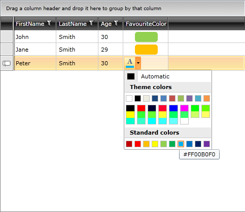

# Create Custom Editor with RadGridView

The purpose of this tutorial is to show you how to create a custom editor with __RadGridView__. If you need a custom editor to edit specific data, you can use one of the following approaches:

* Use the __CellEditTemplate__ property of __GridViewColumn__.

* Create a custom column by inheriting from __GridViewBoundColumnBase__.

Both approaches have some advantages and disadvantages. Although it is quite easy to implement the first option, you cannot easily apply this to all __RadGridView__ instances in your application, and more importantly - this bypasses RadGridView's validation and editing engine.

This tutorial will demonstrate you the second approach by creating a column with an embedded color picker control as an editor.

* The first step is to create a class that inherits from __GridViewBoundColumnBase__ (this is the base class used to create a column with editing capabilities). Name the class __RadColorPickerColumn__.
          

__Example 1: Creating the RadColorPickerColumn class__

<snippet id='radgridview-managing-data-how-to-howto-create-custom-editor-example_1_creating_the_radcolorpickercolumn_class-cs' />

<snippet id='radgridview-managing-data-how-to-howto-create-custom-editor-example_1_creating_the_radcolorpickercolumn_class-vb' />

There are several methods you should override:

* __CreateCellElement()__ – override this method if you want to customize how cells that belongs to this column will look like. This method is called when __GridViewCell__ is prepared and returned element will be used as a __ContentPresenter__. If you do not override this method a __TextBlock__ control will be used as a default presenter.
          

__Example 2: Overriding the CreateCellElement method__

<snippet id='radgridview-managing-data-how-to-howto-create-custom-editor-example_2_overriding_the_createcellelement_method-cs' />

<snippet id='radgridview-managing-data-how-to-howto-create-custom-editor-example_2_overriding_the_createcellelement_method-vb' />

You should note two things here: first, a border with bound background to the color from data item is created and second, a custom converter is used. The next code snippet shows you the code for the __ColorToBrushConverter__.

__Example 3: The ColorToBrushConverter class__

<snippet id='radgridview-managing-data-how-to-howto-create-custom-editor-example_3_the_colortobrushconverter_class-cs' />

<snippet id='radgridview-managing-data-how-to-howto-create-custom-editor-example_3_the_colortobrushconverter_class-vb' />

* __CreateCellEditElement()__ – override this method to create custom editor element (according to type of the property or some other business logic). This method must be overridden otherwise __GridViewCell__ will have no content when enters into edit mode.

__Example 4: Overriding the CreateCellEditElement method__

<snippet id='radgridview-managing-data-how-to-howto-create-custom-editor-example_4_overriding_the_createcelleditelement_method-cs' />

<snippet id='radgridview-managing-data-how-to-howto-create-custom-editor-example_4_overriding_the_createcelleditelement_method-vb' />

In this method an instance of a __RadColorPicker__ control is created and returned. In order to work properly as an editor you have to bind this editor to the underlying data property. This is done in the __CreateValueBinding()__ method:

__Example 5: The CreateValueBinding() method__

<snippet id='radgridview-managing-data-how-to-howto-create-custom-editor-example_5_the_createvaluebinding_method-cs' />

<snippet id='radgridview-managing-data-how-to-howto-create-custom-editor-example_5_the_createvaluebinding_method-vb' />

You should set __BindingMode__ to __TwoWay__, because this is an editor and you need to update data property which is bound to the parent __GridViewColumn__. The __NotifyOnValidationError__ and __ValidatesOnExceptions__ properties are related to validation engine (if any error or exception occurs while you set new value to the data object will result as validation error and editor will enter into invalid state (if editor has such state)).
Set __UpdateSourceTrigger__ to __Explicit__ and allow __RadGridView__ to validate and update the value of the data item at the right moment. Of course every __TwoWay__ binding requires a path, so you take the path from the __DataMemberBinding__ property.

Another interesting line of the __CreateCellEditElement()__ method is: __cellEditElement.MainPalette = this.MainPalette__. This line shows how you can transfer properties from column to the actual editor. In order to allow such properties and transfer them to custom column instance you have to override __CopyPropertiesFrom()__ method.

* __CopyPropertiesFrom()__

__Example 6: Overriding the CopyPropertiesFrom method__

<snippet id='radgridview-managing-data-how-to-howto-create-custom-editor-example_6_overriding_the_copypropertiesfrom_method-cs' />

<snippet id='radgridview-managing-data-how-to-howto-create-custom-editor-example_6_overriding_the_copypropertiesfrom_method-vb' />

Here is the full code for the __RadColorPickerColumn__ class:

__Example 7: The final RadColorPickerColumn class__

<snippet id='radgridview-managing-data-how-to-howto-create-custom-editor-example_7_the_final_radcolorpickercolumn_class-cs' />

<snippet id='radgridview-managing-data-how-to-howto-create-custom-editor-example_7_the_final_radcolorpickercolumn_class-vb' />

* Use the just created custom column in XAML like the code below:

__Example 8: Defining a RadColorPickerColumn in XAML__

<snippet id='radgridview-managing-data-how-to-howto-create-custom-editor-example_8_defining_a_radcolorpickercolumn_in_xaml-xaml' />

The final result should be similar to the image below:

#### __Figure 1: The RadColorPickerColumn__

## Integrating the RadColorPickerColumn into the Validation and Editing Engine

In order to integrate the __RadColorPickerColumn__ into __RadGridView__'s validation and editing engine, you should override two additional methods:

* __UpdateSourceWithEditorValue()__

__Example 9: Overriding the UpdateSourceWithEditorValue method__

<snippet id='radgridview-managing-data-how-to-howto-create-custom-editor-example_9_overriding_the_updatesourcewitheditorvalue_method-cs' />

<snippet id='radgridview-managing-data-how-to-howto-create-custom-editor-example_9_overriding_the_updatesourcewitheditorvalue_method-vb' />

* __GetNewValueFromEditor()__

__Example 10: Overriding the GetNewValueFromEditor method__

<snippet id='radgridview-managing-data-how-to-howto-create-custom-editor-example_10_overriding_the_getnewvaluefromeditor_method-cs' />

<snippet id='radgridview-managing-data-how-to-howto-create-custom-editor-example_10_overriding_the_getnewvaluefromeditor_method-vb' />

As you can see first method gathers required information from the actual editor (used by the validation engine), after UI validation is successful then new value is submitted to the data item via second method. This second method returns errors (if any) that occurred while new value is set to the data item (Data layer validation).

>In a scenario when there is a column.CellEditTemplate defined, the new value of the editor is not available in the arguments of the __CellEditEnded__ event raised when commiting an edit. To get the right value in __e.NewValue__, you should override the column's __GetNewValueFromEditor__ method.

## See Also

 * [Defining Columns]()
