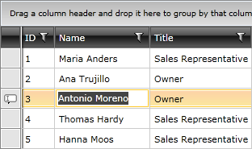
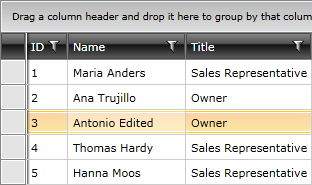

# Updating an Entry

Using the __RadGridView__, you can edit the data displayed in it. The data is edited in rows, which means that when a row is in edit mode, you can edit all of the fields that it contains.

There are three ways for the row to enter edit mode. The first one is when the user presses __F2 (or double clicks the cell),__ the second is when the __BeginEdit()__ method of the __RadGridView__ is called and the third is when the user starts typing over the cell. This behavior is controled by the __EditTriggers__ enumeration either on gridview or column level.


```C#
	this.radGridView.BeginEdit();
```


```VB.NET
	Me.radGridView.BeginEdit()
```

For example, you can use a button to call this method.


```XAML
	<StackPanel x:Name="LayoutRoot">
	    <Button Content="Edit"
	    Click="Button_Click" />
	    <telerik:RadGridView AutoGenerateColumns="False">
	        <!--...-->
	    </telerik:RadGridView>
	</StackPanel>
```

And in the event handler call the method for the Click event.


```C#
	private void Button_Click(object sender, RoutedEventArgs e)
	{
	    this.radGridView.BeginEdit();
	}
```


```VB.NET
	Private Sub Button_Click(ByVal sender As Object, ByVal e As RoutedEventArgs)
	    Me.radGridView.BeginEdit()
	End Sub
```



>If the __IsReadOnly__ property of the __RadGridView__ is set to __True__ you won't be able to bring the row into edit mode.

>When entering edit mode the row to be edited represents the __CurrentItem__ (the currently focused item) of the __RadGridView__. As it is a single object, at most one row can be edited at a time.

The next step in implementing the adding functionality is to attach event handlers to the __BeginningEdit__ and the __RowEditEnded__ events.


```XAML
	<telerik:RadGridView BeginningEdit="radGridView_BeginningEdit"
	             RowEditEnded="radGridView_RowEditEnded">
	    <!--...-->
	</telerik:RadGridView>
```


The __BeginningEdit__ event is raised before the row enters edit mode. In the event handler you can cancel the operation or modify the cell being edited via the __Cancel__ and __Cell__ properties of the __GridViewBeginningEditRoutedEvenArgs__.


```C#
	private void radGridView_BeginningEdit(object sender, GridViewBeginningEditRoutedEventArgs e)
	{
	}
```


```VB.NET
	Private Sub radGridView_BeginningEdit(ByVal sender As Object, ByVal e As GridViewBeginningEditRoutedEventArgs)
	End Sub
```

There are several ways to commit the edited data and all of them will raise the __RowEditEnded__ event. The first one occurs when the user presses __Enter__, the second when the __CommitEdit()__ method is called and the last one when another row is selected. The editing operation can also be cancelled by pressing __Escape.__ The first time you press __Escape__ only the cell cancels the edit. By pressing the __Escape__ second time, the whole row leaves edit mode. Another way to make the row cancel the edit is by calling the __CancelEdit()__ method. In this case the __RowEditEnded__ event will be raised again.

Via the __GridViewRowEditEndedEventArgs__ class you can access the __EditAction__ (__Commit__ or __Cancel__) and the __GridViewEditOperationType__ (__Insert__ or __Edit__) . The event arguments class also allows you to access the updated data via the __NewData__ property. On the other hand the __OldValues__ property contains the old data. To be sure that the appropriate data will be submitted (as this handler will be used by the add operations too), you have to assure that the action is __Commit__ and the operation type is __Edit__.


```C#
	private void radGridView_RowEditEnded(object sender, GridViewRowEditEndedEventArgs e)
	{
	    if (e.EditAction == GridViewEditAction.Cancel)
	    {
	        return;
	    }
	    if (e.EditOperationType == GridViewEditOperationType.Edit)
	    {
	        //Update the entry in the data base based on your logic.
	    }
	}
```


```VB.NET
	Private Sub radGridView_RowEditEnded(ByVal sender As Object, ByVal e As GridViewRowEditEndedEventArgs)
	    If e.EditAction = GridViewEditAction.Cancel Then
	        Exit Sub
	    End If
	
	    If e.EditOperationType = GridViewEditOperationType.Edit Then
	        'Edit the entry in the data base based on your logic.
	    End If
	End Sub
```

>You can also use the __CellEditEnded__ event to handle the committing or the cancelling actions and the logic in the event handler will be executed every time a cell gets edited. In some cases this might be inconvenient because different calls to a service might be made for each cell.

When the updated item is committed, it will be automatically added to the __RadGridView__'s __Items__ collection, so you don't have to worry about anything on the client-side. If you have to save it to a data base use the event handler to call the appropriate method, as it is shown in the example above.



## See Also

 * [Adding New Entries]()

 * [Deleting an Entry]()

 * [Validating]()
