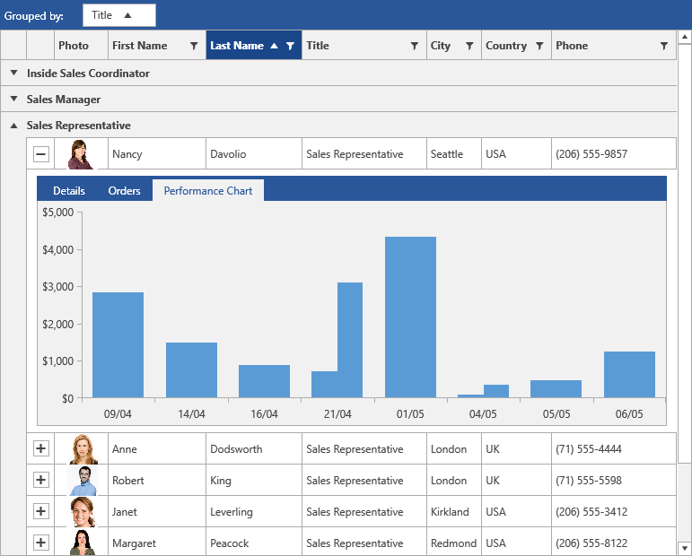

# {{ site.framework_name }} GridView Overview

Thank you for choosing __RadGridView__ - Telerik's {{site.framework_name}} DataGrid!

__RadGridView__ for SilverlightWPF is the ultimate grid control that provides outstanding performance and a remarkably flexible hierarchy model. __RadGridView__ enables you to create fully customizable and highly interactive interfaces for display and management of large data. 





__RadGridView__ key features list:

* __WPF/Silverlight code compatibility__

* __Powerful data binding to objects, collections, XML and WCF services__

* __Grouping__

* __Sorting__

* __Filtering__

* __Totals row with aggregate functions__

* __Frozen columns__

* __Row details and details presenter for better user experience__

* __In-place data editing with validation__

* __Enable\disable grid elements__

* __Completely stylable control with a variety of themes and properties__

* __Templates for advanced customizations of the look and feel__

* __Custom layout__

* __Flexible hierarchy model, support of self-referencing and custom hierarchy models__

* __Selecting and navigating__

* __Localization support__

* __Flexible API__

* __Enhanced Routed Events Framework will help your code become even more elegant and concise__

* __Merged Cells__

* __Column Groups__

You can find a list with all key features and additional explanation of the features [here]()

Check out the online demo [here.](https://demos.telerik.com/silverlight/#GridView/FirstLook)

Check out the WPF demos [here.](https://demos.telerik.com/wpf/)

>tip You can find more examples of how to implement various scenarios available for download from our online SDK repository [here. ](https://github.com/telerik/xaml-sdk/)Look for examples listed under __GridView__. For a better and easier reviewing of our examples you can download the [SDK Samples Browser.](https://demos.telerik.com/xaml-sdkbrowser//)


## Telerik UI for WPF Support and Learning Resources

* [Telerik UI for WPF DataGrid Homepage](https://www.telerik.com/products/wpf/gridview.aspx)
* [Get Started with the Telerik UI for WPF DataGrid]()
* [Telerik UI for WPF API Reference](https://docs.telerik.com/devtools/wpf/api/)
* [Getting Started with Telerik UI for WPF Components]()
* [Telerik UI for WPF Virtual Classroom (Training Courses for Registered Users)](https://learn.telerik.com/learn/course/external/view/elearning/16/telerik-ui-for-wpf) 
* [Telerik UI for WPF DataGrid Forums](https://www.telerik.com/forums/wpf)
* [Telerik UI for WPF Knowledge Base](https://docs.telerik.com/devtools/wpf/knowledge-base)


## See Also

 * [Getting Started]()
 * [Key Features]()
 * [Visual Structure]()
 * [UI for WPF Demos](https://demos.telerik.com/wpf/)
 * [SDK Samples Browser](https://demos.telerik.com/xaml-sdkbrowser//)
