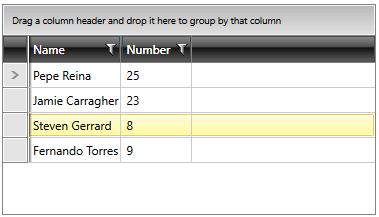

# Configure the Data Bindings

This article will list the possible types of sources Telerik's {{ site.framework_name }} RadGridView can handle and guide you through the process of binding the control to a collection of items and configuring the data bindings for its columns.

## Types of Sources

__RadGridView__'s __ItemsSource__ property is declared to be of type __System.Object__ for compatibility reasons but it is recommended to use collections which implement the __IEnumerable__ interface.

>important When binding the **ItemsSource** to a **DataTable**, you should use its **DefaultView**.

When bound to a collection which implements the **INotifyCollectionChanged** interface, __RadGridView__ will reflect any changes to this collection (due to add or remove operations, for example) in its UI. In {{ site.framework_name }} there is a built-in implementation of this interface – the __ObservableCollection&lt;T&gt;__ class.

Implementations of the __System.ComponentModel.ICollectionView__ interface are fully supported as well. Moreover, when such a source is provided, __RadGridView__ will automatically pick up any group/sort/filter descriptions defined on the collection view and use those to display the data. With this said, it is recommended to pass in such a collection whenever possible. The Telerik UI for {{ site.framework_name }} suite provides such an implementation - the **QueryableCollectionView**. If you bind an instance of the QueryableCollectionView class to RadGridView, the control will automatically work with this instance which can improve performance as it will remove the need to synchronize the bound collection with its **Items** collection.

Last but not least, if the bound source collection implements the **IEditableCollectionView** and/or **IEditableCollectionViewAddNewItem** interfaces, the implementations of their members will be invoked when performing editing operations on the collection via the RadGridView control.

## Binding to an ObservableCollection

For the purposes of this example the control will be bound to a collection of **Player** objects. Please note that the class inherits from **ViewModelBase** which is the Telerik implementation of the **INotifyPropertyChanged** interface.

__Example 1: The Player class__

```C#
    public class Player : ViewModelBase
    {
        private string name;
        private int number;

        public string Name
        {
            get { return this.name; }
            set
            {
                if (value != this.name)
                {
                    this.name = value;
                    this.RaisePropertyChanged();
                }
            }
        }

        public int Number
        {
            get { return this.number; }
            set
            {
                if (value != this.number)
                {
                    this.number = value;
                    this.RaisePropertyChanged();
                }
            }
        }
    }
```

The next step is to create an __ObservableCollection__ of Player objects in our viewmodel.

__Example 2: Create an ObservableCollection in the viewmodel__

```C#    
	public class MainWindowViewModel : ViewModelBase
	{
		private ObservableCollection<Player> players;

		public ObservableCollection<Player> Players
		{
		    get
		    {
			if (this.players == null)
			{
			    this.players = new ObservableCollection<Player>();
			    this.players.Add(new Player() { Name = "Pepe Reina", Number = 25 });
			    this.players.Add(new Player() { Name = "Jamie Carragher", Number = 23 });
			    this.players.Add(new Player() { Name = "Steven Gerrard", Number = 8 });
			    this.players.Add(new Player() { Name = "Fernando Torres", Number = 9 });
			}

			return this.players;
		    }
		}
	}
```

All that's left is to bind this collection to our RadGridView control.

__Example 3: Bind the ItemsSource property__

```XAML
	<telerik:RadGridView ItemsSource="{Binding Players}" />
```

## Binding the Columns

By default, RadGridView will try to automatically generate columns based on the properties of the underlying data objects. If you would like to disable this functionality and manually define the columns yourself, you should set the control's **AutoGenerateColumns** property to **False** and manually populate the **Columns** collection.

__Example 3: Define a column in XAML__

```XAML
	<telerik:RadGridView x:Name="playersGrid" ItemsSource="{Binding Players}" AutoGenerateColumns="False">
	    <telerik:RadGridView.Columns>
	        <telerik:GridViewDataColumn DataMemberBinding="{Binding Name}" Header="Name" />
	        <telerik:GridViewDataColumn DataMemberBinding="{Binding Number}" Header="Number" />
	    </telerik:RadGridView.Columns>
	</telerik:RadGridView>
```

#### Figure 1: The rendered RadGridView



> To learn more about defining columns and the different types of columns, you can take a look at the [Columns]() section.

## See Also

 * [Binding to Dynamic Data]()
 * [Loading Data from XML]()
