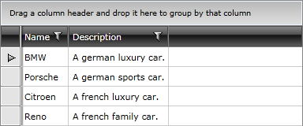

# Using in-memory Data

The purpose of this tutorial is to show you how to populate a __RadGridView__ with in-memory data.

* Add a new __RadGridView__ declaration in your XAML: 

#### __XAML__

{{region gridview-in-memory-date_0}}

	<telerik:RadGridView x:Name="radGridView" Margin="8"/>
{{endregion}}

The control will be bound to an __ObservableCollection__ of __Car__ objects. Each __Car__ has a __Name__ and __Description__.

* Create a new class named __Car__ and add two properties - __Name__ and __Description__. Both of the properties are of type string. Here is the source code: 

#### __C#__

{{region gridview-in-memory-date_1}}

	public class Car
	{
	    public Car()
	    {
	    }
	    public Car( string name, string description )
	    {
	        this.Name = name;
	        this.Description = description;
	    }
	    public string Name
	    {
	        get;
	        set;
	    }
	    public string Description
	    {
	        get;
	        set;
	    }
	}
{{endregion}}

#### __VB.NET__

{{region gridview-in-memory-date_2}}

	Public Class Car
	
	    Public Sub New()
	    End Sub
	
	    Public Sub New(ByVal name As String, ByVal description As String)
	        Me.Name = name
	        Me.Description = description
	    End Sub
	
	Private _Name As String
	    Public Property Name() As String
	        Get
	            Return _Name
	        End Get
	        Set(ByVal value As String)
	            _Name = value
	        End Set
	    End Property
	
	Private _Description As String
	    Public Property Description() As String
	        Get
	            Return _Description
	        End Get
	        Set(ByVal value As String)
	            _Description = value
	        End Set
	    End Property
	End Class
{{endregion}}

* Create a new class named __RadGridViewSampleData__. 

#### __C#__

{{region gridview-in-memory-date_3}}

	public class RadGridViewSampleData
	{
	}
{{endregion}}

#### __VB.NET__

{{region gridview-in-memory-date_4}}

	Public Class RadGridViewSampleData
	End Class
{{endregion}}

* In the __RadGridViewSampleData__ class add a reference to an __ObservableCollection__ of __Car__: 

#### __C#__

{{region gridview-in-memory-date_5}}

	public class RadGridViewSampleData
	{
	    public RadGridViewSampleData()
	    {
	        Cars = new ObservableCollection<Car>();
	    }
	    public ObservableCollection<Car> Cars
	    {
	        get;
	        set;
	    }
	}
{{endregion}}

#### __VB.NET__

{{region gridview-in-memory-date_6}}

	Public Class RadGridViewSampleData
	    Public Sub New()
	        Cars = New ObservableCollection(Of Car)()
	    End Sub
	
	Private _Cars As ObservableCollection(Of Car)
	    Public Property Cars() As ObservableCollection(Of Car)
	        Get
	            Return _Cars
	        End Get
	        Set(ByVal value As ObservableCollection(Of Car))
	            _Cars = value
	        End Set
	    End Property
	End Class
{{endregion}}

* Add the following code in the constructor of the __RadGridViewSampleData__. It will make the initial initialization of the __Cars__ collection.

#### __C#__

{{region gridview-in-memory-date_7}}

	Cars.Add( new Car( "BMW", "A german luxury car." ) );
	Cars.Add( new Car( "Porsche", "A german sports car." ) );
	Cars.Add( new Car( "Citroen", "A french luxury car." ) );
	Cars.Add( new Car( "Reno", "A french family car." ) );
{{endregion}}

#### __VB.NET__

{{region gridview-in-memory-date_8}}

	Cars.Add(New Car("BMW", "A german luxury car."))
	Cars.Add(New Car("Porsche", "A german sports car."))
	Cars.Add(New Car("Citroen", "A french luxury car."))
	Cars.Add(New Car("Reno", "A french family car."))
{{endregion}}

* Declare the __RadGridViewSampleData__ object as a resource in your application. 

#### __XAML__

{{region gridview-in-memory-date_9}}

	<UserControl.Resources>
	    <sampleData:RadGridViewSampleData x:Key="DataSource"/>
	</UserControl.Resources>
{{endregion}}

* Update your __RadGridView__ declaration - set the __ItemsSource__ property. 

#### __XAML__

{{region gridview-in-memory-date_10}}

	<telerik:RadGridView x:Name="radGridView" Margin="8"
	    ItemsSource="{Binding Source={StaticResource DataSource}, Path=Cars}"/>
{{endregion}}

Run your demo, the result can be seen on the next picture:

>tipIf you need to define the columns manually read the topic [Defining Columns](0AE6DD74-8F95-4625-9083-A42F3F9217BD#Manual_Columns_Definition).

# See Also

 * [Loading Data from XML]()

 * [Loading Data from RIA Services]()

 * [DomainDataSource Support]()

 * [Loading Data from WCF Services]()

 * [Loading Data from ADO.NET Services]()

 * [Loading Data from Web Services]()
