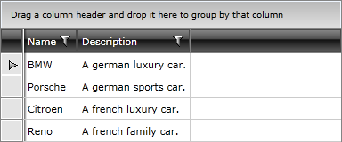

# Using In-Memory Data

The purpose of this tutorial is to show you how to populate a __RadGridView__ with in-memory data.

The control will be bound to an __ObservableCollection__ of __Car__ objects. Each __Car__ has a __Name__ and __Description__.

* Create a new class named __Car__ and add two properties - __Name__ and __Description__. Both of the properties are of type string. Here is the source code: 

<snippet id='radgridview-populating-with-data-in-memory-date-block_1-cs' />

<snippet id='radgridview-populating-with-data-in-memory-date-block_1-vb' />

* Create a new class named __RadGridViewSampleData__. 

<snippet id='radgridview-populating-with-data-in-memory-date-block_2-cs' />

<snippet id='radgridview-populating-with-data-in-memory-date-block_2-vb' />

* Declare the __RadGridViewSampleData__ object as a resource in your application. 

<snippet id='radgridview-populating-with-data-in-memory-date-block_3-xaml' />

* Update your __RadGridView__ declaration - set the __ItemsSource__ property. 

<snippet id='radgridview-populating-with-data-in-memory-date-block_4-xaml' />

Run your demo, the result can be seen on the next picture:

>tip If you need to define the columns manually read the topic [Defining Columns]().

## See Also

 * [Loading Data from XML]() 


 * [Loading Data from RIA Services]()

 * [DomainDataSource Support]()

 * [Loading Data from Web Services]()


 * [Loading Data from WCF Services]()

 * [Loading Data from ADO.NET Services]()

