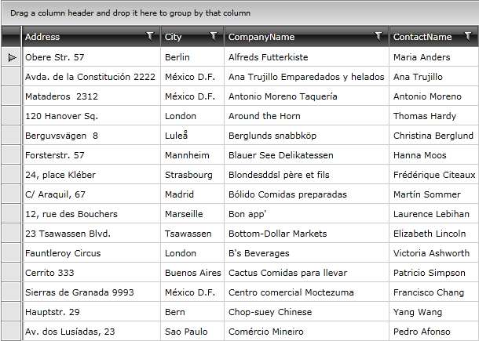

# Loading Data from RIA Services

The purpose of this tutorial is to show you how to populate a __RadGridView__ with data from a __.NET RIA Service__. 

>This tutorial will use the __Northwind__ database, which can be download it from [here](http://www.microsoft.com/downloads/details.aspx?FamilyID=06616212-0356-46A0-8DA2-EEBC53A68034&displaylang=en).

* Add a new __RadGridView__ declaration in your XAML: 

#### __XAML__

{{region xaml-gridview-loading-data-from-ria-services_0}}
	<telerik:RadGridView x:Name="radGridView" Margin="8"/>
{{endregion}}

The __RadGridView__ will be bound to a data source object, that has a property __Customers__. When the control is loaded all customers from the Customers table in the Northwind database are loaded asynchronously.

* Create a new class named __NorthwindDataSource__. 

#### __C#__

{{region cs-gridview-loading-data-from-ria-services_1}}
	public class NorthwindDataSource
	{
	}
{{endregion}}

#### __VB.NET__

{{region vb-gridview-loading-data-from-ria-services_2}}
	Public Class NorthwindDataSource
	End Class
{{endregion}}

* In the __NorthwindDataSource__ class add a reference to an __ObservableCollection of Customers__. 

* In the __NorthwindDataSource__ class add a reference to your RIA Service context: 

#### __C#__

{{region cs-gridview-loading-data-from-ria-services_3}}
	public class NorthwindDataSource
	{
	    SampleRiaContext riaContext;
	    public NorthwindDataSource()
	    {
	        riaContext = new SampleRiaContext();
	        this.Customers = new ObservableCollection<Customer>();
	    }
	    public ObservableCollection<Customer> Customers
	    {
	        get;
	        set;
	    }
	}
{{endregion}}

#### __VB.NET__

{{region vb-gridview-loading-data-from-ria-services_4}}
	Public Class NorthwindDataSource
	    Private riaContext As SampleRiaContext
	    Public Sub New()
	        riaContext = New SampleRiaContext()
	        Me.Customers = New ObservableCollection(Of Customer)()
	    End Sub
	    Public Property Customers() As ObservableCollection(Of Customer)
	End Class
{{endregion}}

* Add the following code in the constructor of the __NorthwindDataSource__. It will make the initial load of all __Customers__ from the database:

#### __C#__

{{region cs-gridview-loading-data-from-ria-services_5}}
	LoadOperation<Customer> loadOperation = riaContext.Load<Customer>(riaContext.GetCustomersQuery());
	loadOperation.Completed += loadOperation_Completed;
{{endregion}}

#### __VB.NET__

{{region vb-gridview-loading-data-from-ria-services_6}}
	Dim loadOperation As LoadOperation(Of Customer) = riaContext.Load(Of Customer)(riaContext.GetCustomersQuery())
	AddHandler loadOperation.Completed, AddressOf loadOperation_Completed
	'
{{endregion}}

And here is the code handling the __Completed__ event of the load operation: 

#### __C#__

{{region cs-gridview-loading-data-from-ria-services_7}}
	private void loadOperation_Completed(object sender, EventArgs e)
	{
	    //Consume the result
	    foreach (Customer c in riaContext.Customers)
	    {
	        this.Customers.Add(c);
	    }
	}
{{endregion}}

#### __VB.NET__

{{region vb-gridview-loading-data-from-ria-services_8}}
	Private Sub loadOperation_Completed(ByVal sender As Object, ByVal e As EventArgs)
	    'Consume the result
	    For Each c As Customer In riaContext.Customers
	        Me.Customers.Add(c)
	    Next c
	End Sub
{{endregion}}

* Declare the __NorthwindDataSource__ object as a resource in your application.

#### __XAML__

{{region xaml-gridview-loading-data-from-ria-services_9}}
	<UserControl.Resources>
	    <my:NorthwindDataSource x:Key="DataSource"/>
	</UserControl.Resources>
{{endregion}}

* Update your __RadGridView__ declaration - set the __ItemsSource__ property.

#### __XAML__

{{region xaml-gridview-loading-data-from-ria-services_10}}
	<telerik:RadGridView ItemsSource="{Binding Source={StaticResource DataSource}, Path=Customers}"/>
{{endregion}}

Run your demo, the result can be seen on the next picture:

>tipIf you need to define the columns manually read the topic [Defining Columns]().

## See Also

 * [Using in-memory Data]()

 * [Loading Data from XML]()

 * [DomainDataSource Support]()

 * [Loading Data from WCF Services]()

 * [Loading Data from ADO.NET Services]()

 * [Loading Data from Web Services]()
