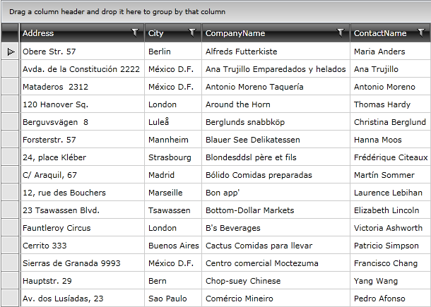

# Loading Data from WCF Services

The purpose of this tutorial is to show you how to populate __RadGridView__ with data from a __WCF Service__:

>This tutorial will use the __Northwind__ database, which can be downloaded from [here](http://www.microsoft.com/downloads/details.aspx?FamilyID=06616212-0356-46A0-8DA2-EEBC53A68034&displaylang=en).

Before proceeding further with this tutorial you need to create a new application and add a __RadGridView__ declaration in your XAML: 

<snippet id='radgridview-populating-with-data-loading-data-from-wcf-services-block_1-xaml' />

## Plain Method Calls

* Add a reference to your WCF Service. 

* Switch to the code-behind and create a new instance of your WCF Service client.

<snippet id='radgridview-populating-with-data-loading-data-from-wcf-services-block_2-cs' />

<snippet id='radgridview-populating-with-data-loading-data-from-wcf-services-block_2-vb' />

>tip For more information about how to add a reference to a WCF Service and how to create a new instance of a WCF Service client, take a look at the [Consuming WCF Service](http://www.telerik.com/help/silverlight/consuming-data-wcf-service.html)[Consuming WCF Service](http://www.telerik.com/help/wpf/consuming-data-wcf-service.html) topic.

* The gridview control will be populated with all __Customers__ from the __Northwind__ database. Add the following code which will make the initial load of the objects.

<snippet id='radgridview-populating-with-data-loading-data-from-wcf-services-block_3-cs' />

<snippet id='radgridview-populating-with-data-loading-data-from-wcf-services-block_3-vb' />

<snippet id='radgridview-populating-with-data-loading-data-from-wcf-services-block_4-cs' />

<snippet id='radgridview-populating-with-data-loading-data-from-wcf-services-block_4-vb' />

Run your demo, the result can be seen on the next image:

## Using MVVM Approach

This section will show you how to populate your __RadGridView__ control in a MVVM manner. The __RadGridView__ will be bound to a data source object, that has a property __Customers__. When the control is loaded all customers from the Customers table in the Northwind database are loaded asynchronously.

* Create a new class named __NorthwindDataSource__. 

<snippet id='radgridview-populating-with-data-loading-data-from-wcf-services-block_5-cs' />

<snippet id='radgridview-populating-with-data-loading-data-from-wcf-services-block_5-vb' />

* Add a reference to your WCF Service 

* In the __NorthwindDataSource__ class add a reference to an __ObservableCollection of Customers__. 

* In the __NorthwindDataSource__ class add a reference to your WCF Service client: 

<snippet id='radgridview-populating-with-data-loading-data-from-wcf-services-block_6-cs' />

<snippet id='radgridview-populating-with-data-loading-data-from-wcf-services-block_6-vb' />

>tip For more information about how to add a reference to a WCF Service and how to create a new instance of a WCF Service client, take a look at the [Consuming WCF Service](http://www.telerik.com/help/wpf/consuming-data-wcf-service.html) topic.

* Add the following code in the constructor of the __NorthwindDataSource__. It will make the initial load of all __Customers__ from the database: 

<snippet id='radgridview-populating-with-data-loading-data-from-wcf-services-block_7-cs' />

<snippet id='radgridview-populating-with-data-loading-data-from-wcf-services-block_8-cs' />

<snippet id='radgridview-populating-with-data-loading-data-from-wcf-services-block_8-vb' />

<snippet id='radgridview-populating-with-data-loading-data-from-wcf-services-block_9-vb' />

<snippet id='radgridview-populating-with-data-loading-data-from-wcf-services-block_10-cs' />

<snippet id='radgridview-populating-with-data-loading-data-from-wcf-services-block_10-vb' />

* Declare the __NorthwindDataSource__ object as a resource in your application. 

<snippet id='radgridview-populating-with-data-loading-data-from-wcf-services-block_11-xaml' />

* Update your __RadGridView__ declaration - set the __ItemsSource__ property. 

<snippet id='radgridview-populating-with-data-loading-data-from-wcf-services-block_12-xaml' />

Run your demo, the result can be seen on the next picture: 

>tip If you need to define the columns manually take a look at the [Defining Columns]() topic.

## See Also

 * [Using in-memory Data]()

 * [Loading Data from XML]()
 
 * [Loading Data from ADO.NET Services]()
 