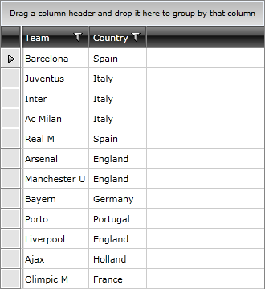

# Loading Data from XML

In order to bind the __RadGridView__ to a XML you will need to convert the XML to a collection and then to bind that collection using the __ItemsSource__ property of __RadGridView__. This tutorial will show you how to do this.

The final result should look like the snapshot below:  



* Below is a simple XML declaration, used in this tutorial: 


```XAML
	<Items>
	    <XmlNodeItem Team="Barcelona" Country="Spain"/>
	    <XmlNodeItem Team="Juventus" Country="Italy"/>
	    <XmlNodeItem Team="Inter" Country="Italy"/>
	    <XmlNodeItem Team="Ac Milan" Country="Italy"/>
	    <XmlNodeItem Team="Real M" Country="Spain"/>
	    <XmlNodeItem Team="Arsenal" Country="England"/>
	    <XmlNodeItem Team="Manchester U" Country="England"/>
	    <XmlNodeItem Team="Bayern" Country="Germany"/>
	    <XmlNodeItem Team="Porto" Country="Portugal"/>
	    <XmlNodeItem Team="Liverpool" Country="England"/>
	    <XmlNodeItem Team="Ajax" Country="Holland"/>
	    <XmlNodeItem Team="Olimpic M" Country="France"/>
	</Items>
```

* Create a new class named __XmlNodeItem__. The class is pretty simple and it represents a separate node from the XML document. Its properties are __Team__ and __Country__. Both of the properties are of type string. Here is the source code: 


```C#
	public class XmlNodeItem
	{
	    [XmlAttribute(AttributeName = "Team")]
	    public string Team
	    {
	        get;
	        set;
	    }
	    [XmlAttribute(AttributeName = "Country")]
	    public string Country
	    {
	        get;
	        set;
	    }
	}
```


```VB.NET
	Public Class XmlNodeItem
	    Private _Team As String
	    <XmlAttribute(AttributeName := "Team")>
	    Public Property Team() As String
	        Get
	            Return _Team
	        End Get
	        Set(ByVal value As String)
	            _Team = value
	        End Set
	    End Property
	
	    Private _Country As String
	    <XmlAttribute(AttributeName := "Country")>
	    Public Property Country() As String
	        Get
	            Return _Country
	        End Get
	        Set(ByVal value As String)
	            _Country = value
	        End Set
	    End Property
	End Class
```

* Create a new class named __XmlNodeItemList__, which derives from __ObservableCollection__ of __XmlNodeItem__. This is a collection that will be created from the XML file. __RadGridView__ will be bound to this collection. 


```C#
	[XmlRoot(ElementName = "Items")]
	public class XmlNodeItemList : ObservableCollection<XmlNodeItem>
	{
	    public void AddRange(IEnumerable<XmlNodeItem> range)
	    {
	        foreach (XmlNodeItem node in range)
	        {
	            this.Add(node);
	        }
	    }
	}
```


```VB.NET
	<XmlRoot(ElementName := "Items")>
	Public Class XmlNodeItemList
	    Inherits ObservableCollection(Of XmlNodeItem)
	    Public Sub AddRange(ByVal range As IEnumerable(Of XmlNodeItem))
	        For Each node As XmlNodeItem In range
	            Me.Add(node)
	        Next
	    End Sub
	End Class
```

* Create a new class named __RadGridViewXmlDataSource__, which derives from __XmlNodeItemList__. Practically, this will be the data source (the model) for the __RadGridView__. The class takes a path to the XML file and deserialize the data in the private method __RetrieveData__. 


```C#
	public class RadGridViewXmlDataSource : XmlNodeItemList
	{
	    private string source;
	    public string Source
	    {
	        get
	        {
	            return this.source;
	        }
	        set
	        {
	            this.source = value;
	            AddRange(RetrieveData(Application.GetResourceStream(new Uri(value, UriKind.Relative)).Stream));
	            AddRange(RetrieveData(File.Open(value, FileMode.Open)));
	        }
	    }
	    private XmlNodeItemList RetrieveData(Stream xmlStream)
	    {
	        XmlSerializer serializer = new XmlSerializer(typeof(XmlNodeItemList));
	        StreamReader reader = new StreamReader(xmlStream);
	        XmlNodeItemList list = (XmlNodeItemList)serializer.Deserialize(reader);
	        return list;
	    }
	}
```


```VB.NET
	Public Class RadGridViewXmlDataSource
	    Inherits XmlNodeItemList
	    Private m_source As String
	
	    Public Property Source() As String
	        Get
	            Return Me.m_source
	        End Get
	        Set(ByVal value As String)
	            Me.m_source = value
	            AddRange(RetrieveData(Application.GetResourceStream(New Uri(value, UriKind.Relative)).Stream))
	        End Set
	    End Property
	
	    Private Function RetrieveData(ByVal xmlStream As Stream) As XmlNodeItemList
	        Dim serializer As New XmlSerializer(GetType(XmlNodeItemList))
	        Dim reader As New StreamReader(xmlStream)
	        Dim list As XmlNodeItemList = DirectCast(serializer.Deserialize(reader), XmlNodeItemList)
	        Return list
	    End Function
	End Class
```

* The next step is to declare the __RadGridViewXmlDataSource__ as a resource in your application. 


```XAML
	<UserControl.Resources>
	    <local:RadGridViewXmlDataSource x:Key="DataSource" Source="RadGridViewBindingToXml.xml"/>
	    <XmlDataProvider x:Key="loadingDataFromXml">
	        <x:XData>
	            <!-- #region gridview-loading-data-from-xml_0 -->
	            <Items>
	                <XmlNodeItem Team="Barcelona" Country="Spain"/>
	                <XmlNodeItem Team="Juventus" Country="Italy"/>
	                <XmlNodeItem Team="Inter" Country="Italy"/>
	                <XmlNodeItem Team="Ac Milan" Country="Italy"/>
	                <XmlNodeItem Team="Real M" Country="Spain"/>
	                <XmlNodeItem Team="Arsenal" Country="England"/>
	                <XmlNodeItem Team="Manchester U" Country="England"/>
	                <XmlNodeItem Team="Bayern" Country="Germany"/>
	                <XmlNodeItem Team="Porto" Country="Portugal"/>
	                <XmlNodeItem Team="Liverpool" Country="England"/>
	                <XmlNodeItem Team="Ajax" Country="Holland"/>
	                <XmlNodeItem Team="Olimpic M" Country="France"/>
	            </Items>
```

* Update your __RadGridView__ declaration - set the __ItemsSource__ property. 


```XAML
	<telerik:RadGridView x:Name="radGridView" ItemsSource="{Binding Source={StaticResource DataSource}}"/>
```

Run your demo, the result can be seen on the next picture: 


>tipIf you need to define the columns manually read the topic [Defining Columns]().

## See Also

 * [Using in-memory Data]() 
 
 * [Loading Data from WCF Services]()

 * [Loading Data from ADO.NET Services]()
 


 * [Loading Data from RIA Services]()

 * [DomainDataSource Support]()

 * [Loading Data from Web Services]()

