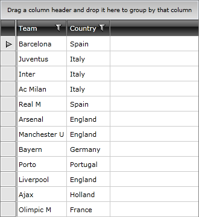

# Loading Data from XML

In order to bind the __RadGridView__ to a XML you will need to convert the XML to a collection and then to bind that collection using the __ItemsSource__ property of __RadGridView__. This tutorial will show you how to do this.

The final result should look like the snapshot below:  

* Below is a simple XML declaration, used in this tutorial: 

<snippet id='radgridview-populating-with-data-loading-data-from-xml-block_1-xaml' />

* Create a new class named __XmlNodeItem__. The class is pretty simple and it represents a separate node from the XML document. Its properties are __Team__ and __Country__. Both of the properties are of type string. Here is the source code: 

<snippet id='radgridview-populating-with-data-loading-data-from-xml-block_2-cs' />

<snippet id='radgridview-populating-with-data-loading-data-from-xml-block_2-vb' />

* Create a new class named __XmlNodeItemList__, which derives from __ObservableCollection__ of __XmlNodeItem__. This is a collection that will be created from the XML file. __RadGridView__ will be bound to this collection. 

<snippet id='radgridview-populating-with-data-loading-data-from-xml-block_3-cs' />

<snippet id='radgridview-populating-with-data-loading-data-from-xml-block_3-vb' />

* Create a new class named __RadGridViewXmlDataSource__, which derives from __XmlNodeItemList__. Practically, this will be the data source (the model) for the __RadGridView__. The class takes a path to the XML file and deserialize the data in the private method __RetrieveData__. 

<snippet id='radgridview-populating-with-data-loading-data-from-xml-block_4-cs' />

<snippet id='radgridview-populating-with-data-loading-data-from-xml-block_4-vb' />

* The next step is to declare the __RadGridViewXmlDataSource__ as a resource in your application. 

<snippet id='radgridview-populating-with-data-loading-data-from-xml-block_5-xaml' />

* Update your __RadGridView__ declaration - set the __ItemsSource__ property. 

<snippet id='radgridview-populating-with-data-loading-data-from-xml-block_6-xaml' />

Run your demo, the result can be seen on the next picture: 

>tip If you need to define the columns manually read the topic [Defining Columns]().

## See Also

 * [Using in-memory Data]() 
 
 * [Loading Data from WCF Services]()

 * [Loading Data from ADO.NET Services]()
 


 * [Loading Data from RIA Services]()

 * [DomainDataSource Support]()

 * [Loading Data from Web Services]()

