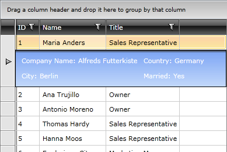

# Customizing the Row Details

The __Row Details__ are represented by a __DetailsPresenter__ control. By default, the __DetailsPresenter__ control is styled according to the current theme. Its style includes properties such as __Background__, __BorderBrush__ and others. Use the __RowDetailsStyle__ property of the __RadGridView__, if you want to customize its appearance.

To learn how to do this take a look at the [Styling the Row Details]() topic. 

# See Also

 * [RowDetails Overview]()

 * [Toggle RowDetails Column]()

 * [Row Details Template]()

 * [Row Details Visibility]()

 * [External Row Details]()
