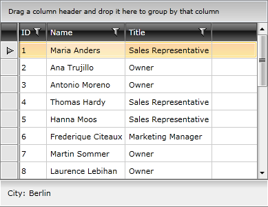

# External Row Details

In order to display Row Details outside of the __RadGridView__, place a __DetailsPresenter__ control somewhere around your __RadGridView__. The only thing that you need to do in order to synchronize the __DetailsPresenter__ with the __RadGridView__ is to connect its __DetailsProvider__ property to the __RowDetailsProvider__ property of the __RadGridView__. 

>tipThe __DetailsPresenter__ control used for displaying external details is exactly the same control internally used by the __RadGridView__ rows. 

The __RowDetailsProvider__ takes care to passing the needed data (the data template, the row details style and etc) to the presenter. It doesn't matter if it is internal or external. Each time a different row is selected or the template is changed, the grid will communicate this change via its __RowDetailsProvider__ property and update the connected __DetailsPresenter__ automatically. 

Also, you may want to set the __RowDetailsVisibilityMode__ property of the grid view to __Collapsed__ in order to prevent the row details to show both inside and outside the __RadGridView__.

#### __XAML__

{{region radgridview-row-details-external-row-details_0}}

	<telerik:RadGridView x:Name="radGridView"
	                         RowDetailsVisibilityMode="Collapsed">
	    <telerik:RadGridView.RowDetailsTemplate>
	        <DataTemplate x:Name="RowDetailsProvider">
	            <StackPanel Orientation="Horizontal"
	                        Margin="10,10,10,10">
	                <TextBlock Text="City: " />
	                <TextBlock Text="{Binding City}" />
	            </StackPanel>
	        </DataTemplate>
	    </telerik:RadGridView.RowDetailsTemplate>
	    ...
	</telerik:RadGridView>
	<telerik:DetailsPresenter x:Name="ExternalPresenter"
	                                          DetailsProvider="{Binding RowDetailsProvider, ElementName=radGridView}" />
{{endregion}}

#### __C#__

{{region radgridview-row-details-external-row-details_1}}

	this.ExternalPresenter.DetailsProvider = this.radGridView.RowDetailsProvider;
{{endregion}}

#### __VB.NET__

{{region radgridview-row-details-external-row-details_2}}

	Me.ExternalPresenter.DetailsProvider = Me.radGridView.RowDetailsProvider
{{endregion}}

>You can see that the __RowDetailsTemplate__ must be defined in the __RadGridView__ as it is passed by the __RowDetailsProvider__ to both the internal and the external presenter. The same applies for the __RowDetailsStyle__.

# See Also

 * [RowDetails Overview]()

 * [Toggle RowDetails Column]()

 * [Row Details Template]()

 * [Row Details Visibility]()

 * [Customizing the Row Details]()
